---

# Información
---


- **Nombre**: Cap
- **Plataforma**: Hack The Box
- **Año de creación**: 2021
- **Estatus**: Retirada
- **Creador**: infosecjack
- **Sistema operativo**: Linux
- **Técnicas empleadas**: IDOR, Exploiting Linux capabilities.

---

# 1. Reconocimiento
---

## Comprobación de Conectividad (ICMP)

Para iniciar la fase de reconocimiento, se verificó la disponibilidad del objetivo enviando cuatro paquetes ICMP mediante la herramienta **ping**:

```bash
ping -c 4 10.129.3.5
```

**Resultados:**

- **Conectividad:** Exitosa.
- **SO (Fingerprinting):** El **TTL de 63** sugiere un sistema **Linux** (TTL base 64).
- **Topología:** La reducción en una unidad del TTL indica un salto (_hop_) de red intermedio hacia el objetivo.

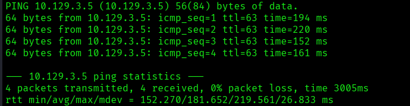

---

## Escaneo de puertos (TCP)

Se realizó un escaneo exhaustivo de los 65,535 puertos para identificar servicios activos mediante **Nmap**:

**Comando ejecutado:**

```bash
nmap -p- --open -sS --min-rate 5000 -Pn -n 10.129.3.5 -oN full-ports.txt
```

**Resultados:**

- **Puertos detectados:** 21 (FTP), 22 (SSH) y 80 (HTTP).
- **Estado:** Todos los puertos reportan un estado `open`.

**Siguiente paso:** Ejecutar un escaneo de detección de versiones y scripts predeterminados (`-sCV`) para identificar tecnologías y posibles vectores de exposición.

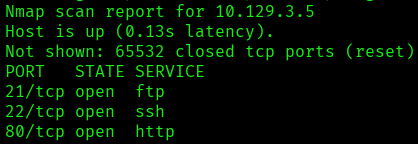


---
# 2. Enumeración

---

## Enumeración de Servicios y Scripts (NSE)

Se ejecutó un escaneo dirigido a los puertos detectados para identificar versiones (**-sV**) y aplicar scripts de reconocimiento por defecto (**-sC**):

**Comando ejecutado:**

```bash
nmap -p 21,22,80 -sCV 10.129.3.5 -oN services-nse.txt
```

**Análisis de Resultados:**

- **Port 21 (FTP):** `vsftpd 3.0.3`. Vulnerable a Denial of Service (DoS), vector descartado por no proporcionar acceso intrusivo.
- **Port 22 (SSH):** `OpenSSH 8.2p1`. Versión actualizada y sin exploits públicos conocidos para ejecución remota.
- **Port 80 (HTTP):** Servidor basado en **WSGI** (Web Server Gateway Interface). Indica una aplicación desarrollada en **Python** (Django/Flask), lo que orienta la búsqueda hacia vulnerabilidades en la lógica del framework o archivos de configuración.

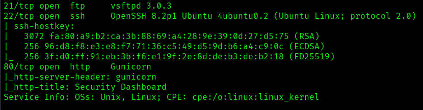

---
## Enumeración Web (WhatWeb)

Se analizó el servicio web para identificar el _stack_ tecnológico y posibles vectores de ataque en el lado del cliente (_Client-Side_):

**Comando ejecutado:**

```bash
whatweb http://10.129.3.5
```

**Resultados y Hallazgos:**

- **Servidor:** `gunicorn` (Confirma el uso de **Python/WSGI**).
- **Framework Frontend:** `Bootstrap` (Diseño responsivo).
- **Librerías Críticas (Desactualizadas):**
    - **jQuery 2.2.4:** Versión obsoleta vulnerable a **Prototype Pollution** y **Cross-Site Scripting (XSS)**.
    - **Modernizr 2.8.3.min:** Versión de 2014 con riesgos potenciales de **XSS**.
- **Título del Sitio:** `Security Dashboard`.
- **Estado HTTP:** `200 OK`.

**Análisis Técnico:** La presencia de versiones antiguas de jQuery y Modernizr sugiere una falta de mantenimiento en el frontend. El servidor **Gunicorn** refuerza la teoría de una aplicación Python.

```bash
http://10.129.3.5 [200 OK] Bootstrap, Country[RESERVED][ZZ], HTML5, HTTPServer[gunicorn], IP[10.129.3.5], JQuery[2.2.4], Modernizr[2.8.3.min], Script, Title[Security Dashboard], X-UA-Compatible[ie=edge]
```

---

## **Interacción y Análisis del Frontend**

Se realizó una inspección manual de la interfaz `Security Dashboard` para identificar puntos de entrada y vectores de ataque potenciales:

- **Puntos de Interés:** Búsqueda de formularios de inicio de sesión (_Login_), paneles de administración o campos de entrada de datos.
- **Funcionalidad:** Identificación de posibles vulnerabilidades en la lógica de negocio o falta de controles de acceso en el lado del cliente.
- **Objetivo:** Localizar vectores para **Inyección de Código**, **SSTI** (debido al entorno Python/Gunicorn) o **Bypass de Autenticación**.

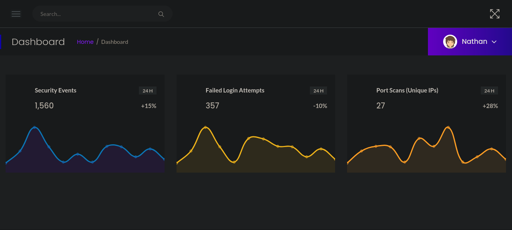

### **Identificación de Insecure Direct Object Reference (IDOR)**

Al inspeccionar la funcionalidad de **"Traffic Capture"**, se detectó que el sistema gestiona archivos de captura mediante parámetros numéricos en la URL (posible vulnerabilidad **IDOR**).

**Acciones realizadas:**

- **Fuzzing de parámetros:** Se probaron diferentes valores numéricos para identificar capturas de tráfico almacenadas.
- **Hallazgo crítico:** Al ingresar el valor **`0`**, el sistema devolvió una captura con un volumen de paquetes significativamente mayor.
- **Extracción:** Se descargó el archivo resultante, confirmando que se trata de un volcado de tráfico en formato **.pcap**.


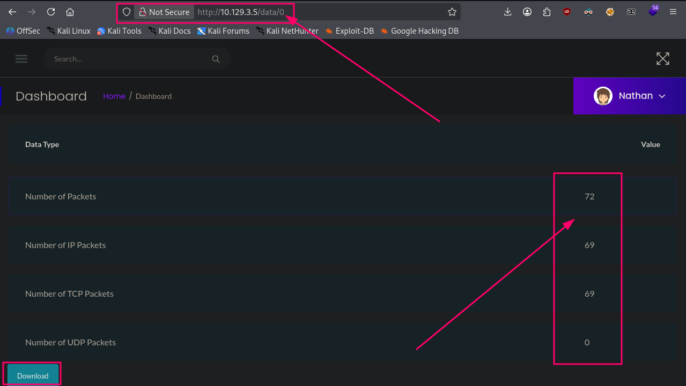

**Análisis de Datos:** Se procedió a la apertura y análisis del archivo mediante **Wireshark** para la búsqueda de credenciales en texto plano o tráfico sensible.

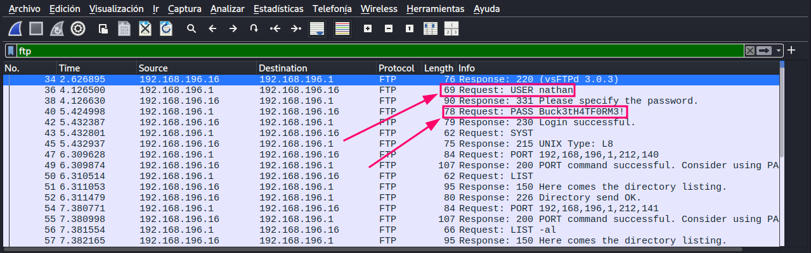

#### **Análisis de Tráfico y Exfiltración de Credenciales**

Tras el análisis del archivo `.pcap` con **Wireshark**, se interceptó una comunicación en texto plano que reveló las siguientes credenciales:

- **Usuario:** `nathan`
- **Contraseña:** `Buck3tH4TF0RM3!`

**Explotación de Post-Enumeración (FTP):** Dado que el servicio **FTP (puerto 21)** carece de cifrado por defecto, se procedió a autenticarse con las credenciales obtenidas para realizar una enumeración profunda del sistema de archivos.

**Objetivos:**

1. Localizar archivos de configuración sensibles.
2. Identificar posibles vectores de escalada de privilegios o persistencia.
3. Exfiltrar información crítica que no era visible vía HTTP.

---

## Enumeración FTP

Se validaron las credenciales obtenidas en el servicio **FTP**, logrando una autenticación exitosa. Al listar el directorio raíz del usuario, se identificó un único archivo de interés:

**Credenciales:** `nathan` : `Buck3tH4TF0RM3!`

**Hallazgos:**

- **Recurso:** `user.txt`
- **Acción:** El archivo fue transferido exitosamente a la máquina atacante.

**Nota Técnica:** El acceso al sistema de archivos mediante FTP confirma que el usuario `nathan` tiene un directorio _home_ persistente y permisos de lectura sobre archivos críticos de usuario.

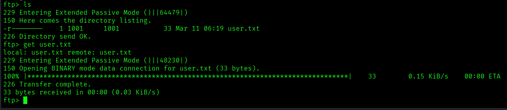

**Resultado:** Tras la obtención de la flag de usuario vía FTP, no se identificaron vectores adicionales de ejecución de comandos en dicho servicio. Ante la falta de otros puntos de entrada, se procedió a validar la **reutilización de credenciales.

---

# 3. Explotación (Acceso inicial)

---

## **Intrusión y Acceso Inicial (SSH)**

Se validó la **reutilización de credenciales** (_Password Reuse_) en el servicio **SSH** para obtener una sesión interactiva en el sistema:

**Comando ejecutado:**

```bash
ssh nathan@10.129.3.5
```

**Resultados:**

- **Acceso:** Exitoso como el usuario `nathan`.
- **Persistencia:** Se obtuvo una _shell_ estable, permitiendo la interacción directa con el sistema operativo.
- **Flag de Usuario:** Confirmada la lectura de `user.txt` desde el directorio _home_ del usuario.

**Vista de la flag:**

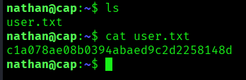

---

# 4. Post-Explotación

---

## Escalada de privilegios

Tras obtener acceso al sistema, se inició la fase de enumeración interna para identificar vectores de **escalada de privilegios**:

**Acciones realizadas:**

- **Grupos de Usuario:** Se verificó la pertenencia a grupos suplementarios de interés (ej. `sudo`, `docker`, `lxd`), con resultados negativos.
- **Privilegios de Sudo:** Se ejecutó `sudo -l` para listar permisos específicos de ejecución, confirmando que el usuario `nathan` no posee privilegios elevados.
- **Filtro inicial:** No se detectaron configuraciones erróneas evidentes en la política de privilegios del usuario actual.

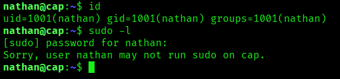

### Hallazgo crítico

Tras agotar las vías convencionales, se realizó una búsqueda recursiva de **Capabilities** de Linux para identificar binarios con privilegios especiales:

```bash
getcap -r / 2>/dev/null
```

**Hallazgo Crítico:** Se detectó que el binario `/usr/bin/python3.8` posee la _capability_ **`cap_setuid+ep`**.

**Impacto Técnico:** Esta configuración es extremadamente crítica, ya que permite al binario manipular el **UID** (User ID) del proceso. Un atacante puede forzar al intérprete de Python a cambiar su identidad a la del usuario **root** (UID 0), permitiendo una escalada de privilegios completa sin requerir contraseña ni pertenecer al grupo `sudoers`.

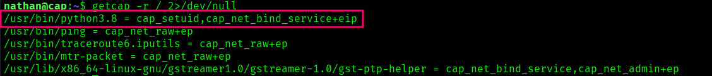

#### **Escalada de Privilegios (Root)**

Tras identificar la _capability_ en el binario de **Python 3.8**, se procedió con la explotación para elevar privilegios al usuario **root** (UID 0):

```python
python3.8 -c 'import os; os.setuid(0); os.system("/bin/bash")'
```

**Desglose del Payload:**

1. **`import os`**: Carga el módulo de sistema operativo.
2. **`os.setuid(0)`**: Aprovecha la _capability_ `cap_setuid` para cambiar el identificador del proceso al del superusuario (**root**).
3. **`os.system("/bin/bash")`**: Ejecuta una instancia de la consola _bash_ con los privilegios heredados.

**Resultado:**

- **Usuario:** `root`
- **Acceso:** Control total del sistema.
- **Flag Final:** Se localizó y leyó el archivo `/root/root.txt` de forma exitosa.

**Conclusión del Compromiso:** El sistema fue comprometido íntegramente debido a una cadena de fallos que inició con la exposición de credenciales en un protocolo no cifrado (FTP/ICMP-PCAP), seguido de una reutilización de contraseñas y finalizando en una configuración insegura de _capabilities_ en binarios del sistema.

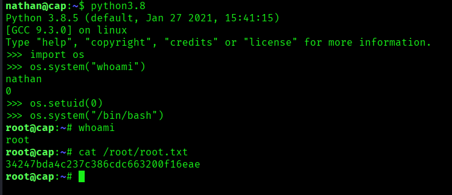


---
